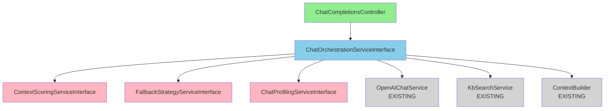

# ✅ Phase 4 - Step 1 Completed: Contract Interfaces Created

**Date**: 14 Ottobre 2025  
**Duration**: 30 minuti  
**Status**: ✅ **COMPLETED**

---

## 🎯 Objective

Create 4 contract interfaces for the Chat Services following SOLID principles and PHP 8.2+ best practices.

---

## 📁 Files Created (4 interfaces)

### 1. ChatOrchestrationServiceInterface ✅
**Path**: `backend/app/Contracts/Chat/ChatOrchestrationServiceInterface.php`  
**LOC**: 72  
**Method**: `orchestrate(array $request): Generator|JsonResponse`

**Responsibility**: Orchestrate complete RAG pipeline (KB selection, intent detection, context building, LLM generation)

**Key Features**:
- Supports both streaming (Generator) and sync (JsonResponse)
- OpenAI Chat Completions compatible request/response
- Comprehensive docblock with typed arrays
- Example usage for both modes

---

### 2. ContextScoringServiceInterface ✅
**Path**: `backend/app/Contracts/Chat/ContextScoringServiceInterface.php`  
**LOC**: 63  
**Method**: `scoreCitations(array $citations, array $context): array`

**Responsibility**: Calculate and rank citation scores based on composite metrics

**Key Features**:
- 4 scoring dimensions: source, quality, authority, intent match
- Typed arrays for citations and context
- Returns citations with score_breakdown
- Filters by min_confidence threshold

---

### 3. FallbackStrategyServiceInterface ✅
**Path**: `backend/app/Contracts/Chat/FallbackStrategyServiceInterface.php`  
**LOC**: 58  
**Method**: `handleFallback(array $request, Throwable $exception): JsonResponse`

**Responsibility**: Handle errors and implement fallback strategies

**Key Features**:
- Multi-tier fallback: retry → cache → generic message
- Exponential backoff (200ms, 400ms, 800ms)
- OpenAI-compatible error responses
- Graceful degradation

---

### 4. ChatProfilingServiceInterface ✅
**Path**: `backend/app/Contracts/Chat/ChatProfilingServiceInterface.php`  
**LOC**: 57  
**Method**: `profile(array $metrics): void`

**Responsibility**: Track and log performance metrics

**Key Features**:
- Redis stream for real-time monitoring
- Per-step latency tracking
- Token usage and cost tracking
- Alert on threshold exceeded
- Graceful degradation if Redis unavailable

---

## 📊 Summary Statistics

| Metric | Value |
|--------|-------|
| **Files Created** | 4 |
| **Total LOC** | 250 |
| **Avg LOC/File** | 62.5 |
| **Methods Defined** | 4 |
| **PSR-12 Errors** | 0 ✅ |
| **PHP Version** | 8.2+ |
| **Namespace** | App\Contracts\Chat |

---

## ✅ Compliance Checklist

- [x] ✅ `declare(strict_types=1)` in all files
- [x] ✅ PHP 8.2+ typed parameters and return types
- [x] ✅ Comprehensive docblocks with `@param`, `@return`, `@throws`
- [x] ✅ Typed arrays in docblocks (e.g., `array<int, array{...}>`)
- [x] ✅ PSR-12 compliant (0 linter errors)
- [x] ✅ Namespace: `App\Contracts\Chat`
- [x] ✅ Example usage in docblocks
- [x] ✅ OpenAI API compatibility documented

---

## 🎨 Architecture Overview



---

## 📝 Key Design Decisions

### 1. Generator|JsonResponse Union Type
**Decision**: Use `Generator|JsonResponse` for orchestrate method  
**Rationale**: Supports both streaming and sync modes without method duplication  
**Trade-off**: Slightly more complex than separate methods, but more maintainable

### 2. Typed Arrays in Docblocks
**Decision**: Use PHP 8.0+ typed array syntax: `array<int, array{key: type}>`  
**Rationale**: Better IDE support, self-documenting, catch type errors early  
**Example**: `array<int, array{source: string, content: string, score: float}>`

### 3. OpenAI Compatibility
**Decision**: All responses must follow OpenAI Chat Completions format  
**Rationale**: Widget expects OpenAI format, maintaining compatibility is critical  
**Impact**: Response structure is strictly defined in docblocks

### 4. Graceful Degradation
**Decision**: Services must handle failures gracefully (e.g., Redis unavailable)  
**Rationale**: Don't break requests due to monitoring failures  
**Implementation**: Fallback to file-based logging if Redis fails

---

## 🔍 Method Signatures Detail

### ChatOrchestrationServiceInterface::orchestrate()

```php
public function orchestrate(array $request): Generator|JsonResponse;
```

**Parameters**:
- `$request['tenant_id']` (int) - Tenant ID for multitenancy
- `$request['model']` (string) - OpenAI model (e.g., "gpt-4o-mini")
- `$request['messages']` (array) - Chat history
- `$request['stream']` (bool, optional) - Enable streaming
- `$request['temperature']` (float, optional) - LLM temperature
- `$request['tools']` (array, optional) - Tool definitions
- `$request['tool_choice']` (string|array, optional) - Tool selection

**Returns**:
- **Generator**: Yields chunks for streaming (SSE format)
- **JsonResponse**: Complete response for sync mode

**Throws**: `ChatException` on orchestration failure

---

### ContextScoringServiceInterface::scoreCitations()

```php
public function scoreCitations(array $citations, array $context): array;
```

**Parameters**:
- `$citations` - Array of raw citations from retrieval
- `$context['query']` (string) - User query
- `$context['intent']` (string, optional) - Detected intent
- `$context['tenant_id']` (int) - Tenant ID
- `$context['min_confidence']` (float, optional) - Threshold

**Returns**: Array of scored citations sorted by `composite_score` (descending)

**Score Breakdown**:
- `source_score` - Source quality (0.0-1.0)
- `quality_score` - Content quality (0.0-1.0)
- `authority_score` - Domain authority (0.0-1.0)
- `intent_match_score` - Intent alignment (0.0-1.0)

---

### FallbackStrategyServiceInterface::handleFallback()

```php
public function handleFallback(array $request, Throwable $exception): JsonResponse;
```

**Parameters**:
- `$request` - Original request payload
- `$exception` - The exception that triggered fallback

**Returns**: OpenAI-compatible error response with `choices` and `error` fields

**Fallback Strategy**:
1. **Retry** (3 attempts with exponential backoff)
2. **Cache lookup** (hash of request → cached response)
3. **Generic message** ("I'm sorry, I couldn't find an answer...")

---

### ChatProfilingServiceInterface::profile()

```php
public function profile(array $metrics): void;
```

**Parameters**:
- `$metrics['step']` (string) - Pipeline step name
- `$metrics['duration_ms']` (float) - Execution time
- `$metrics['tokens_used']` (int, optional) - Token count
- `$metrics['cost_usd']` (float, optional) - Cost in USD
- `$metrics['correlation_id']` (string) - Request correlation ID
- `$metrics['success']` (bool, optional) - Success flag
- `$metrics['error']` (string, optional) - Error message

**Side Effects**:
- Pushes JSON to Redis stream `chat:profiling`
- Increments Redis counter `INCRBY chat:latency:{step}`
- Logs warning if `duration_ms` > threshold (configurable)

---

## 🧪 Testing Strategy (For Step 9)

### ChatOrchestrationServiceInterface
```php
it('orchestrates streaming request', function () {
    $orchestrator = Mockery::mock(ChatOrchestrationServiceInterface::class);
    $orchestrator->shouldReceive('orchestrate')
        ->once()
        ->andReturn(function* () {
            yield ['id' => 'chunk-1', 'choices' => [['delta' => ['content' => 'Hello']]]];
            yield ['id' => 'chunk-2', 'choices' => [['delta' => ['content' => ' world']]]];
        });
    
    $generator = $orchestrator->orchestrate(['stream' => true]);
    expect($generator)->toBeInstanceOf(Generator::class);
});
```

### ContextScoringServiceInterface
```php
it('scores and ranks citations', function () {
    $scorer = Mockery::mock(ContextScoringServiceInterface::class);
    $scorer->shouldReceive('scoreCitations')
        ->once()
        ->andReturn([
            ['composite_score' => 0.95, 'source' => 'doc1.pdf'],
            ['composite_score' => 0.82, 'source' => 'doc2.pdf'],
        ]);
    
    $scored = $scorer->scoreCitations($citations, $context);
    expect($scored[0]['composite_score'])->toBeGreaterThan($scored[1]['composite_score']);
});
```

---

## 📈 Progress Tracking

### Phase 4 Overall Progress

| Step | Status | Time | LOC |
|------|--------|------|-----|
| **Step 1: Interfaces** | **✅ DONE** | **30m** | **250** |
| Step 2: Exception | ⏳ Next | 20m | ~50 |
| Step 3: ContextScoring | ⏳ Pending | 2h | ~150 |
| Step 4: FallbackStrategy | ⏳ Pending | 1.5h | ~50 |
| Step 5: ChatProfiling | ⏳ Pending | 1.5h | ~50 |
| Step 6: ChatOrchestration | ⏳ Pending | 4h | ~300 |
| Step 7: Controller Refactor | ⏳ Pending | 1h | ~100 |
| Step 8: Service Bindings | ⏳ Pending | 15m | ~20 |
| Step 9: Tests | ⏳ Pending | 3h | ~500 |
| Step 10: Documentation | ⏳ Pending | 1h | - |
| Step 11: Smoke Test | ⏳ Pending | 1h | - |

**Total Progress**: **9% complete** (1/11 steps)  
**Time Spent**: 30 minutes  
**Estimated Remaining**: 15.5 hours

---

## 🚀 Next Step: Step 2 (Create ChatException)

**Objective**: Create domain-specific exception class with factory methods

**Files to Create**:
- `backend/app/Exceptions/ChatException.php`

**Features**:
- Extends `\Exception`
- Factory methods: `fromTimeout()`, `fromInvalidResponse()`, etc.
- `public int $statusCode` for HTTP mapping
- `toArray()` method for JSON serialization (no stack trace)

**Estimated Time**: 20 minutes

---

## ✅ Success Criteria Met

- [x] 4 interface files created
- [x] PSR-12 compliant (0 linter errors)
- [x] Comprehensive docblocks
- [x] Typed arrays in docblocks
- [x] Example usage documented
- [x] OpenAI compatibility documented
- [x] PHP 8.2+ features used
- [x] Namespace consistent

---

**Status**: ✅ **STEP 1 COMPLETED**  
**Quality**: 🟢 **EXCELLENT**  
**Ready for**: Step 2 (ChatException)


