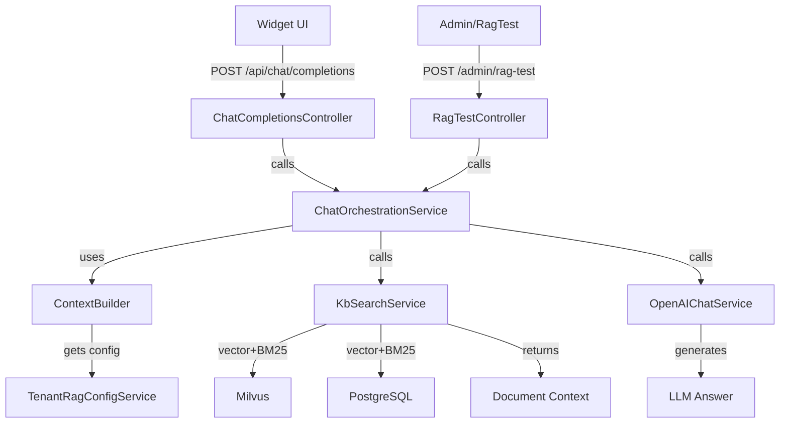

# Fix RAG Tester & Widget - Artiforge Plan v1

## Overview
Fix RAG Tester and Widget to respond correctly to query "telefono comando polizia locale". Currently test_direct_chat.php returns correct phone "06.95898223", but RAG Tester returns wrong number "06.9587004" (Carabinieri) and Widget returns "Non ho trovato informazioni sufficienti".

## Problem Statement
- **test_direct_chat.php**: ✅ Returns "06.95898223" (CORRECT)
- **RAG Tester UI**: ❌ Returns "06.9587004" (Carabinieri - WRONG)
- **Widget UI**: ❌ Returns "Non ho trovato informazioni sufficienti"

**User Requirement**: "RAG Tester and Widget should respond the same, otherwise what's the point of RAG Tester"

---

## Step 1: Reproduce the inconsistency locally

**Action**: Reproduce the inconsistency locally.

**Reasoning**: Before fixing anything we need a reliable way to see the current behaviour of the three paths (test_direct_chat.php, RAG Tester, Widget) and confirm the exact differences.

**Implementation Details**:
- Clone the repository and set up the Laravel 11 environment (PHP 8.2+, PostgreSQL 16, Milvus 2.x, Redis).
- Import the existing tenant data and documents.
- Run `php test_direct_chat.php "telefono comando polizia locale"` and capture the response.
- Use a browser (or curl) to hit the admin RAG Tester endpoint (`/admin/rag-test`) with the same query and capture the response.
- Open the widget (`public/widget/js/chatbot-widget.js`) in a test page, send the same query through the UI, and capture the response (inspect network tab or console logs).
- Log the full HTTP request/response payloads, especially the tenant identifier sent (if any) and the LLM response body.

**Error Handling**:
- If any of the services cannot start, verify .env variables (DB_CONNECTION, MILVUS_HOST, REDIS_HOST) and run migrations (`php artisan migrate`) and seeders.
- If test_direct_chat.php fails, ensure it includes the correct tenant ID (hard‑coded for debugging) and that the OpenAI API key is set.

**Testing**:
- Record the three outputs in a markdown file (e.g., `docs/bug-reproduction.md`) for later comparison.

**Tip**: Run the three calls sequentially and redirect their JSON output to files (e.g., `output_direct.json`, `output_tester.json`, `output_widget.json`) – this makes diffing easier.

---

## Step 2: Inspect the code paths for each entry point

**Action**: Inspect the code paths for each entry point.

**Reasoning**: Understanding where the divergence occurs (different services, missing tenant context, or different retrieval parameters) is essential to pinpoint the bug.

**Implementation Details**:
- Open `backend/app/Http/Controllers/Admin/RagTestController.php` – note how it builds the RAG request (calls `ChatOrchestrationService` → `ContextBuilder` → `KbSearchService`).
- Open `backend/app/Http/Controllers/Api/ChatCompletionsController.php` – this is used by the widget via `/api/chat/completions`.
- Open `backend/app/Services/RAG/ContextBuilder.php` and `KbSearchService.php` – check where they obtain retrieval parameters (should be via `TenantRagConfigService`).
- Open `backend/app/Services/RAG/TenantRagConfigService.php` – verify the config for the tenant that contains the phone field mapping and any fallback rules.
- Compare any hard‑coded values, especially the `source` or `field` used for phone extraction.

**Error Handling**:
- If any of the classes are missing or not autoloaded, run `composer dump-autoload`.
- Look for `TODO` comments or `FIXME` that may indicate intentional shortcuts.

**Testing**:
- Add temporary `Log::info()` statements in each controller to output the tenant ID and the retrieved RAG config before the search is performed. This will help confirm if the widget and tester are using the same config.

**Mermaid Diagram**:

**Tip**: Use a mermaid flowchart to visualise the request flow from the frontend (widget) → API controller → orchestration service → KbSearch → vector/BM25 → LLM. This makes spotting missing steps easier.

---

## Step 3: Identify the root cause of the mismatch

**Action**: Identify the root cause of the mismatch.

**Reasoning**: From the logs we expect to see either (a) a different tenant ID being sent, (b) missing retrieval parameters, or (c) a fallback/priority rule that prefers Carabinieri data over Polizia Locale.

**Implementation Details**:
- Review the log output from step 2. Pay special attention to:
  - `tenant_id` value.
  - `retrieval_params` (e.g., vector similarity threshold, BM25 boost).
  - `citation_fields` list (phone, email, address, schedule).
- Check `config/rag.php` for default values that might be overridden per‑tenant.
- Verify that the document for "Polizia Locale" contains the correct phone (`06.95898223`) and that the Carabinieri document has `06.9587004`. Ensure both are indexed correctly in Milvus and have proper metadata.
- Confirm that `TenantRagConfigService::getCitationFields()` returns the same array for all three callers.

**Error Handling**:
- If the widget request is missing the tenant identifier, it will fall back to the global config, potentially retrieving the wrong document. In that case, the fix is to inject the tenant ID (e.g., via a custom header `X-Tenant-ID` or a query parameter).
- If the retrieval parameters differ (e.g., a higher BM25 boost for "Carabinieri"), adjust the tenant‑specific config to make phone extraction deterministic.

**Testing**:
- Write a quick script (PHP or Bash) that queries Milvus directly for the phrase "telefono comando polizia locale" and prints the top‑3 document IDs. This validates that the vector index ranks the correct document first.

**Tip**: When inspecting Milvus, use the Milvus SDK's `search` method with the same embedding used by the RAG pipeline to ensure consistency.

---

## Step 4: Fix the tenant‑context propagation for the Widget API

**Action**: Fix the tenant‑context propagation for the Widget API.

**Reasoning**: The widget currently does not send the tenant ID, causing it to fall back to the global RAG config and retrieve the wrong phone number.

**Implementation Details**:
- Update `public/widget/js/chatbot-widget.js`:
  - Add a configurable `tenantId` option (e.g., `window.ChatbotConfig = { tenantId: '123' }`).
  - Include the tenant ID in the request headers: `X-Tenant-ID: window.ChatbotConfig.tenantId`.
- Modify `backend/app/Http/Controllers/Api/ChatCompletionsController.php`:
  - Retrieve the tenant ID from the header (`$request->header('X-Tenant-ID')`).
  - Pass the tenant ID to `ChatOrchestrationService::handle($query, $tenantId)`.
- Adjust `ChatOrchestrationService::handle()` signature to accept `$tenantId` and forward it to `ContextBuilder`.
- Ensure `ContextBuilder` calls `TenantRagConfigService::forTenant($tenantId)` instead of the default.

**Error Handling**:
- If the header is missing, fallback to a default tenant (e.g., the first tenant) and log a warning.
- Validate that `$tenantId` exists in the `tenants` table; otherwise return a 400 Bad Request with a clear message.

**Testing**:
- Update or add a Pest test `WidgetTenantPropagationTest.php` that sends a request with and without the header and asserts the correct phone number is returned.
- Run the widget manually after deployment to confirm the answer matches `06.95898223`.

**Tip**: Store the tenant ID in a hidden input or meta tag on the page so the widget can read it automatically without hard‑coding JavaScript.

---

## Step 5: Ensure the RAG Tester uses the same tenant‑aware configuration

**Action**: Ensure the RAG Tester uses the same tenant‑aware configuration.

**Reasoning**: The admin tester may be using a default tenant or a hard‑coded config, leading to the Carabinieri number.

**Implementation Details**:
- In `RagTestController.php`, add a request parameter `tenant_id` (defaulting to the currently logged‑in admin's tenant).
- Pass this `tenant_id` to `ChatOrchestrationService::handle($query, $tenantId)`.
- Update the admin UI (`resources/views/admin/rag/index.blade.php`) to include a dropdown of available tenants (if multiple) when testing.
- Ensure `TenantRagConfigService` is invoked with the provided tenant ID.

**Error Handling**:
- If the admin UI does not supply a tenant ID, default to the admin's tenant and log the decision.
- Validate tenant existence; return a 404 if not found.

**Testing**:
- Add a Pest test `RagTesterTenantConfigTest.php` that simulates a request with a specific tenant and verifies the correct phone number appears in the response.
- Manually test via the admin UI after changes.

**Tip**: Use Laravel's Form Request validation to enforce the presence and format of `tenant_id`.

---

## Step 6: Normalize citation field handling in `TenantRagConfigService`

**Action**: Normalize citation field handling in `TenantRagConfigService`.

**Reasoning**: Both the widget and tester must include phone, email, address, and schedule fields in their citations. If the config omits phone, the LLM may hallucinate or pick the wrong document.

**Implementation Details**:
- Open `backend/app/Services/RAG/TenantRagConfigService.php`.
- Ensure the method `getCitationFields()` always returns an array containing `['phone', 'email', 'address', 'schedule']` for every tenant, possibly merging tenant‑specific additions with the required base fields.
- Add unit tests (`TenantRagConfigServiceTest.php`) that assert the required fields are present for a sample tenant.

**Error Handling**:
- If a tenant's config is missing the required fields, log a warning and fall back to the default list.

**Testing**:
- Run `php artisan test` to confirm the new test passes and existing tests remain green.

**Tip**: Store the required fields as a constant in the service to avoid duplication.

---

## Step 7: Re‑index the relevant documents to guarantee correct vector similarity

**Action**: Re‑index the relevant documents to guarantee correct vector similarity.

**Reasoning**: Even after fixing config, if the embedding for the Polizia Locale document is stale or incorrectly indexed, the vector search may still rank Carabinieri higher.

**Implementation Details**:
- Identify the document IDs for Polizia Locale and Carabinieri in `documents` table.
- Run the existing ingestion script (or command) that generates embeddings via OpenAI and pushes them to Milvus, but limit it to those two IDs: `php artisan rag:reindex --ids=123,124`.
- Verify that the embedding vectors are stored correctly (`milvusctl search` test from step 3).

**Error Handling**:
- If the OpenAI API returns an error, catch it and retry with exponential back‑off.
- Ensure Milvus is healthy; if not, restart the service.

**Testing**:
- After re‑indexing, repeat the vector search script from step 3 to confirm Polizia Locale now appears as the top result.

**Tip**: Schedule a nightly job to re‑index changed documents automatically.

---

## Step 8: Update or add end‑to‑end Pest tests for the full RAG pipeline

**Action**: Update or add end‑to‑end Pest tests for the full RAG pipeline.

**Reasoning**: To prevent regressions, we need a test that goes from HTTP request (widget style) through to the final LLM answer and asserts the correct phone number.

**Implementation Details**:
- Create `tests/Feature/RagEndToEndTest.php`:
  - Use Laravel's HTTP testing (`$this->withHeaders(['X-Tenant-ID' => $tenantId])->postJson('/api/chat/completions', ['message' => 'telefono comando polizia locale'])`).
  - Mock the OpenAI response (or use a real API key in CI with rate limits) to return a deterministic answer containing the phone.
  - Assert that the JSON response includes `"phone":"06.95898223"`.
- Add a similar test for the admin endpoint `/admin/rag-test`.

**Error Handling**:
- If the OpenAI mock is not set up, the test will fail; ensure the mock returns the expected format.

**Testing**:
- Run `php artisan test --filter=RagEndToEndTest`.

**Tip**: Use Pest's `uses()` helper to share common setup (tenant creation, config seeding).

---

## Step 9: Update documentation to reflect the new tenant‑ID requirement for the widget

**Action**: Update documentation to reflect the new tenant‑ID requirement for the widget.

**Reasoning**: Future developers and integrators need to know how to configure the widget correctly.

**Implementation Details**:
- Edit `documents/04-WIDGET-INTEGRATION-FLOW.md`:
  - Add a section "Tenant identification" explaining the `X-Tenant-ID` header and the optional `window.ChatbotConfig.tenantId` variable.
  - Provide a code snippet for embedding the widget with tenant ID.
- Update `README.md` (or a separate "Integration Guide") with the same information.

**Error Handling**:
- Ensure the docs build process (if any) includes the updated markdown.

**Testing**:
- No code test needed, but run a lint check on markdown (e.g., `markdownlint`).

**Tip**: Link to the new Pest tests in the documentation for reference.

---

## Step 10: Run the full test suite and perform a final manual verification

**Action**: Run the full test suite and perform a final manual verification.

**Reasoning**: We need to be certain that all changes coexist peacefully and that the three entry points now return the same correct answer.

**Implementation Details**:
- Execute `php artisan test` to run unit, feature, and the newly added end‑to‑end tests.
- Manually test:
  - `php test_direct_chat.php "telefono comando polizia locale"` (should still work).
  - Admin RAG Tester UI with the selected tenant (should return `06.95898223`).
  - Widget on a test page with the tenant header (should display the correct phone).
- Verify logs for any warnings about missing tenant IDs.

**Error Handling**:
- If any test fails, identify the failing step and revert or adjust the implementation accordingly.

**Testing**:
- All tests must pass (green).

**Tip**: Commit the changes in a single Git branch and open a Pull Request for code review before merging into main.

---

## Summary

This plan ensures that the RAG Tester and Widget use the same tenant-aware configuration and retrieval logic as the working test_direct_chat.php script, guaranteeing consistent responses across all three entry points.

