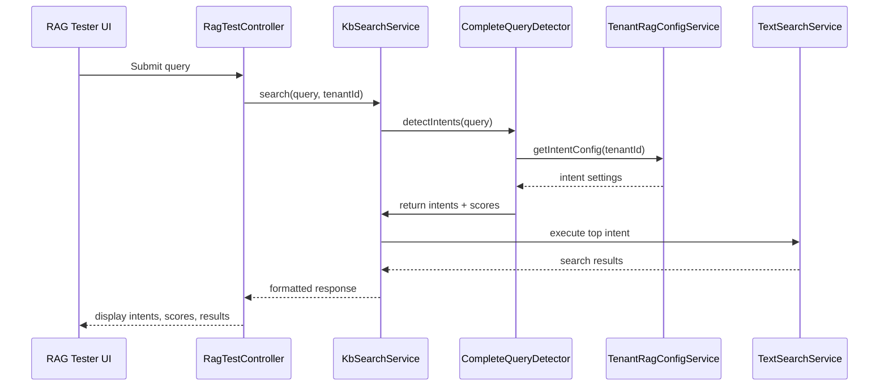

# Plan: Intent Detection Documentation & Improvement

**Created**: 2025-10-24  
**Task**: Documentare il funzionamento attuale del sistema di detection intents e migliorarlo per garantire funzionamento affidabile

---

## Steps Rules

For every step:
1. ALWAYS Read the entire step_content tag placed inside the step tag
2. ALWAYS Extract key technical requirements and constraints
3. ALWAYS Show to the user your reasoning
4. ALWAYS Show to the user a mermaid diagram if applicable
5. Offer a tip to enhance this step or make it more efficient/scalable
6. Make questions if you need more information to complete the step (not mandatory)
7. ALWAYS Ask the user for confirmation before executing the step
8. ALWAYS AFTER the user confirm, call the Artiforge tool "Artiforge/act-as-agent" to get the agent prompt and execute the step

---

## Step 1: Audit the current intent‑detection pipeline

### Action
Audit the current intent‑detection pipeline.

### Reasoning
Understanding the exact flow (from request → RagTestController → KbSearchService → TextSearchService → TenantRagConfigService) is prerequisite for both documentation and bug‑fix work.

### Implementation Details
• Clone the repo locally and open the following files:
  - backend/app/Http/Controllers/Admin/RagTestController.php
  - backend/app/Services/RAG/KbSearchService.php
  - backend/app/Services/RAG/TextSearchService.php
  - backend/app/Services/RAG/CompleteQueryDetector.php
  - backend/app/Services/RAG/TenantRagConfigService.php
  - backend/config/rag.php
  - backend/config/rag-tenant-defaults.php
  - backend/resources/views/admin/tenants/rag-config.blade.php

• Trace the method calls that handle a user query:
  1. Controller receives query.
  2. KbSearchService::search() is invoked.
  3. Inside search(), intent detection is performed via CompleteQueryDetector.
  4. Scoring uses TenantRagConfigService::getIntentConfig().
  5. Based on the selected intent, TextSearchService methods (findPhonesNearName, etc.) are called.

• Document each step, noting where configuration is read, where cache is used, and where fallback logic lives.

### Error Handling
If a file or method is missing, log the missing part and raise a warning; continue with the remaining files.

### Testing
No code change yet – just manual verification. Create a quick checklist to confirm each file was inspected.

---

## Step 2: Generate comprehensive markdown documentation

### Action
Generate a comprehensive markdown documentation of the current intent‑detection flow.

### Reasoning
The user explicitly asks for "documentare il funzionamento attuale". A well‑structured md file will serve both developers and the RAG Tester UI.

### Implementation Details
• Add a new section **Intent Detection Flow** in `backend/docs/doc-rag-tester.md`.

• Include a Mermaid sequence diagram that visualises the request‑response path:

• Explain each component's responsibility, configuration hierarchy (tenant → profile defaults → global), scoring algorithm steps, and fallback mechanisms.

• Add a table summarising the five intents (thanks, phone, email, address, schedule) with keywords, priority, and execution function.

• Reference the related config keys (`intents.enabled`, `intents.min_score`, etc.).

### Error Handling
If the markdown file already contains a section, prepend a "**Updated on <date>**" header and replace the old section to avoid duplication.

### Testing
Open the rendered markdown in a browser or VSCode markdown preview to verify diagram correctness and link validity.

---

## Step 3: Identify and catalogue bugs / edge‑cases

### Action
Identify and catalogue current bugs / edge‑cases in the intent system.

### Reasoning
The user also wants to "eliminare eventuali bug o edge cases". A concrete list is needed before fixing.

### Implementation Details
• Review the **known_issues** list in the project context.

• Write automated checks (PHPUnit/Pest) that expose each issue:
  1. Missing or malformed tenant config → expect `ConfigurationException`.
  2. Extra keywords not merged → test that `TenantRagConfigService::getIntentKeywords()` returns combined list.
  3. Cache not invalidated after config change → simulate a config update, call detection twice, assert changed result.
  4. `first_match` strategy ignoring low scores → test with scores below `intents.min_score`.
  5. Semantic fallback not returning results when vector match exists → mock MilvusClient to return hits, ensure fallback runs.

• Add these tests in `backend/tests/Feature/IntentDetection/IntentBugTests.php`.

### Error Handling
Wrap each test case in a try/catch; on failure, log which known issue could not be reproduced (might be environment‑specific).

### Testing
Run `php artisan test --filter IntentBugTests` and verify failures correspond to the documented bugs.

---

## Step 4: Refactor TenantRagConfigService

### Action
Refactor `TenantRagConfigService` to provide safe, validated, and cached configuration retrieval.

### Reasoning
The current service likely mixes raw DB reads, array merges, and manual cache keys, leading to the bugs listed.

### Implementation Details
• Create a value object `IntentConfig` (typed properties) in `backend/app/Services/RAG/ValueObjects/IntentConfig.php` with:
  - bool $enabled
  - float $minScore
  - string $executionStrategy
  - array $keywords

• In `TenantRagConfigService`:
  1. Load tenant‑specific rag_settings via Eloquent (`Tenant::find($tenantId)->rag_settings`), enforce json schema validation (use `spatie/laravel-data` or custom validator).
  2. Merge with profile defaults (`config/rag-tenant-defaults.php`) and global config (`config/rag.php`) using `array_merge_recursive` **only after** normalising keys.
  3. Properly concatenate `extra_intent_keywords` with default keywords per intent.
  4. Store the final merged array in Redis cache with a key like `rag:config:{tenantId}` and set a TTL of 5 minutes.
  5. Provide a `clearCache(int $tenantId)` method that is called from `RagConfigController` after a UI save.

• All public methods must return the typed `IntentConfig` objects.

• Add PHPDoc and strict return types, adhering to PSR‑12.

### Error Handling
• If validation fails, throw a custom `InvalidRagConfigException` with clear message.
• Gracefully fallback to profile defaults if tenant config is missing.

### Testing
• Unit test `TenantRagConfigServiceTest`:
  - validates merging order;
  - asserts extra keywords are present;
  - checks cache storage & invalidation.
• Use Pest's `uses(TestCase::class)->group('config')`.

---

## Step 5: Correct intent scoring algorithm

### Action
Correct the intent scoring algorithm in `CompleteQueryDetector` to respect `intents.min_score` and `execution_strategy`.

### Reasoning
The current implementation may return an intent even when its score is below the minimum, breaking the "first_match" strategy.

### Implementation Details
• Refactor the method `detectIntents(string $query, int $tenantId): array`.

• Steps:
  1. Normalise query (lowercase, trim, synonym expansion via tenant config).
  2. For each intent, compute score:
     - exact keyword match → weight 1.0
     - synonym match → weight 0.5
     - multiply by `strlen(keyword) / avgKeywordLength` (as described).
  3. Filter out intents with score < `IntentConfig->minScore`.
  4. Sort remaining intents by score descending.
  5. Apply `executionStrategy`:
     - `priority_based`: keep full ordered list.
     - `first_match`: return only the first intent.

• Return a structured array containing `intent`, `score`, `matchedKeyword`.

• Ensure all values are typed (`string`, `float`).

### Error Handling
• If no intent passes the threshold, return a special intent `fallback` with score 0.
• Log a debug message with original query for future analysis.

### Testing
• Write Pest tests covering:
  - exact match vs synonym match;
  - minScore filtering;
  - both execution strategies.
• Include edge cases: empty query, query with multiple intents, multilingual keywords.

---

## Step 6: Update RAG Tester UI

### Action
Update the RAG Tester UI (`RagTestController` & Blade view) to display the new intent detection details.

### Reasoning
The UI must reflect the enriched data (scores, matched keywords, execution strategy) for debugging and for the documentation to stay in sync.

### Implementation Details
• In `RagTestController::testIntent(Request $request)`:
  - Call the refactored `CompleteQueryDetector::detectIntents`.
  - Pass the result to the view as `$detectedIntents`.

• Modify `backend/resources/views/admin/tenants/rag-config.blade.php` (or create a dedicated `rag-test.blade.php`) to:
  - Render a table: Intent | Score | Matched Keyword | Enabled | Min Score | Strategy.
  - Highlight intents that were filtered out (e.g., gray row).
  - Add a button "Refresh Config Cache" that triggers `TenantRagConfigService::clearCache`.

• Use Alpine.js for dynamic sorting/filtering without page reload.

### Error Handling
• If detection throws `InvalidRagConfigException`, catch it and display a user‑friendly alert with a link to edit the config.

### Testing
• Add a Feature test `RagTestControllerTest` that posts a query and asserts the view contains expected intent rows.
• Use Laravel Dusk (or Pest + Livewire component testing) to verify the refresh button clears Redis cache.

---

## Step 7: Add logging and monitoring

### Action
Introduce robust logging and monitoring for intent detection failures.

### Reasoning
Future debugging will be easier, and we can detect misconfigurations early.

### Implementation Details
• Use Laravel's logger (`Log::channel('rag')`) – define a new channel in `config/logging.php` named `rag` (daily file).

• In `CompleteQueryDetector` and `TenantRagConfigService`, log:
  - Missing tenant config.
  - Keyword merge anomalies.
  - Scores below threshold leading to fallback.

• Add a metric (via Laravel Telescope or custom Prometheus exporter) `rag_intent_detection_total` with labels `tenant_id`, `intent`, `status` (detected, filtered, fallback).

### Error Handling
• Ensure logging does not expose PII (e.g., never log full user queries in production; hash or truncate).

### Testing
• Write a test that triggers a configuration error and asserts a log entry exists using `Log::fake()`.

---

## Step 8: Code quality checks

### Action
Run full code style and static analysis checks, then commit.

### Reasoning
All new code must comply with PSR‑12, Laravel Pint, and the project's architecture rules.

### Implementation Details
• Execute `vendor/bin/pint --test` to ensure no violations.
• Run `phpstan analyse` (if present) to catch type errors.
• Verify no new God classes; services stay thin and depend on injected repositories.
• Update `composer.json` scripts if new dev packages were added (e.g., spatie/laravel-data).

### Error Handling
• If Pint finds violations, run `vendor/bin/pint` to auto‑fix, then manually review.

### Testing
• Ensure the test suite passes: `php artisan test --parallel`.

---

## Step 9: Update project documentation

### Action
Update project documentation to reflect the new implementation.

### Reasoning
Both developers and business stakeholders need up‑to‑date docs after the changes.

### Implementation Details
• In `docs/rag.md` add a **Implementation Changes** section summarising:
  - New `IntentConfig` value object.
  - Refactored scoring algorithm.
  - Cache invalidation workflow.

• Add a **Configuration Validation** subsection describing the JSON schema.

• Link to the Mermaid diagram added in step 2.

• Commit changes with a clear commit message prefixed with `docs:`.

### Error Handling
None required.

### Testing
Render the markdown locally to ensure links and code snippets display correctly.

---

## Notes

- ALWAYS ask for confirmation BEFORE executing each step
- NEVER break this rule
- After user confirms, call Artiforge/act-as-agent to execute the step

