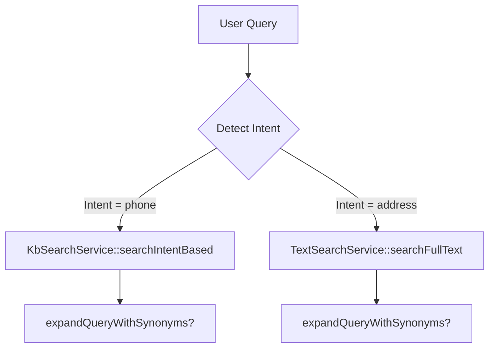

# Piano di Sviluppo: Intent Detection - Sinonimi e Context Chunk Completo

**Task**: Analizzare e risolvere due problemi critici nell'intent detection del sistema RAG

**Problemi Identificati**:
1. **PROBLEMA SINONIMI**: La ricerca intent-based potrebbe non tenere conto dei sinonimi in tutti i path
2. **PROBLEMA SNIPPET/CHUNK**: Il ContextBuilder passa snippet abbreviato (300 char) invece del chunk completo (5000 char) all'LLM, causando allucinazioni

---

## Step 1: Baseline Test Suite

### Azione
Run the current test suite to establish a baseline and capture existing failures (if any).

### Reasoning
Having a clean baseline ensures we can measure the impact of our changes and guarantees that no regressions are introduced.

### Implementation Details
- Open a terminal in the repository root
- Execute `php artisan test --parallel` (or `vendor/bin/pest` if configured)
- Record the exit code and output; save the results to `tests/report/baseline.txt`

### Error Handling
- If the test command fails due to environment issues (e.g., missing .env variables), copy `.env.example` to `.env` and run `php artisan key:generate`
- Ensure Redis and Milvus containers are up (use `docker compose up -d` if using Docker)

### Testing
- Verify that all existing tests pass (exit code 0). If not, note the failing tests for later investigation

### 💡 Tip
Commit the baseline file to a temporary branch (e.g., `debug/baseline`) so you can refer back to it after modifications.

---

## Step 2: Map Synonym Expansion Entry Points

### Azione
Locate the existing synonym‑expansion implementation (`expandQueryWithSynonyms`) and map all entry points where intent‑based search is performed.

### Reasoning
Understanding where the function is currently invoked will reveal the gaps that cause the "PROBLEMA SINONIMI".

### Implementation Details
- Search the codebase: `grep -R "expandQueryWithSynonyms" backend/app`
- Identify the methods in `KbSearchService.php`, `TextSearchService.php`, and any other services (e.g., `CompleteQueryDetector.php`) that perform intent detection
- Create a mermaid flow diagram to visualise the current search pipeline



### Error Handling
- If the function is defined in a trait or helper, note its namespace for later import

### Testing
- Write a quick Pest test (e.g., `tests/Feature/SynonymExpansionDiscoveryTest.php`) that asserts `KbSearchService::searchIntentBased` calls `expandQueryWithSynonyms` via mock spying

### 💡 Tip
Document the discovered entry points in `docs/rag.md` under a new section "Synonym Expansion Flow".

---

## Step 3: Create SynonymExpansionService

### Azione
Create a dedicated service `SynonymExpansionService` to centralise synonym handling.

### Reasoning
Encapsulating the logic prevents duplication, makes future changes trivial, and aligns with the "thin controller / service" rule.

### Implementation Details
- Path: `backend/app/Services/RAG/SynonymExpansionService.php`
- Namespace: `App\Services\RAG`
- Public method: `public function expand(string $query, Tenant $tenant): string`
- Inside, retrieve `$tenant->custom_synonyms` via `TenantRagConfigService` and apply the existing expansion algorithm
- Register the service in the Laravel container (optional: bind in a service provider)

### Error Handling
- If the tenant has no synonyms, simply return the original query
- Guard against cyclic synonym definitions (detect loops and break after first pass)

### Testing
Add unit tests in `tests/Unit/SynonymExpansionServiceTest.php` covering:
- Normal expansion
- Empty synonym list
- Cyclic synonym protection

### 💡 Tip
Run `composer require nesbot/carbon` only if date handling is needed; otherwise avoid adding new dependencies.

---

## Step 4: Refactor KbSearchService & TextSearchService

### Azione
Refactor `KbSearchService` and `TextSearchService` to use `SynonymExpansionService` for **every** intent‑based search path.

### Reasoning
This guarantees consistent synonym expansion across vector, BM25, and intent‑based look‑ups.

### Implementation Details
- Inject `SynonymExpansionService` via the constructor of each service
- Replace all direct calls to `expandQueryWithSynonyms()` with:
```php
$expandedQuery = $this->synonymExpansionService->expand($originalQuery, $tenant);
```
- Ensure the modification is performed **before** any vector or BM25 query is built
- Add a small guard: if `$expandedQuery === $originalQuery` skip extra logging

### Error Handling
- Preserve backward compatibility: keep a private method `fallbackExpand` that simply calls the old helper (in case of unforeseen edge cases) and log a warning

### Testing
Extend `tests/Feature/IntentDetectionTest.php`:
- Create a tenant with synonym `{ "telefono": ["cellulare","cell"] }`
- Submit a query containing "cellulare" and assert that the generated vector query contains the original term "telefono"
- Run the full suite to confirm no test failures

### 💡 Tip
Use Laravel's `Cache::remember` inside `SynonymExpansionService` to cache expanded queries per tenant for 5 minutes, reducing repetitive DB reads.

---

## Step 5: Audit ContextBuilder.php

### Azione
Audit `ContextBuilder.php` to identify which document field is currently used for LLM context (likely `snippet`).

### Reasoning
The "PROBLEMA SNIPPET/CHUNK" stems from feeding the short snippet to the LLM, causing loss of context.

### Implementation Details
- Open `backend/app/Services/RAG/ContextBuilder.php`
- Locate the method (e.g., `build(array $documents)` or `prepareContext()`)
- Note the line where `$doc->snippet` is appended to the context payload

### Error Handling
- If the class uses a DTO, verify its properties

### Testing
- Add a quick Pest test `tests/Feature/ContextBuilderUsesChunkTest.php` that mocks a `Document` with both `snippet` (short) and `chunk` (full) fields, then asserts the built context contains the full `chunk`

### 💡 Tip
Document the current flow in `docs/rag.md` under "ContextBuilder – current implementation".

---

## Step 6: Modify ContextBuilder for Full Chunk

### Azione
Modify `ContextBuilder` to use the full chunk for LLM calls while keeping the short snippet only for UI preview.

### Reasoning
Separating the two concerns satisfies the anti‑hallucination rule and UI requirements.

### Implementation Details
- Introduce a new method signature:
```php
public function build(array $documents, bool $forPreview = false): string
```
- Inside, when `$forPreview` is `true`, concatenate `$doc->snippet` (max 300 chars); otherwise, concatenate `$doc->chunk` (up to 5000 chars) and truncate only if the overall payload exceeds the model's token limit (use a safe margin, e.g., 90% of max tokens)
- Update all callers:
  * In the RAG orchestration flow (likely in `KbSearchService` or a controller), pass `false`
  * In any UI endpoint that returns a preview, pass `true`
- Ensure the `Document` model has a `chunk` accessor; if already present, just verify the field name

### Error Handling
- If a document lacks a `chunk` (null), fall back to `snippet` and log a warning
- Guard against token overflow: if truncation is needed, prioritize keeping the most recent sentences

### Testing
Extend `tests/Feature/ContextBuilderUsesChunkTest.php`:
- Verify that with `$forPreview = false` the context contains the full `chunk`
- Verify that with `$forPreview = true` only the `snippet` appears and length ≤ 300 characters

Add integration test `tests/Feature/RagWorkflowContextTest.php` that runs the full RAG pipeline and asserts the payload sent to OpenAI contains >300 characters (i.e., full chunk).

### 💡 Tip
Cache the prepared context per request id (using Redis) to avoid rebuilding when the same query is re‑executed within a short window.

---

## Step 7: Update UI Controllers/API Resources

### Azione
Update any UI controllers or API resources that previously relied on the snippet for LLM calls.

### Reasoning
After changing `ContextBuilder`, callers that still pass a preview flag incorrectly could break the flow.

### Implementation Details
- Search for `ContextBuilder::build(` usage across `app/Http/Controllers` and `app/Services`
- Ensure calls from API endpoints (e.g., `RagTestController`) use `$forPreview = false`
- For endpoints returning a preview (e.g., `/rag/preview`), explicitly pass `true`

### Error Handling
- If a call site cannot be distinguished, default to `false` and add a comment to review

### Testing
- Add functional tests in `tests/Feature/RagPreviewEndpointTest.php` asserting that the preview response contains ≤300 characters per document
- Run the full suite

### 💡 Tip
Consider adding a response header `X-Context-Type: full|preview` for easier debugging in production.

---

## Step 8: Run Complete Test Suite

### Azione
Run the complete Pest test suite, including the newly added unit and integration tests.

### Reasoning
Ensures that both synonym‑expansion and context‑building fixes work together without regressions.

### Implementation Details
- Execute `vendor/bin/pest --parallel`
- Capture the output; if any test fails, investigate the failing assertion and adjust code accordingly

### Error Handling
- If a test fails due to external service mocking (OpenAI), verify that the mock is correctly set up in `tests/Feature/MockOpenAi.php`

### Testing
- All tests must pass (exit code 0)

### 💡 Tip
After a green run, generate a code coverage report (`./vendor/bin/pest --coverage`) and ensure coverage for the modified files is ≥80%.

---

## Step 9: Static Analysis & Code Style

### Azione
Run static analysis and code‑style checks: Laravel Pint and PHPStan.

### Reasoning
Compliance with PSR‑12 and the project's linting rules prevents CI failures.

### Implementation Details
- `vendor/bin/pint --test` (dry‑run) to see style violations
- Fix any violations automatically (`vendor/bin/pint`)
- Run PHPStan (`vendor/bin/phpstan analyse`) targeting the `app/Services/RAG` namespace

### Error Handling
- If PHPStan reports undefined variables, add appropriate type hints or docblocks

### Testing
- Ensure both tools report zero errors

### 💡 Tip
Commit a `phpcs.xml` configuration if the project does not already have one, to lock the coding standard for future contributors.

---

## Step 10: Update Documentation

### Azione
Update documentation to reflect the new behaviour.

### Reasoning
Stakeholders and future developers need accurate docs on synonym handling and context preparation.

### Implementation Details
In `docs/rag.md`:
- Add a "Synonym Expansion – Global Service" section describing the new `SynonymExpansionService`
- Add a "Context Building – Full Chunk vs. Preview Snippet" section with examples

In `docs/intent-detection-complete-report.md`:
- Summarise the validation steps performed and the test results

Add a changelog entry in `CHANGELOG.md`:
- "Fix: consistent synonym expansion across all intent search paths; Fix: use full chunk for LLM context, preview snippet limited to 300 chars."

### Error Handling
- Verify that the Markdown renders correctly (run any documentation generator if used)

### Testing
- No code testing needed; perform a manual visual check

### 💡 Tip
Link the new docs from the main README for easy discoverability.

---

## Step 11: End-to-End Sanity Check

### Azione
Perform a final sanity check in a local development environment simulating a real tenant.

### Reasoning
End‑to‑end validation guarantees that the fixes work in the actual application flow.

### Implementation Details
- Create a demo tenant with custom synonyms and a few documents containing long chunks
- Use the UI or API to submit an intent‑based query (e.g., "cellulare" for phone intent)
- Observe:
  * The query sent to Milvus includes the original synonym ("telefono")
  * The LLM receives the full document chunk (check logs – JSON structured logs include a `context_length` field)
  * The preview endpoint returns a truncated snippet ≤300 chars

### Error Handling
- If the LLM payload still contains a snippet, double‑check the `$forPreview` flag in the call chain

### Testing
- No automated test; this is a manual verification step

### 💡 Tip
Record the console output (or log file) and attach it to the merge request for reviewer reference.

---

## Step 12: Git Workflow & PR

### Azione
Commit all changes, push to a feature branch, and open a pull request for review.

### Reasoning
Standard Git workflow ensures code review, CI validation, and traceability.

### Implementation Details
- `git checkout -b fix/intent-synonyms-and-context`
- Add all modified files
- Run `git commit -m "fix: ensure synonym expansion on all intent paths and use full chunk for LLM context"`
- Push and create PR targeting `main`
- Ensure CI pipelines (tests, Pint, PHPStan) run automatically

### Error Handling
- If the CI pipeline fails, address the reported issues before merging

### Testing
- CI will re‑run the full test suite; all must pass

### 💡 Tip
Assign reviewers familiar with the RAG module and add the "RAG" label for easier triage.

---

## Summary

**File Principali da Modificare**:
1. `backend/app/Services/RAG/KbSearchService.php` - Refactor synonym expansion
2. `backend/app/Services/RAG/TextSearchService.php` - Refactor synonym expansion
3. `backend/app/Services/RAG/ContextBuilder.php` - Use chunk instead of snippet
4. **NUOVO**: `backend/app/Services/RAG/SynonymExpansionService.php` - Servizio centralizzato

**Test da Creare**:
1. `tests/Unit/SynonymExpansionServiceTest.php`
2. `tests/Feature/SynonymExpansionDiscoveryTest.php`
3. `tests/Feature/ContextBuilderUsesChunkTest.php`
4. `tests/Feature/RagWorkflowContextTest.php`
5. `tests/Feature/RagPreviewEndpointTest.php`

**Risultato Atteso**:
- ✅ Sinonimi applicati consistently in tutti i path di ricerca (vector, BM25, intent-based)
- ✅ LLM riceve chunk completo (5000 char) invece di snippet (300 char)
- ✅ UI preview continua a usare snippet breve per performance
- ✅ Riduzione allucinazioni LLM grazie a contesto completo
- ✅ Test coverage ≥80% sui file modificati

