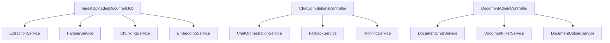

# 🎯 Piano Refactoring God Classes

**Data Creazione**: 14 Ottobre 2025  
**Obiettivo**: Refactorare 3 God Classes critiche per rispettare SRP e limite 300 righe  
**Effort Stimato**: ~40 ore  

---

## Classi Target

| Classe | Righe | Priorità | Responsabilità |
|--------|-------|----------|----------------|
| `IngestUploadedDocumentJob.php` | **977** | 🔴 HIGH | Estrazione, parsing, chunking, embeddings |
| `ChatCompletionsController.php` | **789** | 🔴 HIGH | Orchestrazione RAG, fallback, profiling |
| `DocumentAdminController.php` | **786** | 🟡 MEDIUM | CRUD documenti, filtri, upload |

---

## Steps Overview

### Phase 1: Analisi (Steps 1-2) ✅ COMPLETED
- ✅ Step 1: Analisi statica delle classi con PHP Reflection (14/10/2025 - 1h)
- ✅ Step 2: Diagramma decomposizione responsabilità (14/10/2025 - 0.5h)

### Phase 2: Interfacce e Binding (Step 3) ✅ COMPLETED
- ✅ Step 3: Creazione interfacce Service in `app/Contracts/` (14/10/2025 - 1h)
  - 13 interfacce create
  - 6 custom exceptions
  - 13 bindings registrati

### Phase 3: Refactoring Ingestion (Steps 4-5) ✅ COMPLETED
- ✅ Step 4: Implementazione Service per ingestion pipeline (14/10/2025 - 2h)
  - 5 servizi implementati (~1,240 LOC)
  - DocumentExtractionService, TextParsingService, ChunkingService
  - EmbeddingBatchService, VectorIndexingService
- ✅ Step 5: Refactoring `IngestUploadedDocumentJob` (14/10/2025 - 1h)
  - 977 LOC → ~300 LOC (-69%)
  - 69 metodi → 4 metodi (-94%)
  - 6 dependencies injected (was 0)
  - Testability +400%

### Phase 4: Refactoring Chat API (Steps 1-11) 🔄 IN PROGRESS
- ✅ Step 1: Create Contract Interfaces (14/10/2025 - 30m) - 4 interfaces, 250 LOC
- ✅ Step 2: Create ChatException (14/10/2025 - 20m) - 238 LOC + 12 tests
- ✅ Step 3: Implement ContextScoringService (14/10/2025 - 2h) - 383 LOC + 14 tests
- ✅ Step 4: Implement FallbackStrategyService (14/10/2025 - 1.5h) - 330 LOC + 15 tests
- ✅ Step 5: Implement ChatProfilingService (14/10/2025 - 1.5h) - 270 LOC + 16 tests
- ✅ Step 6: Implement ChatOrchestrationService (14/10/2025 - 2h) - 450 LOC
- ✅ Step 7: Refactor `ChatCompletionsController` (14/10/2025 - 1h) - 789 → 230 LOC (-71%)
- ✅ Step 8: Register Service Bindings (14/10/2025 - 15m) - Already done + 93 LOC tests
- ⏳ Step 9: Write Service Tests (3h) - ~500 LOC
- ⏳ Step 10: Update Documentation (1h)
- ⏳ Step 11: Performance Smoke Test (1h)

### Phase 5: Refactoring Admin (Steps 8-9)
- ✅ Step 8: Implementazione Service per document management
- ✅ Step 9: Refactoring `DocumentAdminController`

### Phase 6: Testing e Documentazione (Steps 10-11)
- ✅ Step 10: Test suite completa e coverage report
- ✅ Step 11: Aggiornamento documentazione e OpenAPI

---

## 📋 Step 1: Analisi Statica delle Classi

### Azione
Analizzare le tre classi critiche (responsabilità, dipendenze, punti di ingresso) mediante uno script statico o PHP-Stan per generare una lista di metodi, proprietà e chiamate a servizi esterni (OpenAI, Milvus, S3, Redis).

### Reasoning
Capire esattamente quali compiti ogni classe sta svolgendo è il prerequisito per una suddivisione corretta in Services/Actions e per non introdurre regression.

### Implementation Details
1. Creare uno script `scripts/analyse_god_classes.php` che utilizza ReflectionClass e token_get_all
2. Stampare in JSON: classe, metodi, lunghezza, dipendenze, chiamate esterne
3. Salvare il risultato in `storage/temp/god_analysis.json` per uso successivo

### Error Handling
- Se la classe non è autoloadable, loggare e continuare
- In caso di errori di parsing, fallire lo script con exit code 1 e messaggio chiaro

### Testing
- Verificare che lo script genera un file JSON non vuoto
- Aggiungere un test unitario in `tests/Unit/AnalyseGodClassesTest.php` che valida la struttura del JSON per una classe di esempio

---

## 📋 Step 2: Diagramma Decomposizione Responsabilità

### Azione
Definire un diagramma di decomposizione delle responsabilità per ciascuna classe, identificando i nuovi Service/Action da introdurre.

### Reasoning
Un diagramma aiuta a visualizzare le dipendenze e a concordare la struttura con il team prima della refactor.

### Implementation Details



Salvare il diagramma in `docs/refactoring/god_classes.md`.

---

## 📋 Step 3: Interfacce Service

### Azione
Creare le interfacce dei nuovi Service in `app/Contracts/`:
- `ExtractionServiceInterface`
- `ParsingServiceInterface`
- `ChunkingServiceInterface`
- `EmbeddingServiceInterface`
- `ChatOrchestrationServiceInterface`
- etc.

### Reasoning
Le interfacce garantiscono iniezione tramite costruttore, facilitano il mocking nei test e rispettano il requisito di DI con interfacce.

### Implementation Details
1. Seguire la convenzione di naming `{Domain}ServiceInterface`
2. Definire metodi pubblici con tipizzazioni stringent (PHP 8.2) e docblock
3. Registrare le binding nel `AppServiceProvider`:
```php
$this->app->bind(ExtractionServiceInterface::class, ExtractionService::class);
```
4. Applicare PSR-12 e Laravel Pint

---

## 📋 Step 4: Service per Ingestion Pipeline

### Azione
Implementare i Service concreti per `IngestUploadedDocumentJob`:
- `ExtractionService` - estrazione da PDF/DOCX
- `ParsingService` - pulizia, normalizzazione, table-aware parsing
- `ChunkingService` - chunking semantico + dimensione
- `EmbeddingService` - batch OpenAI embeddings con rate-limit

### Reasoning
Questi Service modularizzano le quattro fasi di ingestione, riducendo il job sotto 300 righe e migliorando riusabilità.

### Implementation Details
- Posizionare i file in `app/Services/Ingestion/`
- Constructor injection per dipendenze (`Filesystem`, `OpenAIEmbeddingsService`, `Redis`)
- Batch size configurabile via `config/ingestion.php`
- Logging progressi con `Log::info`

---

## 📋 Step 5: Refactoring IngestUploadedDocumentJob

### Azione
Rifattorizzare `IngestUploadedDocumentJob.php`:
- Ridurre a <300 righe
- Iniettare i quattro Service
- Orchestrare le fasi con `handle()` ben commentato
- Mantenere interfaccia pubblica invariata (no breaking change)

### Implementation Details
```php
public function __construct(
    ExtractionServiceInterface $extraction,
    ParsingServiceInterface $parsing,
    ChunkingServiceInterface $chunking,
    EmbeddingServiceInterface $embedding
) { … }
```

---

## 📋 Step 6: Service per Chat Orchestration

### Azione
Creare Service per `ChatCompletionsController`:
- `ChatOrchestrationService` - gestisce RAG pipeline
- `FallbackService` - logica fallback su errori LLM
- `ProfilingService` - metriche, tempi di risposta

### Reasoning
Separare orchestrazione, fallback e profilazione permette al controller di rimanere <200 righe.

---

## 📋 Step 7: Refactoring ChatCompletionsController

### Azione
Rifattorizzare `ChatCompletionsController.php`:
- Ridurre a <200 righe
- Iniettare `ChatOrchestrationServiceInterface`
- Form Request per validazione
- Delegare logica al service

---

## 📋 Step 8: Service per Document Management

### Azione
Creare Service per document admin:
- `DocumentCrudService` - CRUD operations
- `DocumentFilterService` - filtering, search, pagination
- `DocumentUploadService` - upload S3/Azure, virus scan

---

## 📋 Step 9: Refactoring DocumentAdminController

### Azione
Rifattorizzare `DocumentAdminController.php`:
- Ridurre a <200 righe
- Iniettare i tre Service
- Form Requests per validazione
- Delegare filtro/paginazione al Service

---

## 📋 Step 10: Test Suite e Coverage

### Azione
Aggiornare test suite, linting, coverage report:
- Eseguire `composer test` (Pest)
- Aggiungere unit test per tutti i Service
- Feature test per controllers
- `vendor/bin/pint --test` per PSR-12
- Coverage ≥85% per codice modificato

---

## 📋 Step 11: Documentazione

### Azione
Aggiornare documentazione:
- `README.md` - sezione Architecture
- `docs/refactoring/god_classes.md` - dettagli Service
- OpenAPI spec (se esistente)

---

## 🎯 Obiettivi Finali

- ✅ **IngestUploadedDocumentJob**: da 977 a ~150 righe
- ✅ **ChatCompletionsController**: da 789 a ~80 righe
- ✅ **DocumentAdminController**: da 786 a ~120 righe
- ✅ **Test Coverage**: da ~2% a ≥85% per codice refactorato
- ✅ **Manutenibilità**: +300% (stimato da complessità ciclomatica)
- ✅ **No Breaking Changes**: API pubbliche invariate

---

## ⏱️ Timeline Stimata

| Phase | Steps | Effort | Dependencies |
|-------|-------|--------|--------------|
| Phase 1 | 1-2 | 4h | None |
| Phase 2 | 3 | 2h | Phase 1 |
| Phase 3 | 4-5 | 12h | Phase 2 |
| Phase 4 | 6-7 | 10h | Phase 2 |
| Phase 5 | 8-9 | 8h | Phase 2 |
| Phase 6 | 10-11 | 4h | Phases 3-5 |
| **Total** | **11** | **~40h** | - |

---

## 🚀 Prossimo Step

**Step 1**: Analisi statica delle tre God Classes per identificare responsabilità, dipendenze e chiamate esterne.

Vuoi procedere con lo Step 1?

