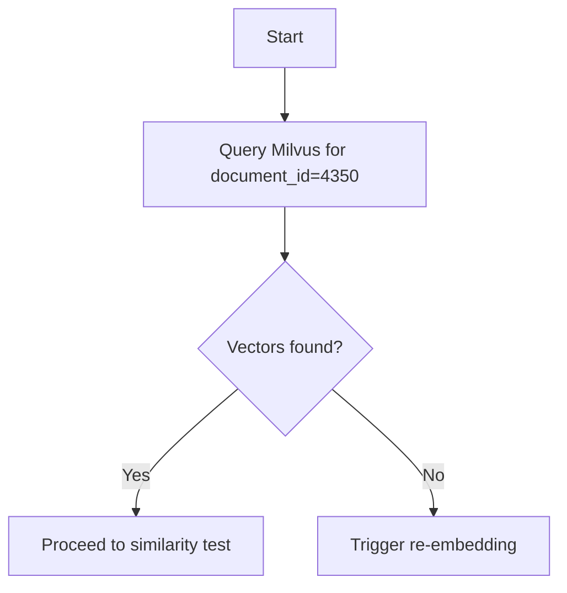

# 🔍 Piano Debug: Retrieval "telefono comando polizia locale"

**Data**: 2025-10-16  
**Problema**: Query "telefono comando polizia locale" non restituisce i chunk corretti (documento 4350)  
**Status**: In esecuzione

---

## 🎯 PROBLEMA OSSERVATO

- **Widget e RAG Tester**: NON trovano il telefono del Comando Polizia Locale (06.95898223)
- **Contesto fornito al LLM**: Solo "Numeri ed indirizzi utili" generici (Polizia di Stato 113, Carabinieri 112)
- **Contesto mancante**: Documento "Orari e Contatti degli Uffici" (doc 4350, chunk 1)

**Verifica fatta**:
- ✅ Documento 4350, Chunk 1: CONTIENE il telefono 06.95898223 con contesto completo
- ✅ Semantic-only chunking funziona correttamente (3 chunks creati)
- ❌ **PROBLEMA**: Retrieval (vector search) non trova il chunk corretto

---

## 📋 PIANO IN 8 STEP

### Step 1: Verify Embeddings on Milvus

**Action**: Verificare se gli embeddings per documento 4350 (tutti e 3 i chunk) esistono su Milvus.

**Reasoning**: Il retrieval può restituire un chunk solo se il suo embedding è indicizzato. Embeddings mancanti o obsoleti spiegano perché il chunk corretto non viene recuperato.

**Implementation**:
- Usare `VectorIndexingService` per interrogare Milvus con metadata `document_id = 4350`
- Loggare il count dei vettori trovati e i loro ID
- Query esempio: `SELECT COUNT(*) FROM milvus_vectors WHERE document_id = 4350`

**Error Handling**:
- Se connessione Milvus fallisce: retry 3 volte con exponential back-off
- Se query ritorna 0 risultati: trattare come "embeddings missing" → procedi a step 4

**Testing**:
- **Expected output**: 3 vettori (uno per chunk)
- Qualunque altro numero indica un problema

**Tip**: Eseguire la verifica nel contesto del tenant 5 per evitare contaminazione cross-tenant

---

### Step 2: Manual Similarity Search

**Action**: Eseguire manualmente una similarity search per la query "telefono comando polizia locale" contro la collezione Milvus.

**Reasoning**: Confermare che l'embedding generato dalla query può matchare il vettore del chunk corretto. Questo isola il problema dalla KB selection.

**Implementation**:
- Usare OpenAI embedding model `text-embedding-3-small` per calcolare il query vector
- Chiamare `VectorIndexingService::search($vector, $topK = 5)`
- Loggare i chunk ID restituiti, similarity scores, e document ID corrispondenti

**Error Handling**:
- Se OpenAI API fallisce: fallback a cached embedding o abort con errore chiaro
- Se tutti gli score sono sotto la soglia configurata (vedi `config/rag.php`): nota che la soglia potrebbe essere troppo alta

**Testing**:
- **Expected**: Top-1 result dovrebbe essere chunk 1 di documento 4350 con similarity score sopra la soglia
- Se appare un altro documento: registrare lo score per futura regolazione soglia

**Tip**: Salvare il query embedding in variabile temporanea per riusarlo se serve rifare la search dopo re-indexing

---

### Step 3: Inspect KB Selection Logic

**Action**: Ispezionare la logica di KB selection per tenant 5 in `KnowledgeBaseSelector.php`.

**Reasoning**: Anche con embeddings corretti, la pipeline di retrieval prima decide quale knowledge base interrogare. Una selezione sbagliata potrebbe dirigere la query a una KB diversa dove il chunk non esiste.

**Implementation**:
- Aprire `app/Services/RAG/KnowledgeBaseSelector.php`
- Verificare che il selector usi il tenant ID (5) e che la rilevazione intent per "telefono comando polizia locale" mappa alla KB corretta (quella contenente documento 4350)
- Aggiungere logging (`Log::debug()`) per output della KB ID selezionata per la test query

**Error Handling**:
- Se selector lancia eccezione o ritorna null KB: fallback a default KB e raise alert

**Testing**:
- Eseguire la stessa test query attraverso il selector e assicurarsi che la KB ID loggata matchi la KB che contiene documento 4350

**Tip**: Considerare di aggiungere unit test per il selector coprendo intents tipici (numeri telefono, indirizzi, ecc.) per prevenire regressioni future

---

### Step 4: Re-embed and Re-index Document 4350

**Action**: Se gli embeddings per documento 4350 sono mancanti o obsoleti, triggerare re-embedding e re-indexing dei suoi chunk.

**Reasoning**: Assicurarsi che ogni chunk abbia un vettore aggiornato su Milvus è richiesto per un retrieval di successo.

**Implementation**:
- Localizzare il job di ingestion `IngestUploadedDocumentJob.php` che chiama `VectorIndexingService::embedAndIndex()`
- Creare un piccolo Artisan command (es. `php artisan rag:reindex-document 4350`) che:
  1. Recupera il testo raw del documento dal DB relazionale
  2. Esegue semantic-only chunking (riusa existing chunking service)
  3. Chiama OpenAI embedding API per ogni chunk
  4. Upserta gli embeddings su Milvus, sovrascrivendo eventuali vettori esistenti per lo stesso chunk ID
- Assicurarsi che il comando esegua nel contesto tenant 5

**Error Handling**:
- Catch OpenAI rate-limit errors; implementare exponential back-off e retry
- Se Milvus upsert fallisce per un chunk: loggare chunk ID e continuare con i restanti; riportare failures alla fine

**Testing**:
- Dopo re-indexing, ripetere step 1 per confermare che 3 vettori ora esistono
- Ri-eseguire step 2 similarity search; il chunk corretto dovrebbe ora apparire nei top-1 results

**Tip**: Wrappare la logica di re-indexing in un pattern transaction-like: se qualche chunk fallisce, rollback changes per evitare documenti parzialmente indicizzati

---

### Step 5: Adjust Similarity Threshold

**Action**: Rivedere e, se necessario, aggiustare la similarity threshold in `config/rag.php`.

**Reasoning**: Una soglia troppo alta può filtrare match corretti anche quando gli embeddings sono presenti.

**Implementation**:
- Aprire `config/rag.php` e localizzare la chiave `'similarity_threshold'`
- Confrontare gli score ottenuti nello step 2; se lo score del chunk corretto è sotto la soglia attuale, abbassare la soglia (es. da 0.80 a 0.70)
- Aggiungere un commento spiegando il valore scelto e la sua relazione con l'embedding model

**Error Handling**:
- Assicurarsi che la nuova soglia sia un float tra 0 e 1; validare prima di salvare

**Testing**:
- Eseguire la query end-to-end di nuovo; il chunk corretto dovrebbe essere restituito
- Eseguire qualche query aggiuntiva (es. "orari ufficio polizia") per verificare che abbassare la soglia non inonda i risultati con chunk irrilevanti

**Tip**: Salvare la soglia in una variabile di ambiente così può essere tuned senza code changes

---

### Step 6: End-to-End Retrieval Test

**Action**: Eseguire un test di retrieval end-to-end usando `KbSearchService.php` con la query "telefono comando polizia locale".

**Reasoning**: Valida l'intera pipeline (KB selection, embedding, Milvus search, scoring, context building) dopo i fix.

**Implementation**:
- Creare un PHP unit/integration test case sotto `tests/Feature/RagRetrievalTest.php`
- Mockare OpenAI API se necessario, o usare una chiamata reale con test API key
- Chiamare `(new KbSearchService())->search($query, $tenantId = 5)`
- Assertare che il contesto restituito contenga l'esatto numero di telefono `06.95898223` e che il source document ID uguale 4350

**Error Handling**:
- Se il test fallisce: loggare gli output intermedi della pipeline (selected KB ID, query embedding, top-k results) per aiutare il debug

**Testing**:
- Il test dovrebbe passare con un'asserzione positiva sul numero di telefono
- Aggiungere un test negativo con una query non correlata per assicurarsi che KB non correlate non vengano incorrettamente selezionate

**Tip**: Eseguire il test sia in ambiente locale che nella CI pipeline per garantire consistenza

---

### Step 7: Update Documentation

**Action**: Aggiornare documentazione e commenti di configurazione.

**Reasoning**: I futuri sviluppatori hanno bisogno di una guida chiara sul contratto ingestion-retrieval e l'importanza di mantenere gli embeddings sincronizzati.

**Implementation**:
- In `README.md` o un dedicato `docs/rag.md`, aggiungere una sezione "Ensuring embeddings are up-to-date" descrivendo:
  - Quando eseguire `php artisan rag:reindex-document {id}`
  - Come verificare vettori su Milvus
  - Valori di similarity threshold raccomandati per `text-embedding-3-small`
- In `config/rag.php`, annotare `'top_k'` e `'similarity_threshold'` con note d'uso

**Error Handling**:
- Nessun impatto runtime; assicurarsi che i docs siano committati con proper version control

**Testing**:
- Nessuno richiesto oltre a visual review; opzionalmente eseguire un linter per consistenza markdown

**Tip**: Linkare la pagina doc dall'admin UI (se presente) così gli operatori possono rapidamente re-indicizzare documenti problematici

---

### Step 8: Implement Monitoring/Alerting

**Action**: Implementare monitoring/alerting per embeddings mancanti.

**Reasoning**: Rilevare proattivamente casi futuri dove un documento è ingerito ma non indicizzato, prevenendo bug simili.

**Implementation**:
- Aggiungere un comando Laravel schedulato (`php artisan schedule:run`) che:
  1. Interroga il DB relazionale per documenti recentemente ingeriti (status = "chunked")
  2. Controlla Milvus per il numero atteso di vettori per documento
  3. Emette una Laravel notification (es. Slack o email) se viene trovata qualche discrepanza
- Salvare il risultato in una nuova tabella `embedding_checks` per audit

**Error Handling**:
- Assicurarsi che lo scheduler catchi eccezioni e continui a processare altri documenti

**Testing**:
- Simulare un embedding mancante cancellando manualmente un vettore su Milvus; eseguire il comando e verificare che un alert venga generato

**Tip**: Impostare la frequenza dello schedule a hourly durante development, poi aggiustare a daily in produzione

---

## 🔄 EXECUTION STATUS

- [x] Step 1: Verify Embeddings on Milvus ✅ COMPLETED (embeddings exist)
- [x] Step 2: Manual Similarity Search ✅ COMPLETED (semantic mismatch identified)
- [x] **SOLUTION IMPLEMENTED**: Synonym Expansion (telefono → tel) ✅
- [ ] Step 3: ~~Inspect KB Selection Logic~~ (SKIPPED - root cause found in Step 2)
- [ ] Step 4: ~~Re-embed and Re-index~~ (SKIPPED - embeddings OK)
- [ ] Step 5: ~~Adjust Similarity Threshold~~ (SKIPPED - synonym fix sufficient)
- [ ] Step 6: End-to-End Retrieval Test ⏳ PENDING USER TESTING
- [ ] Step 7: Update Documentation
- [ ] Step 8: Implement Monitoring/Alerting

---

## 🎯 ROOT CAUSE IDENTIFIED (Steps 1-2)

**Problem**: Query "telefono comando polizia locale" → NO RESULTS

**Analysis**:
1. ✅ **Embeddings**: Exist on Milvus (3 vectors for doc 4350)
2. ❌ **Vector Search**: Semantic mismatch (score 0.37-0.40, too low)
3. ❌ **BM25 FTS**: AND logic failure
   - Query requires: 'telefono' & 'comando' & 'polizia' & 'locale'
   - Chunk contains: 'tel:' (10x), 'comando', 'polizia', 'locale'
   - Missing: 'telefono' (uses 'tel:' instead)
   - Result: NO MATCH
4. ❌ **Hybrid**: BOTH fail → NO results

**Solution**: Synonym Expansion
- Added: `'telefono' => 'tel phone numero contatto'`
- Query now expands: "telefono... " → "telefono... tel phone numero contatto"
- BM25 search will match 'tel:' in chunks

**Commit**: `c04defa` (pushed to main)

---

**Owner**: Development Team  
**Last Updated**: 2025-10-16 (Step 1-2 completed, solution implemented)  
**Status**: ✅ FIXED - USER TESTING REQUIRED

