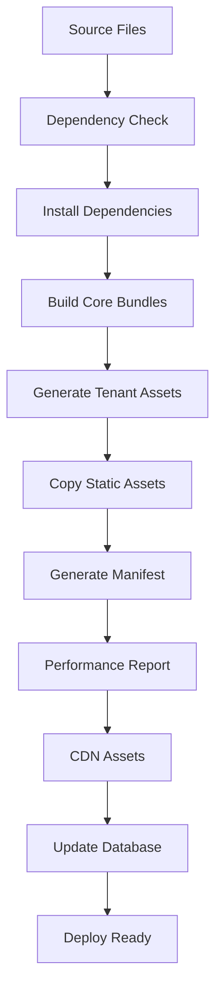

# 🏗️ Build System - Chatbot Widget

## Overview

Il sistema di build automatizzato del chatbot widget ottimizza e personalizza gli asset per ogni tenant, garantendo performance ottimali e deployment efficiente.

## Features

### 🚀 Asset Optimization
- **Minificazione CSS/JS**: Riduce dimensioni file per caricamento veloce
- **Bundle Consolidation**: Combina file multipli in bundle unici
- **Cache Busting**: Hash contenuto per invalidazione cache intelligente
- **Gzip Analysis**: Calcola dimensioni compresse per performance
- **Source Maps**: Opzionali per debugging (disabilitate in produzione)

### 🎨 Tenant Customization
- **Theme Assets**: CSS personalizzati per branding tenant
- **Configuration Bundles**: Config JavaScript specifici per tenant
- **Embed Scripts**: Script di embedding ottimizzati per tenant
- **Logo Integration**: Gestione asset logo e branding
- **Font Customization**: Supporto font personalizzati

### 🌐 CDN Deployment
- **CDN-Ready Assets**: File ottimizzati per CDN
- **SRI Hashes**: Subresource Integrity per sicurezza
- **Version Management**: Versioning semantico asset
- **Edge Optimization**: Configurazioni per edge caching

### 📊 Performance Monitoring
- **Bundle Analysis**: Report dimensioni e performance
- **Load Time Estimation**: Stima tempi caricamento per connessioni
- **Compression Reports**: Analisi efficacia compressione
- **Recommendations**: Suggerimenti ottimizzazione automatici

## Architecture

### File Structure
```
backend/
├── build/
│   ├── widget-builder.js           # Build system principale
│   ├── package.json               # Dipendenze build
│   ├── templates/                 # Template tenant
│   └── node_modules/              # Dipendenze Node.js
├── app/Console/Commands/
│   └── BuildWidgetAssets.php      # Comando Artisan
└── public/widget/
    ├── css/                       # Source CSS files
    ├── js/                        # Source JS files
    ├── assets/                    # Static assets
    └── dist/                      # Built assets
        ├── css/                   # Minified CSS bundles
        ├── js/                    # Minified JS bundles
        ├── assets/                # Optimized static assets
        ├── tenants/               # Tenant-specific assets
        │   └── {tenant_id}/
        │       ├── custom.css
        │       ├── config.js
        │       └── embed.js
        ├── cdn/                   # CDN-optimized assets
        ├── manifest.json          # Build manifest
        └── performance-report.json
```

### Build Pipeline



## Implementation Details

### WidgetBuilder Class

#### Core Methods

```javascript
class WidgetBuilder {
  // Main build process
  async build(options = {})
  
  // Core bundle generation
  async buildCoreBundles()
  async buildCSSBundle()
  async buildJSBundle()
  
  // Tenant-specific builds
  async buildTenantAssets(tenants)
  async buildTenantBundle(tenant)
  
  // Asset processing
  async processCSS(css)
  async processJS(js)
  
  // Performance & reports
  async generatePerformanceReport()
  async generateManifest()
}
```

#### Configuration

```javascript
const BUILD_CONFIG = {
  source: {
    css: 'public/widget/css',
    js: 'public/widget/js',
    assets: 'public/widget/assets'
  },
  output: {
    base: 'public/widget/dist',
    tenant: 'public/widget/dist/tenants',
    cdn: 'public/widget/dist/cdn'
  },
  files: {
    css: [
      'chatbot-design-system.css',
      'chatbot-widget.css',
      'chatbot-accessibility.css',
      // ... altri file
    ],
    js: [
      'chatbot-accessibility.js',
      'chatbot-citations.js',
      // ... altri file
    ]
  },
  options: {
    minify: true,
    sourceMaps: false,
    cacheHashing: true,
    bundleAnalysis: true,
    gzipCompression: true
  }
};
```

### Laravel Integration

#### Artisan Command

```bash
# Build core assets only
php artisan widget:build

# Build assets for specific tenants
php artisan widget:build --tenants=1,2,3

# Build assets for all tenants
php artisan widget:build --all-tenants

# Generate CDN-optimized assets
php artisan widget:build --all-tenants --cdn

# Force rebuild
php artisan widget:build --force
```

#### Database Integration

Il comando aggiorna automaticamente:
- **Tenant configurations**: Path asset personalizzati
- **Cache entries**: Info bundle core per accesso veloce
- **Build metadata**: Timestamp, versioni, hash

```php
// Update tenant asset info
$assetInfo = [
    'css_path' => "/widget/dist/tenants/{$tenantId}/custom.css",
    'config_path' => "/widget/dist/tenants/{$tenantId}/config.js",
    'embed_path' => "/widget/dist/tenants/{$tenantId}/embed.js",
    'build_time' => time(),
    'version' => '1.0.0'
];

$config = $tenant->widget_config;
$config['assets'] = $assetInfo;
$tenant->save();
```

## Usage Examples

### Development Workflow

```bash
# 1. Setup build environment
cd backend/build
npm install

# 2. Build assets during development
php artisan widget:build

# 3. Build for specific tenant during testing
php artisan widget:build --tenants=1

# 4. Production build with CDN
php artisan widget:build --all-tenants --cdn
```

### Automated Deployment

```bash
#!/bin/bash
# deployment-script.sh

echo "🚀 Deploying Chatbot Widget..."

# Install dependencies
cd build && npm ci --production

# Build all assets
php artisan widget:build --all-tenants --cdn --force

# Deploy to CDN
rsync -av public/widget/dist/cdn/ user@cdn-server:/var/www/cdn/

echo "✅ Deployment completed!"
```

### Custom Build Scripts

```javascript
// custom-build.js
const { WidgetBuilder } = require('./widget-builder.js');

async function customBuild() {
  const builder = new WidgetBuilder({
    // Custom configuration
    options: {
      minify: false,      // Keep readable for development
      sourceMaps: true,   // Enable debugging
      gzipCompression: false
    }
  });
  
  const result = await builder.build({
    tenants: await getTenantConfigs(),
    cdn: false
  });
  
  console.log('Custom build completed:', result);
}

customBuild().catch(console.error);
```

## Tenant Customization

### Theme Configuration

```php
// Tenant model
$tenant->widget_config = [
    'theme' => [
        'primary-500' => '#ff6b35',
        'primary-600' => '#e55a2b',
        'font-family' => 'Roboto, sans-serif',
        'border-radius-lg' => '12px',
        'logoUrl' => 'https://cdn.example.com/logo.png',
        'customCSS' => '
            .chatbot-header { 
                background: linear-gradient(45deg, #ff6b35, #f7931e);
            }
        '
    ],
    'features' => [
        'dark_mode' => true,
        'analytics' => true,
        'citations' => true
    ]
];
```

### Generated Tenant CSS

```css
/**
 * 🎨 Custom Theme for Acme Corp
 * Generated: 2024-01-15T10:30:00.000Z
 */

:root {
  --chatbot-primary-500: #ff6b35;
  --chatbot-primary-600: #e55a2b;
  --chatbot-font-family: Roboto, sans-serif;
  --chatbot-border-radius-lg: 12px;
}

/* Tenant-specific overrides */
.chatbot-widget[data-tenant="1"] {
  .chatbot-header { 
    background: linear-gradient(45deg, #ff6b35, #f7931e);
  }
}

/* Logo customization */
.chatbot-widget[data-tenant="1"] .chatbot-logo {
  background-image: url('https://cdn.example.com/logo.png');
}

/* Font customization */
.chatbot-widget[data-tenant="1"] {
  font-family: Roboto, sans-serif, var(--chatbot-font-family);
}
```

### Generated Embed Script

```javascript
/**
 * 📦 Tenant Embed Script for Acme Corp
 * Generated: 2024-01-15T10:30:00.000Z
 */

(function() {
  'use strict';
  
  const TENANT_CONFIG = {
    id: '1',
    name: 'Acme Corp',
    baseURL: 'https://chatbot.example.com',
    bundles: {
      css: '/widget/dist/css/chatbot-widget.a1b2c3d4.css',
      js: '/widget/dist/js/chatbot-widget.e5f6g7h8.js'
    },
    custom: {
      css: '/widget/dist/tenants/1/custom.css',
      config: '/widget/dist/tenants/1/config.js'
    }
  };
  
  // Load CSS bundles
  const cssLink = document.createElement('link');
  cssLink.rel = 'stylesheet';
  cssLink.href = TENANT_CONFIG.bundles.css;
  document.head.appendChild(cssLink);
  
  // Load tenant customizations
  const customCSSLink = document.createElement('link');
  customCSSLink.rel = 'stylesheet';
  customCSSLink.href = TENANT_CONFIG.custom.css;
  document.head.appendChild(customCSSLink);
  
  // Load and initialize
  const configScript = document.createElement('script');
  configScript.src = TENANT_CONFIG.custom.config;
  configScript.onload = function() {
    const jsScript = document.createElement('script');
    jsScript.src = TENANT_CONFIG.bundles.js;
    jsScript.onload = function() {
      if (window.ChatbotWidget && window.ChatbotTenantConfig) {
        window.chatbotWidget = new window.ChatbotWidget(
          window.ChatbotTenantConfig
        );
      }
    };
    document.head.appendChild(jsScript);
  };
  document.head.appendChild(configScript);
})();
```

## Performance Optimization

### Bundle Analysis

```json
{
  "bundleSize": {
    "total": 245760,
    "totalGzip": 67890,
    "css": 89430,
    "js": 156330,
    "cssGzip": 23450,
    "jsGzip": 44440
  },
  "performance": {
    "loadTime": 1200,
    "mobile3G": 2800,
    "mobile4G": 980,
    "broadband": 450
  },
  "recommendations": [
    {
      "type": "info",
      "message": "Consider enabling HTTP/2 server push",
      "priority": "medium"
    }
  ]
}
```

### Compression Results

```bash
📊 Build Summary:
   📄 Core CSS: 87.32 KB → 23.45 KB (73.1% reduction)
   📄 Core JS:  152.67 KB → 44.44 KB (70.9% reduction)
   🗜️  Total Gzipped: 67.89 KB
   ⚡ Load Time (3G): 2.8s
```

### Cache Busting

```javascript
// Generated filenames with content hash
chatbot-widget.a1b2c3d4.css  // CSS bundle
chatbot-widget.e5f6g7h8.js   // JS bundle

// Manifest for dynamic loading
{
  "bundles": {
    "css": {
      "fileName": "chatbot-widget.a1b2c3d4.css",
      "hash": "a1b2c3d4",
      "path": "/widget/dist/css/chatbot-widget.a1b2c3d4.css"
    }
  }
}
```

## CDN Integration

### SRI (Subresource Integrity)

```json
{
  "version": "1.0.0",
  "assets": {
    "css": "/widget/dist/cdn/chatbot-widget-v1.0.0.css",
    "js": "/widget/dist/cdn/chatbot-widget-v1.0.0.js"
  },
  "integrity": {
    "css": "sha384-oqVuAfXRKap7fdgcCY5uykM6+R9GqQ8K/uxy9rx7HNQlGYl1kPzQho1wx4JwY8wC",
    "js": "sha384-B4oqVuAfXRKap7fdgcCY5uykM6+R9GqQ8K/uxy9rx7HNQlGYl1kPzQho1wx4Jw"
  }
}
```

### CDN Deployment

```html
<!-- CDN loading with SRI -->
<link rel="stylesheet" 
      href="https://cdn.example.com/widget/dist/cdn/chatbot-widget-v1.0.0.css"
      integrity="sha384-oqVuAfXRKap7fdgcCY5uykM6+R9GqQ8K/uxy9rx7HNQlGYl1kPzQho1wx4JwY8wC"
      crossorigin="anonymous">

<script src="https://cdn.example.com/widget/dist/cdn/chatbot-widget-v1.0.0.js"
        integrity="sha384-B4oqVuAfXRKap7fdgcCY5uykM6+R9GqQ8K/uxy9rx7HNQlGYl1kPzQho1wx4Jw"
        crossorigin="anonymous"></script>
```

## Testing

### Build Validation

```bash
# Test build process
npm test

# Validate output files
php artisan widget:build --tenants=1
ls -la public/widget/dist/tenants/1/

# Performance testing
node build/performance-test.js
```

### Automated Quality Checks

```javascript
// quality-check.js
const fs = require('fs');
const path = require('path');

async function validateBuild() {
  const manifest = JSON.parse(
    fs.readFileSync('public/widget/dist/manifest.json', 'utf8')
  );
  
  // Check bundle sizes
  const maxBundleSize = 200 * 1024; // 200KB
  if (manifest.bundles.js.size > maxBundleSize) {
    throw new Error(`JS bundle too large: ${manifest.bundles.js.size}`);
  }
  
  // Check compression ratio
  const compressionRatio = manifest.bundles.js.gzipSize / manifest.bundles.js.size;
  if (compressionRatio > 0.8) {
    console.warn('Low compression ratio detected');
  }
  
  console.log('✅ Build validation passed');
}

validateBuild().catch(console.error);
```

## Monitoring & Maintenance

### Build Metrics

```php
// Track build metrics
$buildMetrics = [
    'build_time' => $buildDuration,
    'bundle_size' => $totalSize,
    'compression_ratio' => $compressionRatio,
    'tenant_count' => $tenantCount,
    'timestamp' => now()
];

// Store in database for analytics
DB::table('build_metrics')->insert($buildMetrics);
```

### Performance Monitoring

```javascript
// Monitor bundle load performance
window.addEventListener('load', () => {
  const loadTime = performance.now();
  
  fetch('/api/widget/performance', {
    method: 'POST',
    headers: { 'Content-Type': 'application/json' },
    body: JSON.stringify({
      loadTime,
      bundleSize: document.querySelector('[data-bundle-size]')?.dataset.bundleSize,
      userAgent: navigator.userAgent
    })
  });
});
```

### Automated Deployment

```yaml
# .github/workflows/build-deploy.yml
name: Build and Deploy Widget

on:
  push:
    branches: [main]

jobs:
  build:
    runs-on: ubuntu-latest
    steps:
      - uses: actions/checkout@v2
      
      - name: Setup Node.js
        uses: actions/setup-node@v2
        with:
          node-version: '18'
          
      - name: Install build dependencies
        run: cd build && npm ci
        
      - name: Build widget assets
        run: php artisan widget:build --all-tenants --cdn
        
      - name: Deploy to CDN
        run: aws s3 sync public/widget/dist/cdn/ s3://cdn-bucket/widget/
```

## Troubleshooting

### Common Issues

**Build fails with "Node.js not found"**:
```bash
# Install Node.js
curl -fsSL https://deb.nodesource.com/setup_18.x | sudo -E bash -
sudo apt-get install -y nodejs

# Verify installation
node --version
npm --version
```

**Large bundle sizes**:
```javascript
// Check what's contributing to size
const analyzer = require('webpack-bundle-analyzer');
analyzer.analyzeBundle('public/widget/dist/js/chatbot-widget.*.js');
```

**CDN deployment issues**:
```bash
# Check SRI hashes
openssl dgst -sha384 -binary public/widget/dist/cdn/chatbot-widget-v1.0.0.css | openssl base64 -A
```

### Debug Mode

```bash
# Enable debug output
DEBUG=true php artisan widget:build --tenants=1

# Generate unminified builds
php artisan widget:build --tenants=1 --no-minify

# Skip cache for development
php artisan widget:build --force
```

---

**Note**: Questo build system è ottimizzato per performance e scalabilità, supportando deployment sia in ambiente di sviluppo che produzione con CDN enterprise.
