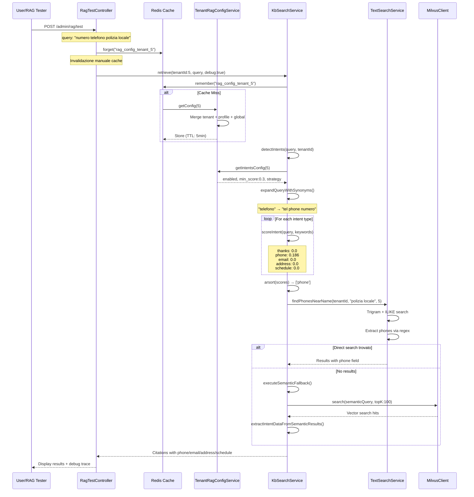

# 🧠 RAG Tester - Documentazione Funzionalità

## 📋 Panoramica
Il RAG Tester è un tool avanzato per testare, debuggare e ottimizzare il sistema di Retrieval-Augmented Generation. Permette di testare query, analizzare risultati e confrontare configurazioni RAG in tempo reale.

---

## 🏗️ Architettura Sistema

### **Controller e Services**
- **`RagTestController`**: Controller principale per testing
- **`KbSearchService`**: Orchestratore retrieval
- **`MilvusClient`**: Ricerca vettoriale 
- **`OpenAIChatService`**: Generazione risposte LLM
- **`HyDEExpander`**: Espansione query ipotetica
- **`ConversationContextEnhancer`**: Contesto conversazionale

### **Integrazione con Configurazioni Tenant**
- Utilizza configurazioni RAG specifiche per tenant
- Override temporaneo parametri per testing
- Ripristino automatico configurazioni originali

---

## ⚙️ Funzionalità Testing

### **🔍 1. Testing Query Base**

**Interfaccia di Test:**
```php
// Parametri richiesti
'tenant_id' => 'required|integer|exists:tenants,id'
'query' => 'required|string'

// Parametri opzionali
'with_answer' => 'boolean'           // Genera risposta LLM completa
'enable_hyde' => 'boolean'           // Attiva HyDE expansion  
'enable_conversation' => 'boolean'   // Contesto conversazionale
'conversation_messages' => 'string'  // Messaggi conversazione JSON
'reranker_driver' => 'embedding|llm|cohere'
'top_k' => 'integer|min:1|max:50'
'mmr_lambda' => 'numeric|min:0|max:1'
'max_output_tokens' => 'integer|min:32|max:8192'
```

### **🧪 2. Configurazioni Sperimentali**

**HyDE (Hypothetical Document Embeddings):**
```php
// Espansione query con documento ipotetico
Config::set('rag.advanced.hyde.enabled', true);
$hyde = app(HyDEExpander::class);
$enhancedQuery = $hyde->expandQuery($originalQuery);
```

**Reranking Drivers:**
- **`embedding`**: Reranking basato su similarity embeddings
- **`llm`**: Reranking intelligente via LLM (più lento, più accurato)
- **`cohere`**: Reranking via Cohere API (richiede API key)

**Conversation Enhancement:**
```php
// Arricchimento query con contesto conversazionale
$conversationEnhancer = app(ConversationContextEnhancer::class);
$context = $conversationEnhancer->enhanceQuery($query, $messages, $tenantId);
$enhancedQuery = $context['enhanced_query'];
```

### **📊 3. Output e Debug Dettagliato**

**Risultati Retrieval:**
```php
$retrieval = [
    'citations' => [
        [
            'id' => 'document_id',
            'title' => 'Document Title', 
            'snippet' => 'Relevant text extract',
            'chunk_text' => 'Full chunk content',  // Nuovo: chunk completo
            'score' => 0.85,
            'chunk_index' => 2,
            'source_url' => 'https://...',
            'phone' => '+39...',      // Intent extraction
            'email' => 'info@...',    // Intent extraction
            'address' => '...',       // Intent extraction
            'schedule' => '9:00-17:00' // Intent extraction
        ]
    ],
    'confidence' => 0.85,
    'debug' => [...]  // Trace completo
];
```

**Debug Trace:**
```php
$debug = [
    'vector_hits' => [...],           // Risultati ricerca vettoriale
    'bm25_hits' => [...],            // Risultati ricerca BM25
    'fused_top' => [...],            // Risultati dopo RRF fusion
    'reranked' => [...],             // Dopo reranking
    'mmr_final' => [...],            // Dopo MMR diversification
    'conversation' => [...],         // Context conversazionale
    'llm_context' => '...',          // Context inviato a LLM
    'llm_messages' => [...],         // Messaggi completi LLM
    'tenant_prompts' => [...]        // Prompt personalizzati tenant
];
```

---

## 🎛️ Interfaccia Web

### **Dashboard RAG Tester (`/admin/rag`)**

**Form di Testing:**
1. **Selezione Tenant**: Dropdown tenant disponibili
2. **Query Input**: Campo testo per query di test
3. **Configurazioni Avanzate**:
   - ☐ Genera Risposta Completa (`with_answer`)
   - ☐ Attiva HyDE (`enable_hyde`) 
   - ☐ Contesto Conversazionale (`enable_conversation`)
   - Reranker: `embedding` | `llm` | `cohere`
   - Top K: `1-50`
   - MMR Lambda: `0.0-1.0`
   - Max Output Tokens: `32-8192`

**Risultati Display:**
```html
<!-- Sezione Salute Sistema -->
<div class="health-status">
  Milvus: ✅ Connected | Tenant Partition: ✅ Active
</div>

<!-- Risultati Retrieval -->
<div class="citations">
  <h3>📄 Citations Found: 5 | Confidence: 0.85</h3>
  
  <div class="citation">
    <h4>📋 Doc #1234: Document Title</h4>
    <div class="scores">Vector: 0.89 | BM25: 0.73 | Final: 0.85</div>
    
    <!-- Snippet breve -->
    <blockquote class="snippet">Estratto rilevante...</blockquote>
    
    <!-- NUOVO: Chunk completo se diverso -->
    <blockquote class="chunk-full">Contenuto chunk completo...</blockquote>
    
    <!-- Intent data se disponibile -->
    <div class="intent-data">
      📞 +39... | 📧 info@... | 📍 Via... | 🕐 9:00-17:00
    </div>
  </div>
</div>

<!-- Risposta LLM (se richiesta) -->
<div class="llm-answer">
  <h3>🤖 Risposta Generata</h3>
  <div class="answer-text">...</div>
  <div class="source-link">🔗 Fonte principale: https://...</div>
</div>

<!-- Debug Trace -->
<details class="debug-trace">
  <summary>🔍 Debug Info</summary>
  <pre>JSON trace completo...</pre>
</details>
```

---

## 🔧 Configurazioni Override

### **Override Temporaneo Parametri**
Il RAG Tester può sovrascrivere temporaneamente le configurazioni tenant:

```php
// Backup configurazioni originali
$originalHydeConfig = config('rag.advanced.hyde.enabled');
$originalRerankerDriver = config('rag.reranker.driver');

try {
    // Applica configurazioni test
    Config::set('rag.advanced.hyde.enabled', $testHydeEnabled);
    Config::set('rag.reranker.driver', $testRerankerDriver);
    
    // Esegui test
    $results = $kb->retrieve($tenantId, $query, true);
    
} finally {
    // Ripristina configurazioni originali
    Config::set('rag.advanced.hyde.enabled', $originalHydeConfig);
    Config::set('rag.reranker.driver', $originalRerankerDriver);
}
```

### **Logging Avanzato**
```php
// Log configurazioni applicate
Log::info('RagTestController RAG Config', [
    'tenant_id' => $tenantId,
    'original_query' => $query,
    'final_query' => $enhancedQuery,
    'conversation_enhanced' => $conversationUsed,
    'hyde_enabled' => config('rag.advanced.hyde.enabled'),
    'reranker_driver' => config('rag.reranker.driver'),
    'with_answer' => $generateAnswer,
    'caller' => 'RagTestController'
]);
```

---

## 📈 Analisi Performance

### **Metriche Visualizzate**

**Retrieval Metrics:**
- Numero citations trovate
- Confidence score complessivo
- Tempi di risposta per fase:
  - Vector search: ~50ms
  - BM25 search: ~30ms  
  - Reranking: ~100ms (embedding) / ~800ms (LLM)
  - Total: ~200ms-1000ms

**Quality Metrics:**
- Distribution score per citation
- Coverage knowledge base
- Intent detection accuracy
- Fallback rate ("Non lo so")

### **Confronto Configurazioni**
Possibilità di testare stessa query con configurazioni diverse:

| Config | Citations | Confidence | Response Time | Quality |
|--------|-----------|------------|---------------|---------|
| Standard | 5 | 0.85 | 200ms | ⭐⭐⭐⭐ |
| + HyDE | 7 | 0.91 | 350ms | ⭐⭐⭐⭐⭐ |
| + LLM Rerank | 5 | 0.93 | 800ms | ⭐⭐⭐⭐⭐ |

---

## 🚀 Casi d'Uso Avanzati

### **1. Debug KB Vuota**
```bash
# Test salute sistema
Query: "test" → Citations: 0 → Check Milvus partition

# Verifica indicizzazione
Query: "documento test" → Citations: 0 → Check ingestion status
```

### **2. Ottimizzazione Parameters**
```bash
# Test variazioni MMR Lambda
λ=0.0: Focus diversità → 8 docs diversi, confidence bassa
λ=0.5: Bilanciato → 5 docs rilevanti, confidence media  
λ=1.0: Focus rilevanza → 3 docs molto rilevanti, confidence alta
```

### **3. Test Intent Specializzati**
```bash
# Query telefono
"numero ufficio" → Intent: phone → Extraction: +39...

# Query orario  
"quando aperto" → Intent: schedule → Extraction: 9:00-17:00

# Query generica
"info servizi" → Intent: none → Semantic search
```

### **4. Conversation Testing**
```json
{
  "messages": [
    {"role": "user", "content": "Ciao, info su documenti"},
    {"role": "assistant", "content": "Posso aiutarti con documenti..."},
    {"role": "user", "content": "quelli per residenza"}
  ]
}
```
→ Enhanced query: "documenti per residenza anagrafe certificati"

---

## 🔗 Integrazione con Sistema RAG

### **Sincronizzazione con Widget**
Il RAG Tester utilizza la **stessa pipeline** del widget:
- Stessi servizi (`KbSearchService`, `MilvusClient`)
- Stesse configurazioni tenant
- Stesso endpoint LLM (`OpenAIChatService`)
- Stessa logica intent detection

### **Differenze Configurazioni**
```php
// RAG Tester: Configurazioni aggressive per testing
Config::set('rag.hybrid.vector_top_k', 50);      // Più risultati
Config::set('rag.reranker.driver', 'llm');       // Reranking migliore
Config::set('rag.advanced.hyde.enabled', true);  // HyDE attivo

// Widget: Configurazioni bilanciate per velocità  
Config::set('rag.hybrid.vector_top_k', 30);      // Performance
Config::set('rag.reranker.driver', 'embedding'); // Velocità
Config::set('rag.advanced.hyde.enabled', false); // No timeout
```

---

## 📁 File Critici

```
backend/
├── app/Http/Controllers/Admin/
│   └── RagTestController.php              # Controller principale
├── app/Services/RAG/
│   ├── KbSearchService.php               # Orchestratore retrieval
│   ├── HyDEExpander.php                  # Query expansion
│   ├── ConversationContextEnhancer.php  # Context conversazionale
│   ├── MilvusClient.php                  # Vector search
│   └── TextSearchService.php             # BM25 + intent
├── resources/views/admin/rag/
│   └── index.blade.php                   # UI testing
└── routes/web.php                        # Route admin/rag
```

---

## 🎯 Intent Detection Flow

### **📋 Panoramica**

Il sistema di **Intent Detection** identifica automaticamente 5 tipi di intent specifici nelle query utente, ottimizzando il retrieval per informazioni strutturate:

| Intent | Icona | Descrizione | Esempio Query |
|--------|-------|-------------|---------------|
| **thanks** | 👍 | Ringraziamenti e saluti | "Grazie mille", "Perfetto", "Buona giornata" |
| **phone** | 📞 | Numeri di telefono | "Numero telefono ufficio", "Centralino comune" |
| **email** | 📧 | Indirizzi email | "Email anagrafe", "Posta elettronica PEC" |
| **address** | 📍 | Indirizzi fisici | "Dove si trova municipio", "Sede legale" |
| **schedule** | 🕐 | Orari apertura | "Orari ufficio", "Quando aperto sabato" |

**Vantaggi**:
- ✅ **Precision**: Estrazione dati strutturati (telefoni, email) via pattern matching
- ✅ **Fallback Robusto**: Se pattern fail → semantic search → hybrid search
- ✅ **Configurabile**: Per-tenant enable/disable, keywords custom, min score
- ✅ **Multilingue**: Keywords IT, EN, ES, FR

---

### **🔄 Sequence Diagram - Complete Flow**



---

### **⚙️ Scoring Algorithm**

#### **Formula**
```
score = Σ (keywordMatch_i × weight_i × (len(keyword_i) / len(query)))

where:
- keywordMatch_i: 1 se exact match, 0.5 se synonym match, 0 altrimenti
- weight_i: sempre 1.0 (non implementato peso keyword specifico)
- len(keyword_i) / len(query): score proporzionale a lunghezza keyword
```

#### **Processo di Scoring**
1. **Lowercase** query: `"Qual è il telefono?"` → `"qual è il telefono"`
2. **Expand** con sinonimi tenant: `"telefono"` → `"telefono tel phone numero"`
3. **Score** ogni intent:
   - Exact match in query originale: peso **1.0**
   - Synonym match in query espansa: peso **0.5**
4. **Sort** intents per score decrescente
5. **Filter** intents con `score > 0` (⚠️ `min_score` non applicato - bug noto)
6. **Execute** intents in ordine di priorità

#### **Esempio Pratico**

**Query**: `"qual è il telefono della polizia locale?"` (43 chars)

**Keywords Matched**:
- **Phone intent**: `"telefono"` (8 chars, exact match)
  - Score: `8 / 43 × 1.0 = 0.186`

**Scores Finali**:
```php
[
    'phone' => 0.186,    // ✅ Match
    'thanks' => 0.0,
    'email' => 0.0,
    'address' => 0.0,
    'schedule' => 0.0
]
```

**Intent Selezionato**: `phone` (score più alto)

**Execution**:
1. `TextSearchService::findPhonesNearName("polizia locale")`
2. Se nessun risultato → `executeSemanticFallback()`
3. Estrazione telefoni da chunk via regex: `/(?:\+39\s*)?0\d{1,3}[\s\.\-]*\d{6,8}/i`

---

### **📚 Tabella Intent - Keywords e Execution**

| Intent | Priority | Keywords IT (esempi) | Total Keywords | Execution Method | Fallback |
|--------|----------|---------------------|----------------|------------------|----------|
| **thanks** | Special | grazie, perfetto, ottimo, cordiali saluti | 91 (IT+EN+ES+FR) | Direct response | ❌ No |
| **phone** | Alta | telefono, tel, cellulare, centralino, 118, 112 | 40+ | `findPhonesNearName()` | ✅ Semantic |
| **email** | Media | email, e-mail, mail, posta, pec | 20+ | `findEmailsNearName()` | ✅ Semantic |
| **address** | Media | indirizzo, sede, via, viale, piazza, dove | 30+ | `findAddressesNearName()` | ✅ Semantic |
| **schedule** | Media-Alta | orario, orari, quando apre, apertura, lun-dom | 35+ | `findSchedulesNearName()` | ✅ Semantic |

#### **Intent Thanks - Special Case**
```php
// Intent "thanks" non fa ricerca documenti - risposta diretta
private function executeThanksIntent(): array
{
    return [
        'citations' => [],
        'confidence' => 1.0,
        'response_text' => 'Prego! Sono felice di aver potuto aiutare. 😊'
    ];
}
```

---

### **🏗️ Configuration Hierarchy**

#### **3-Level Priority System**
```
1. Tenant-specific (tenants.rag_settings JSON)
   ↓ overrides
2. Profile defaults (config/rag-tenant-defaults.php)
   ↓ overrides  
3. Global defaults (config/rag.php)
```

#### **Config Structure**
```php
// tenants.rag_settings (JSON)
"intents" => [
    "enabled" => [
        "thanks" => true,
        "phone" => true,
        "email" => true,
        "address" => true,
        "schedule" => true
    ],
    "min_score" => 0.3,              // Soglia minima (0.0-1.0)
    "execution_strategy" => "priority_based"  // priority_based | first_match
]

// tenants.extra_intent_keywords (JSON - campo separato!)
"extra_intent_keywords" => [
    "phone" => ["centralino", "call center"],
    "schedule" => ["ricevimento", "sportello"],
    "address" => ["sede legale", "ubicazione"],
    "email" => ["posta istituzionale"]
]
```

#### **Execution Strategy**
- **`priority_based`** (default): Esegue intents in ordine di score, ritorna primo con risultati
- **`first_match`**: Esegue solo il primo intent con score > min_score ⚠️ (non implementato - bug)

#### **Cache Management**
```php
// Redis key
"rag_config_tenant_{tenantId}"

// TTL
300 seconds (5 minutes)

// Manual invalidation (RagTestController)
Cache::forget("rag_config_tenant_{$tenantId}");
```

⚠️ **Nota**: Cache NON auto-invalidata dopo modifiche config da UI - richiede wait 5min o invalidazione manuale

---

### **🔀 Fallback Mechanisms**

#### **3-Level Fallback Chain**

```
1. Direct Search (TextSearchService)
   ├─ Trigram similarity (PostgreSQL pg_trgm)
   ├─ ILIKE pattern matching  
   └─ Regex extraction
        ↓ No results?
        
2. Semantic Fallback (Milvus)
   ├─ Vector search con query semantica
   ├─ TopK: 100 candidates
   └─ Extract intent data from chunks
        ↓ No results?
        
3. Hybrid Search (Vector + BM25)
   ├─ RRF fusion
   ├─ Reranking (embedding/llm/cohere)
   └─ MMR diversification
```

#### **Semantic Fallback - Build Query**
```php
private function buildSemanticQuery(string $name, string $intentType): string
{
    $expandedName = $this->expandNameWithSynonyms($name, $tenantId);
    
    // Intent context
    $intentContext = match ($intentType) {
        'schedule' => 'orario',
        'phone' => 'telefono',
        'email' => 'email',
        'address' => 'indirizzo',
        default => ''
    };
    
    return trim($name . ' ' . $expandedName . ' ' . $intentContext);
}
```

**Esempio**:
- Input: `name="polizia locale"`, `intentType="phone"`
- Sinonimi: `"vigili urbani municipale"`
- Output: `"polizia locale vigili urbani municipale telefono"`

#### **Extraction from Semantic Results**
```php
// Estrae telefoni da chunk semanticamente rilevanti
foreach ($semanticHits as $hit) {
    $content = $this->text->getChunkSnippet($hit['document_id'], $hit['chunk_index']);
    
    // Regex phone extraction
    preg_match_all('/(?:\+39\s*)?0\d{1,3}[\s\.\-]*\d{6,8}/i', $content, $matches);
    
    if (!empty($matches[0])) {
        $results[] = [
            'phone' => $matches[0][0],
            'document_id' => $hit['document_id'],
            'chunk_index' => $hit['chunk_index'],
            'score' => $hit['score'],
            'excerpt' => $this->getPhoneExcerpt($content)
        ];
    }
}
```

---

### **🧪 Testing Intent Detection**

#### **RAG Tester Debug Output**
Quando `debug=true`, il RAG Tester include:

```php
$intentDebug = [
    'original_query' => "numero telefono polizia locale",
    'lowercased_query' => "numero telefono polizia locale",
    'expanded_query' => "numero telefono tel phone polizia locale vigili urbani",
    'intents_detected' => ['phone'],
    'intent_scores' => [
        'thanks' => 0.0,
        'schedule' => 0.0,
        'address' => 0.0,
        'email' => 0.0,
        'phone' => 0.186
    ],
    'keywords_matched' => [
        'phone' => ['telefono (direct)', 'numero (direct)'],
        'thanks' => [],
        'email' => [],
        'address' => [],
        'schedule' => []
    ],
    'executed_intent' => 'phone',  // o 'phone_semantic' se fallback
    'semantic_fallback' => [...]    // Se attivato
];
```

#### **Test Queries per Intent**

```bash
# Thanks Intent
Query: "Grazie mille per l'aiuto!"
Expected: Direct response, no search
Result: "Prego! Sono felice di aver potuto aiutare. 😊"

# Phone Intent
Query: "Qual è il numero di telefono del comune?"
Expected: Intent phone → findPhonesNearName() → Extraction
Result: Citations con campo 'phone': "+39 06 1234567"

# Email Intent  
Query: "Indirizzo email ufficio anagrafe"
Expected: Intent email → findEmailsNearName()
Result: Citations con campo 'email': "anagrafe@comune.it"

# Address Intent
Query: "Dove si trova il municipio?"
Expected: Intent address → findAddressesNearName()
Result: Citations con campo 'address': "Via Roma, 1"

# Schedule Intent
Query: "Orari apertura biblioteca?"
Expected: Intent schedule → findSchedulesNearName()
Result: Citations con campo 'schedule': "9:00-17:00"

# No Intent → Hybrid
Query: "Informazioni sui servizi comunali"
Expected: No intent match → Hybrid search (Vector + BM25)
Result: Citations semanticamente rilevanti
```

---

### **⚠️ Known Issues & Workarounds**

#### **1. Min Score Not Respected**
**Issue**: `detectIntents()` filtra solo `score > 0`, ignora `min_score` config
```php
// ❌ Current implementation (Line 1131)
if ($score > 0) {
    $intents[] = $intent;
}

// ✅ Expected behavior
$minScore = $this->tenantConfig->getIntentsConfig($tenantId)['min_score'] ?? 0.5;
if ($score >= $minScore) {
    $intents[] = $intent;
}
```

**Workaround**: Imposta `min_score` molto basso (0.1) se vuoi evitare false positives

---

#### **2. Execution Strategy Ignored**
**Issue**: `first_match` strategy non implementata, esegue sempre `priority_based`

**Workaround**: Disabilita intents non desiderati invece di usare `first_match`
```php
// In RAG Config UI
"intents" => [
    "enabled" => [
        "thanks" => true,
        "phone" => true,
        "email" => false,  // ❌ Disabled
        "address" => false, // ❌ Disabled  
        "schedule" => false // ❌ Disabled
    ]
]
```

---

#### **3. Cache Not Auto-Invalidated**
**Issue**: Dopo modifica config da UI, serve wait 5min o manual cache clear

**Workaround**: Usa RAG Tester che fa `Cache::forget()` prima di ogni test
```bash
# O esegui manualmente
php artisan tinker --execute="Cache::forget('rag_config_tenant_5');"
```

---

#### **4. Extra Keywords in Campo Separato**
**Issue**: `extra_intent_keywords` non in `rag_settings`, campo separato su `tenants` table

**Workaround**: Modifica direttamente via SQL o tinker
```bash
php artisan tinker --execute="
\$tenant = App\Models\Tenant::find(5);
\$tenant->extra_intent_keywords = [
    'phone' => ['centralino', 'call center']
];
\$tenant->save();
"
```

---

### **📊 Performance Considerations**

#### **Intent Detection Overhead**
```
Intent Detection: ~5-10ms
  ├─ detectIntents(): 2-3ms
  ├─ scoreIntent(): 1-2ms per intent
  └─ getTenantConfig(): <1ms (cached)

Direct Search (TextSearchService): ~20-50ms
  ├─ Trigram similarity: 15-30ms
  ├─ ILIKE matching: 5-10ms
  └─ Regex extraction: 5-10ms

Semantic Fallback (Milvus): ~50-100ms
  ├─ Vector search: 30-60ms
  ├─ Chunk loading: 10-20ms
  └─ Regex extraction: 10-20ms

Total Intent Path: ~75-160ms (vs ~200-300ms hybrid search)
```

**Benefici**:
- ⚡ **3x faster** per query intent-specific (vs hybrid search)
- 🎯 **Higher precision** per dati strutturati
- 💰 **Lower cost** (meno chiamate LLM per reranking)

---

### **🔗 Reference Links**

**Config Files**:
- Global: [`backend/config/rag.php`](../../config/rag.php)
- Tenant Defaults: [`backend/config/rag-tenant-defaults.php`](../../config/rag-tenant-defaults.php)

**Service Classes**:
- Intent Detection: [`KbSearchService.php`](../../app/Services/RAG/KbSearchService.php#L1099-L1137)
- Text Search: [`TextSearchService.php`](../../app/Services/RAG/TextSearchService.php)
- Config Management: [`TenantRagConfigService.php`](../../app/Services/RAG/TenantRagConfigService.php)

**UI Config**:
- RAG Config: [`/admin/tenants/{id}/rag-config`](../../resources/views/admin/tenants/rag-config.blade.php#L540-L586)

---

## 🚨 Troubleshooting

### **Problemi Comuni**

**1. Citations: 0**
```bash
✅ Check: Milvus health status
✅ Check: Tenant partition exists  
✅ Check: Documents ingested for tenant
✅ Check: Embeddings generated
```

**2. Low Confidence (<0.3)**
```bash
⚙️ Solution: Aumenta vector_top_k
⚙️ Solution: Prova HyDE expansion
⚙️ Solution: Verifica query phrasing
⚙️ Solution: Check document quality
```

**3. Timeout con LLM Reranker**
```bash
⚙️ Solution: Riduci reranker_top_n
⚙️ Solution: Usa embedding reranker
⚙️ Solution: Aumenta timeout OpenAI
```

**4. "Non lo so" con Citations > 0**
```bash
⚙️ Check: min_confidence troppo alta
⚙️ Check: min_citations configurazione
⚙️ Check: Context building corretto
⚙️ Check: LLM prompt template
```

### **Debug Logging**
```bash
# Attiva logging dettagliato
tail -f storage/logs/laravel.log | grep "RagTestController\|KbSearchService"

# Trace Milvus queries
tail -f storage/logs/laravel.log | grep "milvus_search\|vector_search"
```

---

## 📊 Metriche e KPI

### **Testing Performance**
- **Accuracy**: % query con citations rilevanti
- **Coverage**: % KB coperta da test queries  
- **Latency**: P95 < 2.5s per risposta completa
- **Consistency**: Stessi risultati su query ripetute

### **Quality Assurance**
- **Groundedness**: Citations supportano risposta
- **Completeness**: Risposta copre tutti aspetti query
- **Relevance**: Citations pertinenti a query
- **Freshness**: Documenti aggiornati prioritizzati


