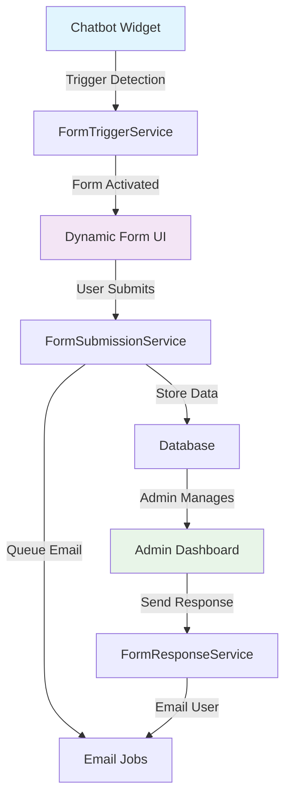

# Sistema Form Dinamici - Documentazione Tecnica

## 📋 Indice

- [Panoramica](#panoramica)
- [Architettura](#architettura)
- [Schema Database](#schema-database)
- [Modelli Eloquent](#modelli-eloquent)
- [Sistema di Trigger](#sistema-di-trigger)
- [Interfaccia Admin](#interfaccia-admin)
- [API Endpoints](#api-endpoints)
- [Email System](#email-system)
- [Configurazione](#configurazione)
- [Esempi di Utilizzo](#esempi-di-utilizzo)
- [Troubleshooting](#troubleshooting)

---

## 📖 Panoramica

Il **Sistema Form Dinamici** permette ad ogni tenant di creare form personalizzati per la raccolta dati dagli utenti del chatbot. Il sistema supporta:

- ✅ **Form configurabili** con campi dinamici
- ✅ **Trigger automatici** (parole chiave, numero messaggi, domande specifiche)
- ✅ **Email personalizzate** con logo tenant
- ✅ **Dashboard admin** per gestione sottomissioni
- ✅ **Sistema di risposta** via web ed email
- ✅ **Prevenzione spam** e sessioni duplicate

### 🎯 Casi d'Uso

1. **Richieste Anagrafe**: Form attivato con parole "anagrafe", "documenti"
2. **Supporto Tecnico**: Form dopo 3 messaggi senza risoluzione
3. **Feedback Utente**: Form attivato da domande specifiche
4. **Lead Generation**: Form per raccolta contatti qualificati

---

## 🏗️ Architettura



### 📦 Componenti Principali

| Componente | Responsabilità | Stato |
|------------|----------------|-------|
| **FormTriggerService** | Detection e attivazione trigger | ✅ Completato |
| **FormSubmissionService** | Gestione sottomissioni e validazione | ✅ Completato |
| **TenantFormController** | CRUD admin per form | ✅ Completato |
| **Email Jobs** | Invio email conferma/notifica | 🚧 In sviluppo |
| **Widget Integration** | UI form nel chatbot | 🚧 In sviluppo |
| **Response System** | Gestione risposte admin | 🚧 In sviluppo |

---

## 🗄️ Schema Database

### 📋 Tabelle

#### **tenant_forms**
Configurazione form per ogni tenant.

```sql
- id (bigint, PK)
- tenant_id (bigint, FK → tenants.id)
- name (varchar) - Nome del form
- description (text) - Descrizione per admin
- active (boolean) - Form attivo
- trigger_keywords (json) - Parole chiave trigger
- trigger_after_messages (int) - Attiva dopo N messaggi
- trigger_after_questions (json) - Domande specifiche trigger
- email_template_subject (varchar) - Oggetto email conferma
- email_template_body (text) - Template email conferma
- email_logo_path (varchar) - Path logo tenant
- admin_notification_email (varchar) - Email notifica admin
- auto_response_enabled (boolean) - Auto-risposta abilitata
- auto_response_message (text) - Messaggio auto-risposta
- created_at, updated_at
```

#### **form_fields**
Campi dinamici dei form.

```sql
- id (bigint, PK)
- tenant_form_id (bigint, FK → tenant_forms.id)
- name (varchar) - Nome campo (es. 'email')
- label (varchar) - Label visibile (es. 'Indirizzo Email')
- type (enum) - text|email|phone|textarea|select|checkbox|radio|date|number
- placeholder (varchar) - Placeholder text
- required (boolean) - Campo obbligatorio
- validation_rules (json) - Regole validazione Laravel
- options (json) - Opzioni per select/radio/checkbox
- help_text (text) - Testo di aiuto
- order (int) - Ordine visualizzazione
- active (boolean) - Campo attivo
- created_at, updated_at
```

#### **form_submissions**
Sottomissioni compilate dagli utenti.

```sql
- id (bigint, PK)
- tenant_form_id (bigint, FK → tenant_forms.id)
- tenant_id (bigint, FK → tenants.id)
- session_id (varchar) - ID sessione chatbot
- user_email (varchar) - Email utente estratta
- user_name (varchar) - Nome utente estratto
- form_data (json) - Dati form compilato
- chat_context (json) - Contesto conversazione
- status (enum) - pending|responded|closed
- submitted_at (timestamp) - Data sottomissione
- ip_address (inet) - IP utente
- user_agent (text) - User agent browser
- trigger_type (varchar) - keyword|auto|manual|question
- trigger_value (varchar) - Valore specifico trigger
- confirmation_email_sent (boolean)
- confirmation_email_sent_at (timestamp)
- admin_notification_sent (boolean)
- admin_notification_sent_at (timestamp)
- created_at, updated_at
```

#### **form_responses**
Risposte admin alle sottomissioni.

```sql
- id (bigint, PK)
- form_submission_id (bigint, FK → form_submissions.id)
- admin_user_id (bigint, FK → users.id, nullable)
- response_content (text) - Contenuto risposta
- response_type (enum) - web|email|auto
- email_subject (varchar) - Oggetto email (se type=email)
- email_sent (boolean) - Email inviata
- email_sent_at (timestamp) - Data invio email
- email_error (text) - Errore invio email
- closes_submission (boolean) - Chiude la pratica
- attachments (json) - Eventuali allegati
- internal_notes (text) - Note interne
- created_at, updated_at
```

### 🔗 Relazioni

```php
TenantForm::class
├── belongsTo(Tenant::class)
├── hasMany(FormField::class)
└── hasMany(FormSubmission::class)

FormField::class
└── belongsTo(TenantForm::class)

FormSubmission::class
├── belongsTo(TenantForm::class)
├── belongsTo(Tenant::class)
└── hasMany(FormResponse::class)

FormResponse::class
├── belongsTo(FormSubmission::class)
└── belongsTo(User::class, 'admin_user_id')
```

---

## 🔧 Modelli Eloquent

### 📝 TenantForm

**Metodi principali:**

```php
// Trigger detection
canBeTriggeredByKeyword(string $text): bool
canBeTriggeredByMessageCount(int $count): bool  
canBeTriggeredByQuestion(string $question): bool

// Email templates
getConfirmationEmailBody(array $formData): string

// Scope
scopeActive($query)
scopeForTenant($query, int $tenantId)

// Attributes
getPendingSubmissionsCountAttribute(): int
getTotalSubmissionsCountAttribute(): int
```

**Esempio utilizzo:**
```php
$form = TenantForm::active()->forTenant(5)->first();
if ($form->canBeTriggeredByKeyword('anagrafe')) {
    // Attiva form
}
```

### 📄 FormField

**Tipi di campo supportati:**
```php
const FIELD_TYPES = [
    'text' => 'Testo',
    'email' => 'Email', 
    'phone' => 'Telefono',
    'textarea' => 'Area di testo',
    'select' => 'Selezione',
    'checkbox' => 'Checkbox',
    'radio' => 'Radio button',
    'date' => 'Data',
    'number' => 'Numero',
];
```

**Metodi principali:**
```php
getValidationRulesForLaravel(): array
renderInputHtml(string $value, array $errors): string
validateValue($value): array
```

**Esempio rendering:**
```php
$field = FormField::find(1);
echo $field->renderInputHtml('', []);
// Genera HTML del campo con styling Tailwind
```

### 📊 FormSubmission

**Stati disponibili:**
```php
const STATUS_PENDING = 'pending';     // In attesa
const STATUS_RESPONDED = 'responded'; // Risposta inviata  
const STATUS_CLOSED = 'closed';       // Chiusa
```

**Metodi principali:**
```php
// Gestione stato
isPending(): bool
markAsResponded(): void
close(): void

// Tracking email
markConfirmationEmailSent(): void
markAdminNotificationSent(): void

// Dati formattati
getFormattedDataAttribute(): array
getTriggerDescriptionAttribute(): string
```

### 💬 FormResponse

**Tipi di risposta:**
```php
const TYPE_WEB = 'web';     // Interfaccia web
const TYPE_EMAIL = 'email'; // Email
const TYPE_AUTO = 'auto';   // Automatica
```

**Metodi principali:**
```php
// Gestione email
markEmailSent(): void
markEmailError(string $error): void

// Status check
isEmailSent(): bool
hasEmailError(): bool
```

---

## 🎯 Sistema di Trigger

Il **FormTriggerService** gestisce l'attivazione automatica dei form basandosi su 3 tipi di trigger.

### 🔑 1. Keyword Triggers

Attivazione basata su parole chiave configurate.

```php
// Configurazione nel form
'trigger_keywords' => ['anagrafe', 'documenti', 'certificato']

// Detection (case-insensitive)
$service = new FormTriggerService();
$result = $service->checkForTriggers(
    tenantId: 5,
    message: 'Ho bisogno di un certificato anagrafe',
    sessionId: 'session_123'
);
// Returns: form trigger data se match trovato
```

**Algoritmo:**
- Converte messaggio e keywords in lowercase
- Cerca substring match usando `mb_strpos()`
- Prima keyword matchata attiva il form

### 📊 2. Message Count Triggers

Attivazione dopo un numero specifico di messaggi.

```php
// Configurazione nel form  
'trigger_after_messages' => 3

// Detection
$result = $service->checkForTriggers(
    tenantId: 5,
    message: 'Qualsiasi messaggio',
    sessionId: 'session_123',
    conversationHistory: [$msg1, $msg2] // 3° messaggio (history + current)
);
```

**Algoritmo:**
- Conta messaggi: `count($history) + 1`
- Attiva se `messageCount >= trigger_after_messages`

### ❓ 3. Question Similarity Triggers

Attivazione basata su similarità semantica delle domande.

```php
// Configurazione nel form
'trigger_after_questions' => [
    'Come posso richiedere un certificato?',
    'Che documenti servono per l\'anagrafe?'
]

// Detection con doppio algoritmo
$result = $service->checkForTriggers(
    tenantId: 5, 
    message: 'Quali documenti mi servono per anagrafe?',
    sessionId: 'session_123'
);
```

**Algoritmo doppio:**

1. **Similarity Score** (70%+ threshold):
   ```php
   similar_text($questionLower, $messageLower, $percent);
   if ($percent >= 70) return true;
   ```

2. **Keyword Matching** (60%+ threshold):
   ```php
   $triggerWords = explode(' ', $question); // Parole > 3 char
   $matchedWords = count(words found in message);
   $percentage = ($matchedWords / count($triggerWords)) * 100;
   if ($percentage >= 60) return true;
   ```

### 🛡️ Session Protection

Previene trigger multipli nella stessa sessione:

```php
$existingSubmission = FormSubmission::forSession($sessionId)
    ->forTenant($tenantId)
    ->pending()
    ->first();
    
if ($existingSubmission) {
    return null; // Blocca nuovo trigger
}
```

### 📈 Trigger Response Format

```php
[
    'form_id' => 123,
    'form_name' => 'Richiesta Anagrafe',
    'form_description' => 'Form per documenti...',
    'trigger_type' => 'keyword', // keyword|auto|question|manual
    'trigger_value' => 'anagrafe',
    'fields' => [
        [
            'id' => 1,
            'name' => 'email',
            'label' => 'Email',
            'type' => 'email',
            'required' => true,
            'placeholder' => 'user@example.com',
            'help_text' => null,
            'options' => null,
            'order' => 0
        ]
        // ... altri campi
    ],
    'message' => 'Ho notato che potresti aver bisogno di assistenza per **Richiesta Anagrafe**...'
]
```

---

## 🎛️ Interfaccia Admin

### 📋 Routes Disponibili

```php
// CRUD completo
Route::resource('forms', TenantFormController::class);

// Azioni extra  
Route::post('/forms/{form}/toggle-active', 'toggleActive');
Route::get('/forms/{form}/preview', 'preview');
Route::post('/forms/{form}/test-submit', 'testSubmit');
```

### 🔗 URL Admin

| Azione | URL | Descrizione |
|--------|-----|-------------|
| **Lista** | `/admin/forms` | Elenco form con filtri |
| **Crea** | `/admin/forms/create` | Creazione nuovo form |
| **Visualizza** | `/admin/forms/{id}` | Dettagli e statistiche |
| **Modifica** | `/admin/forms/{id}/edit` | Modifica configurazione |
| **Anteprima** | `/admin/forms/{id}/preview` | Preview form UI |
| **Toggle** | `POST /admin/forms/{id}/toggle-active` | Attiva/disattiva |

### 📊 Filtri Lista Form

- **Tenant**: Filtra per cliente specifico
- **Stato**: Attivi/Disattivi
- **Ricerca**: Nome o descrizione
- **Ordinamento**: Data creazione (desc)

### 🎨 Creazione Form - Flusso

1. **Info Base**: Nome, tenant, descrizione, stato
2. **Trigger Config**: 
   - Keywords (una per riga)
   - Trigger dopo N messaggi  
   - Domande specifiche
3. **Email Settings**:
   - Oggetto email conferma
   - Template email (con placeholder)
   - Email admin notifica
4. **Campi Dinamici**:
   - Aggiungi/rimuovi campi con JS
   - 9 tipi di campo supportati
   - Validazione, placeholder, help text
   - Opzioni per select/radio/checkbox

### ⚙️ JavaScript Form Builder

```javascript
let fieldIndex = 1;

function addField() {
    // Clona template campo
    // Aggiorna indices degli input name="fields[N][...]"
    // Append al container
    fieldIndex++;
}

function removeField(button) {
    // Rimuovi campo (min 1 campo richiesto)
    button.closest('.field-row').remove();
}

// Form submit: converte textarea keywords in array
form.addEventListener('submit', function(e) {
    const keywords = textarea.value.split('\n')
        .map(k => k.trim())
        .filter(k => k);
    
    // Crea hidden inputs per array keywords
    keywords.forEach((keyword, index) => {
        const input = document.createElement('input');
        input.type = 'hidden';
        input.name = `trigger_keywords[${index}]`;
        input.value = keyword;
        this.appendChild(input);
    });
});
```

---

## 🔌 API Endpoints

> **Nota**: Gli endpoint API sono in fase di sviluppo. Questa sezione verrà aggiornata.

### 📝 Form Submission

```http
POST /api/v1/forms/submit
Authorization: Bearer {api_key}
Content-Type: application/json

{
    "form_id": 123,
    "session_id": "session_abc123",
    "form_data": {
        "email": "user@example.com",
        "nome": "Mario Rossi",
        "tipo_documento": "certificato_nascita",
        "note": "Urgente per pratiche..."
    },
    "chat_context": [
        {"role": "user", "content": "Ho bisogno di documenti anagrafe"},
        {"role": "assistant", "content": "Ti aiuto volentieri..."}
    ],
    "trigger_type": "keyword",
    "trigger_value": "anagrafe"
}
```

**Response Success (200):**
```json
{
    "success": true,
    "submission_id": 456,
    "message": "Richiesta inviata con successo! Ti risponderemo al più presto.",
    "confirmation_email_sent": true
}
```

**Response Error (422):**
```json
{
    "success": false,
    "message": "Alcuni campi non sono validi",
    "errors": {
        "email": ["Il campo email è obbligatorio."],
        "nome": ["Il campo nome deve essere una stringa."]
    }
}
```

### 🔍 Form Triggers Check

```http
POST /api/v1/forms/check-triggers
Authorization: Bearer {api_key}
Content-Type: application/json

{
    "tenant_id": 5,
    "message": "Ho bisogno di un certificato",
    "session_id": "session_abc123", 
    "conversation_history": [...]
}
```

**Response:**
```json
{
    "triggered": true,
    "form": {
        "form_id": 123,
        "form_name": "Richiesta Anagrafe",
        "trigger_type": "keyword",
        "trigger_value": "certificato",
        "fields": [...],
        "message": "Ho notato che potresti aver bisogno..."
    }
}
```

---

## 📧 Email System

> **Nota**: Il sistema email è in fase di sviluppo. Jobs Laravel verranno implementati.

### 📨 Email di Conferma

**Trigger**: Dopo sottomissione form con email utente

**Template personalizzabile** con placeholder:
- `{tenant_name}` - Nome del tenant
- `{form_name}` - Nome del form
- `{form_data}` - Dati formattati del form
- `{submission_id}` - ID sottomissione

**Esempio template:**
```
Gentile utente,

abbiamo ricevuto la sua richiesta per {form_name}.

Dati inviati:
{form_data}

La contatteremo al più presto.

Cordiali saluti,
{tenant_name}
```

### 🔔 Notifica Admin

**Trigger**: Dopo sottomissione form (se admin_notification_email configurata)

**Contenuto automatico:**
- Dettagli form e sottomissione
- Dati utente compilati
- Link diretto alla gestione admin
- Context conversazione (se presente)

### 🎨 Logo Tenant

Il campo `email_logo_path` permette di personalizzare le email con il logo del tenant:

```php
// Configurazione nel form
'email_logo_path' => 'logos/tenant_5/logo.png'

// Utilizzo nell'email template
email_logo_path) }}" alt="{{ $tenant->name }}" />
```

---

## ⚙️ Configurazione

### 🔧 Environment Variables

```env
# Form System
FORM_MAX_FIELDS_PER_FORM=20
FORM_MAX_SUBMISSIONS_PER_SESSION=3
FORM_EMAIL_RATE_LIMIT=10  # Max email per ora per tenant

# Email Configuration  
MAIL_MAILER=smtp
MAIL_HOST=smtp.example.com
MAIL_PORT=587
MAIL_USERNAME=noreply@example.com
MAIL_PASSWORD=password
MAIL_ENCRYPTION=tls
MAIL_FROM_ADDRESS=noreply@example.com
MAIL_FROM_NAME="ChatbotPlatform"

# Queue Configuration (per email asincrona)
QUEUE_CONNECTION=redis
REDIS_HOST=127.0.0.1
REDIS_PASSWORD=null
REDIS_PORT=6379
```

### 📝 Form Validation Rules

Le regole di validazione sono configurabili per campo nel campo `validation_rules` (JSON):

```json
{
    "validation_rules": [
        "min:3",
        "max:255", 
        "regex:/^[a-zA-Z\\s]+$/",
        "unique:table,column"
    ]
}
```

**Regole automatiche per tipo:**
- `email`: Aggiunge automaticamente regola `email`
- `phone`: Aggiunge `regex:/^[\+]?[0-9\s\-\(\)]+$/`
- `date`: Aggiunge `date`
- `number`: Aggiunge `numeric`
- `select/radio`: Aggiunge `in:option1,option2,option3`

### 🚀 Performance & Scaling

**Database Indexes:**
```sql
-- Ottimizzazione query frequenti
CREATE INDEX idx_tenant_forms_active ON tenant_forms(tenant_id, active);
CREATE INDEX idx_form_submissions_session ON form_submissions(session_id);
CREATE INDEX idx_form_submissions_status ON form_submissions(tenant_id, status, submitted_at);
CREATE INDEX idx_form_fields_ordered ON form_fields(tenant_form_id, order);
```

**Caching Strategy:**
```php
// Cache form attivi per tenant (TTL: 1 ora)
$forms = Cache::remember("tenant_{$tenantId}_active_forms", 3600, function() use ($tenantId) {
    return TenantForm::active()->forTenant($tenantId)->with('fields')->get();
});
```

---

## 💡 Esempi di Utilizzo

### 🏛️ 1. Form Anagrafe Comunale

**Configurazione:**
```php
TenantForm::create([
    'tenant_id' => 5,
    'name' => 'Richiesta Documenti Anagrafe',
    'description' => 'Form per richieste di certificati e documenti anagrafici',
    'active' => true,
    'trigger_keywords' => ['anagrafe', 'certificato', 'documenti', 'carta identità'],
    'trigger_after_messages' => null,
    'email_template_subject' => 'Conferma richiesta documenti anagrafe',
    'admin_notification_email' => 'anagrafe@comune.example.it',
    'auto_response_enabled' => true,
    'auto_response_message' => 'Grazie per la richiesta. Elaboreremo i documenti entro 3 giorni lavorativi.',
]);
```

**Campi del form:**
```php
FormField::create([
    'name' => 'tipo_documento',
    'label' => 'Tipo di Documento',
    'type' => 'select',
    'required' => true,
    'options' => [
        'certificato_nascita' => 'Certificato di Nascita',
        'certificato_residenza' => 'Certificato di Residenza', 
        'carta_identita' => 'Carta d\'Identità',
        'passaporto' => 'Passaporto'
    ],
    'order' => 0
]);

FormField::create([
    'name' => 'codice_fiscale',
    'label' => 'Codice Fiscale',
    'type' => 'text',
    'required' => true,
    'validation_rules' => ['regex:/^[A-Z]{6}[0-9]{2}[A-Z][0-9]{2}[A-Z][0-9]{3}[A-Z]$/'],
    'placeholder' => 'RSSMRA85M01H501Z',
    'help_text' => 'Inserisci il codice fiscale (16 caratteri)',
    'order' => 1
]);
```

### 🛠️ 2. Form Supporto Tecnico

**Configurazione con trigger automatico:**
```php
TenantForm::create([
    'name' => 'Richiesta Supporto Tecnico',
    'trigger_keywords' => ['problema', 'errore', 'non funziona', 'aiuto'],
    'trigger_after_messages' => 3, // Dopo 3 messaggi senza soluzione
    'trigger_after_questions' => [
        'Ho un problema con il sito',
        'Non riesco ad accedere',
        'Il servizio non funziona'
    ]
]);
```

### 📋 3. Form Feedback Qualitativo

**Per raccolta feedback dettagliato:**
```php
FormField::create([
    'name' => 'valutazione',
    'label' => 'Come valuti il servizio?',
    'type' => 'radio',
    'required' => true,
    'options' => [
        '5' => '⭐⭐⭐⭐⭐ Eccellente',
        '4' => '⭐⭐⭐⭐ Buono',
        '3' => '⭐⭐⭐ Sufficiente', 
        '2' => '⭐⭐ Scarso',
        '1' => '⭐ Pessimo'
    ]
]);

FormField::create([
    'name' => 'suggerimenti',
    'label' => 'Suggerimenti per migliorare',
    'type' => 'textarea',
    'required' => false,
    'placeholder' => 'Scrivi qui i tuoi suggerimenti...',
    'help_text' => 'I tuoi feedback ci aiutano a migliorare il servizio'
]);
```

---

## 🔧 Troubleshooting

### ❌ Problemi Comuni

#### **1. Form non si attiva con keyword**

**Sintomi:** L'utente scrive una keyword ma il form non appare.

**Diagnosi:**
```php
// Debug trigger detection
Log::info('[FormTrigger] Debug', [
    'message' => $message,
    'keywords' => $form->trigger_keywords,
    'message_lower' => mb_strtolower($message)
]);

// Verifica form attivo
$form = TenantForm::find($formId);
if (!$form->active) {
    echo "Form disattivato";
}
```

**Soluzioni:**
- Verifica che il form sia `active = true`
- Controlla che le keywords siano nel formato array corretto
- Verifica case-sensitivity (dovrebbe essere case-insensitive)
- Controlla che non ci sia già una submission pending per la sessione

#### **2. Email di conferma non inviata**

**Sintomi:** Form sottomesso ma email non arriva all'utente.

**Diagnosi:**
```php
// Controlla email estratta
$submission = FormSubmission::find($submissionId);
Log::info('[Email] Debug', [
    'user_email' => $submission->user_email,
    'email_sent' => $submission->confirmation_email_sent,
    'form_data' => $submission->form_data
]);

// Verifica queue
php artisan queue:work --once
```

**Soluzioni:**
- Verifica configurazione SMTP in `.env`
- Controlla che il campo email nel form sia riconosciuto (nomi: `email`, `mail`, `e_mail`)
- Verifica che la queue sia in esecuzione: `php artisan queue:work`
- Controlla log Laravel: `storage/logs/laravel.log`

#### **3. Validazione form fallisce**

**Sintomi:** Form compilato ma validazione dice che i dati non sono validi.

**Diagnosi:**
```php
// Debug validazione
$field = FormField::find($fieldId);
$rules = $field->getValidationRulesForLaravel();
Log::info('[Validation] Field rules', [
    'field_name' => $field->name,
    'rules' => $rules,
    'value' => $formData[$field->name] ?? null
]);
```

**Soluzioni:**
- Verifica che i nomi dei campi nel form corrispondano ai `name` nei FormField
- Controlla le regole di validazione personalizzate in `validation_rules`
- Verifica che i campi required abbiano effettivamente valore
- Per select/radio, verifica che le opzioni siano nel formato corretto

#### **4. Trigger similarity non funziona**

**Sintomi:** Domande simili non attivano il form.

**Diagnosi:**
```php
// Debug similarity matching
$triggerQuestion = "Come posso richiedere un certificato?";
$userMessage = "Come richiedo certificati?";

similar_text(
    mb_strtolower($triggerQuestion),
    mb_strtolower($userMessage), 
    $percent
);

Log::info('[Similarity] Debug', [
    'trigger_question' => $triggerQuestion,
    'user_message' => $userMessage,
    'similarity_percent' => $percent,
    'threshold' => 70
]);
```

**Soluzioni:**
- Abbassa threshold similarity da 70% a 60% se troppo restrittivo
- Aggiungi varianti della domanda trigger
- Usa keyword matching come fallback (già implementato)
- Considera stemming/lemmatization per migliori match

### 🔍 Log Analysis

**File di log principali:**
```bash
# Laravel general log
tail -f storage/logs/laravel.log | grep FormTrigger

# Queue job logs  
tail -f storage/logs/laravel.log | grep "SendFormConfirmation\|SendFormAdmin"

# Database query log (se abilitato)
tail -f storage/logs/laravel.log | grep "SELECT.*tenant_forms"
```

**Debug queries utili:**
```sql
-- Form più utilizzati
SELECT tf.name, COUNT(fs.id) as submissions_count
FROM tenant_forms tf
LEFT JOIN form_submissions fs ON tf.id = fs.tenant_form_id  
GROUP BY tf.id, tf.name
ORDER BY submissions_count DESC;

-- Trigger più efficaci
SELECT trigger_type, COUNT(*) as count
FROM form_submissions 
WHERE created_at >= NOW() - INTERVAL '30 days'
GROUP BY trigger_type;

-- Conversion rate per form
SELECT 
    tf.name,
    COUNT(fs.id) as total_submissions,
    COUNT(CASE WHEN fs.status = 'responded' THEN 1 END) as responded,
    ROUND(COUNT(CASE WHEN fs.status = 'responded' THEN 1 END) * 100.0 / COUNT(fs.id), 2) as conversion_rate
FROM tenant_forms tf
LEFT JOIN form_submissions fs ON tf.id = fs.tenant_form_id
GROUP BY tf.id, tf.name;
```

### 📈 Performance Monitoring

**Metriche da monitorare:**
- **Trigger rate**: % messaggi che attivano form  
- **Completion rate**: % form iniziati vs completati
- **Response time**: Tempo medio risposta admin
- **Email delivery rate**: % email consegnate con successo

**Query di monitoring:**
```sql
-- Performance trigger detection
SELECT 
    DATE(created_at) as date,
    COUNT(*) as triggers_activated,
    COUNT(DISTINCT session_id) as unique_sessions
FROM form_submissions 
WHERE created_at >= NOW() - INTERVAL '7 days'
GROUP BY DATE(created_at)
ORDER BY date;
```

---

## 📚 Riferimenti

### 🔗 Link Utili

- **Laravel Validation**: https://laravel.com/docs/validation
- **Laravel Queue Jobs**: https://laravel.com/docs/queues  
- **Laravel Mail**: https://laravel.com/docs/mail
- **Eloquent Relationships**: https://laravel.com/docs/eloquent-relationships

### 📋 Checklist Implementazione

- [x] Schema database creato e migrato
- [x] Modelli Eloquent con relazioni
- [x] FormTriggerService per detection
- [x] FormSubmissionService per gestione dati
- [x] Admin interface CRUD completa
- [x] Validazione dinamica campi
- [x] Sistema di template email
- [ ] Jobs per invio email asincrono
- [ ] API endpoints per widget
- [ ] UI form nel chatbot widget
- [ ] Dashboard admin per sottomissioni
- [ ] Sistema risposta admin
- [ ] Test automatizzati

### 📞 Supporto

Per problemi o domande sul sistema form dinamici:

1. **Controlla i log**: `storage/logs/laravel.log`
2. **Verifica configurazione**: File `.env` e database  
3. **Debug step-by-step**: Usa i metodi di diagnosi sopra
4. **Contatta sviluppatore**: Con log specifici e passi per riprodurre

---

*Documentazione aggiornata al: {{ date('d/m/Y H:i') }}*
*Versione sistema: 1.0.0 - Base Implementation*
