# 🔍 Intent Detection Pipeline - Audit Completo (Step 1)

**Audit Date**: 2025-10-24  
**Environment**: DEV (Tenant ID: 5 - San Cesareo)  
**Audited By**: Senior Software Architect - Marco Rossi  
**Scope**: Analisi completa dei 5 intents (thanks, phone, email, address, schedule)

---

## 📊 Executive Summary

L'audit ha tracciato il flusso completo della intent detection pipeline dal momento in cui una query arriva al RAG Tester fino alla risposta finale. Il sistema utilizza un **scoring algorithm basato su keywords multilingua** con fallback semantico via Milvus quando la ricerca diretta non trova risultati.

### ✅ Sistema Attualmente Funzionante
- **Architettura modulare** con separazione responsabilità
- **Configurazione multi-livello** (tenant → profile → global)
- **Fallback robusti** (direct search → semantic → hybrid)
- **Cache management** (Redis 5min TTL)

### ⚠️ Criticità Identificate
1. **Cache invalidation** manuale non sempre chiamata
2. **Extra keywords** in campo separato (`tenants.extra_intent_keywords`) vs `rag_settings`
3. **Min score filtering** applicato solo dopo scoring, non durante
4. **Execution strategy** non sempre rispettata
5. **Config merge** potrebbe sovrascrivere campi nested

---

## 🔍 Flow Diagram - Complete Pipeline

```mermaid
sequenceDiagram
    participant U as User/RAG Tester UI
    participant C as RagTestController
    participant Cache as Redis Cache
    participant TRC as TenantRagConfigService
    participant KB as KbSearchService
    participant CD as CompleteQueryDetector
    participant TS as TextSearchService
    participant M as MilvusClient
    participant DB as PostgreSQL

    U->>C: POST /admin/rag/test (query, tenant_id)
    C->>Cache: forget("rag_config_tenant_5")
    Note over C: ⚠️ Manual cache invalidation
    
    C->>KB: retrieve(tenantId:5, query, debug:true)
    KB->>Cache: remember("rag_config_tenant_5", 300s)
    
    alt Cache Miss
        Cache->>TRC: getConfig(5)
        TRC->>DB: Tenant::find(5)->rag_settings
        TRC->>TRC: Merge tenant + profile + global
        TRC->>Cache: store config (TTL: 5min)
    end
    
    Cache-->>KB: Config loaded
    
    KB->>KB: detectIntents(query, tenantId:5)
    KB->>TRC: getIntentsConfig(5)
    TRC-->>KB: enabled, min_score:0.3, strategy:priority_based
    
    KB->>DB: Tenant::find(5)->extra_intent_keywords
    KB->>KB: Score each intent (thanks, phone, email, address, schedule)
    
    loop For each keyword
        KB->>KB: scoreIntent(query, expandedQuery, keywords)
        Note over KB: Exact match: 1.0 weight<br/>Synonym match: 0.5 weight<br/>Score *= keywordLength/queryLength
    end
    
    KB->>KB: arsort($scores) - Order DESC
    KB->>KB: Filter score > 0
    Note over KB: ⚠️ Min score NOT applied here
    
    alt Intent "thanks" detected
        KB->>KB: executeThanksIntent()
        KB-->>C: Direct response (no search)
    else Intent phone/email/address/schedule
        KB->>TS: findPhonesNearName(tenantId, name, 5, kbId)
        TS->>DB: SELECT with trigram similarity + ILIKE
        TS-->>KB: Results with phone field
        
        alt No results from direct search
            KB->>KB: executeSemanticFallback(intentType)
            KB->>M: search(tenantId, semanticQuery, topK:100)
            M-->>KB: Vector search results
            KB->>KB: extractIntentDataFromSemanticResults()
            KB->>TS: Extract phone numbers via regex
        end
        
        KB->>DB: Batch load documents (avoid N+1)
        KB-->>C: Citations with phone/email/address/schedule fields
    end
    
    C->>C: Build final response with trace
    C-->>U: Display citations + debug info
```



---

## 🏗️ Architettura Componenti

### 1️⃣ **RagTestController** (`backend/app/Http/Controllers/Admin/RagTestController.php`)

**Responsabilità**:
- Entry point per RAG Tester UI
- Gestione request validation
- Cache invalidation manuale
- Conversation context enhancement (opzionale)
- Final response formatting

**Configuration Management**:
```php
// Line 79: Manual cache invalidation
Cache::forget("rag_config_tenant_{$tenantId}");

// Line 104-106: Load config via service
$tenantCfgSvc = app(\App\Services\RAG\TenantRagConfigService::class);
$advCfg = $tenantCfgSvc->getAdvancedConfig($tenantId);
$rerankCfg = $tenantCfgSvc->getRerankerConfig($tenantId);
```

**Intent Detection Trigger**:
```php
// Line 132: Main retrieval call (triggers intent detection)
$retrieval = $kb->retrieve($tenantId, $finalQuery, true);
```

**Debug Information**:
- Costruisce trace con `intent_detection`, `hybrid_config`, `reranking`
- Include performance profiling (retrieval + LLM time)
- Logs citations preview per debugging

**⚠️ Issues Identificate**:
- Cache invalidation manuale (line 79, 153) - potrebbe dimenticare di chiamarla
- Nessuna gestione errori per config malformata

---

### 2️⃣ **KbSearchService** (`backend/app/Services/RAG/KbSearchService.php`)

**Responsabilità**:
- Orchestratore principale del retrieval
- Intent detection logic
- Scoring algorithm implementation
- Fallback management (semantic + hybrid)
- Multi-KB support

**Intent Detection Flow** (Lines 80-116):
```php
// Line 82: Detect intents
$intents = $this->detectIntents($query, $tenantId);

// Line 89-104: Build debug info (solo se debug=true)
$intentDebug = [
    'original_query' => $query,
    'lowercased_query' => $q,
    'expanded_query' => $expandedQ,
    'intents_detected' => $intents,
    'intent_scores' => [
        'thanks' => $this->scoreIntent($q, $expandedQ, $this->keywordsThanks($this->activeLangs)),
        'schedule' => $this->scoreIntent($q, $expandedQ, $this->keywordsSchedule($this->activeLangs)),
        'address' => $this->scoreIntent($q, $expandedQ, $this->keywordsAddress($this->activeLangs)),
        'email' => $this->scoreIntent($q, $expandedQ, $this->keywordsEmail($this->activeLangs)),
        'phone' => $this->scoreIntent($q, $expandedQ, $this->keywordsPhone($this->activeLangs)),
    ],
    'keywords_matched' => $this->getMatchedKeywords($q, $expandedQ),
];
```

**Intent Execution Loop** (Lines 118-202):
```php
// Line 119: Loop attraverso intents in ordine di score
foreach ($intents as $intentType) {
    Log::info("🔍 [RETRIEVE] Testando intent: {$intentType}");
    
    // Lines 123-137: KB selection (multi-KB o singola)
    if ($useMultiKb) {
        $kbSelIntent = $this->getAllKnowledgeBasesForTenant($tenantId);
        $selectedKbIdIntent = null;
    } else {
        $kbSelIntent = $this->kbSelector->selectForQuery($tenantId, $query);
        $selectedKbIdIntent = $kbSelIntent['knowledge_base_id'] ?? null;
    }
    
    // Line 140: Execute intent
    $result = $this->executeIntent($intentType, $tenantId, $query, $debug, $selectedKbIdIntent);
    
    // Line 148: Se trova risultati, ritorna immediatamente
    if ($result !== null) {
        return $result; // ⚠️ Esce al primo intent con risultati
    }
}
```

**detectIntents() Method** (Lines 1099-1137):
```php
private function detectIntents(string $query, int $tenantId = null): array
{
    $q = mb_strtolower($query);
    $expandedQ = $this->expandQueryWithSynonyms($q, $tenantId);
    $intents = [];
    
    // Line 1106-1107: Load config
    $enabledIntents = $this->getTenantEnabledIntents($tenantId);
    $extraKeywords = $this->getTenantExtraKeywords($tenantId);
    
    // Line 1110-1111: Intent types
    $scores = [];
    $allIntentTypes = ['thanks', 'schedule', 'address', 'email', 'phone'];
    
    // Lines 1113-1126: Scoring loop
    foreach ($allIntentTypes as $intentType) {
        if (!($enabledIntents[$intentType] ?? true)) {
            continue; // Skip disabilitati
        }
        
        $keywords = $this->getIntentKeywords($intentType, $this->activeLangs);
        
        // Line 1121-1123: Merge extra keywords
        if (!empty($extraKeywords[$intentType])) {
            $keywords = array_merge($keywords, (array) $extraKeywords[$intentType]);
        }
        
        $scores[$intentType] = $this->scoreIntent($q, $expandedQ, $keywords);
    }
    
    // Lines 1129-1134: Filter and sort
    arsort($scores); // Ordina per score DESC
    foreach ($scores as $intent => $score) {
        if ($score > 0) {
            $intents[] = $intent;
        }
    }
    
    return $intents; // ⚠️ Ritorna TUTTI gli intents con score > 0
}
```

**⚠️ Issues Identificate**:
1. **Min score non applicato**: Filtra solo `$score > 0`, non rispetta `intents.min_score` da config
2. **Execution strategy ignorata**: Ritorna sempre tutti gli intents con score > 0, non solo il primo se `first_match`
3. **Extra keywords campo separato**: `extra_intent_keywords` è in `tenants` table, non in `rag_settings`

**scoreIntent() Method** (Lines 1142-1160):
```php
private function scoreIntent(string $query, string $expandedQuery, array $keywords): float
{
    $score = 0.0;
    $queryLen = mb_strlen($query);
    
    foreach ($keywords as $kw) {
        if (str_contains($query, $kw)) {
            // Exact match: peso 1.0
            $keywordScore = mb_strlen($kw) / max($queryLen, 1);
            $score += $keywordScore;
        } elseif (str_contains($expandedQuery, $kw)) {
            // Synonym match: peso 0.5
            $keywordScore = (mb_strlen($kw) / max($queryLen, 1)) * 0.5;
            $score += $keywordScore;
        }
    }
    
    return $score;
}
```

**Scoring Algorithm**:
- **Exact match** in query originale: `weight = 1.0`
- **Synonym match** in query espansa: `weight = 0.5`
- **Score proporzionale** a lunghezza keyword: `keywordLength / queryLength`
- **Cumulativo**: Somma score di tutte le keywords matched

**Keywords Hardcoded** (Lines 978-1069):
```php
// THANKS
private function keywordsThanks(array $langs): array {
    $it = [
        'grazie','grazie mille','ti ringrazio','la ringrazio',
        'ottimo','perfetto','bene','molto bene','eccellente',
        'cordiali saluti','buona giornata','buon lavoro','arrivederci'
    ];
    // + multilang (en, es, fr)
}

// SCHEDULE
private function keywordsSchedule(array $langs): array {
    $it = [
        'orario','orari','orario di apertura','quando è aperto','quando apre',
        'quando chiude','a che ora','apertura','chiusura','aperto','chiuso','ore',
        'lunedì','martedì',...,'festivi','feriali','weekend','mattina','pomeriggio'
    ];
}

// PHONE
private function keywordsPhone(array $langs): array {
    $it = [
        'telefono','numero di telefono','numero','tel','cellulare','cell',
        'recapito telefonico','mobile','fisso','centralino','chiamare','telefonare',
        '118','112','113', // Numeri emergenza
        'contatto','contatti','recapito'
    ];
}

// EMAIL
private function keywordsEmail(array $langs): array {
    $it = ['email','e-mail','mail','posta','posta elettronica','pec'];
}

// ADDRESS
private function keywordsAddress(array $langs): array {
    $it = [
        'indirizzo','residenza','domicilio','sede','ubicazione',
        'dove si trova','dove è','via','viale','piazza','corso','largo','vicolo',
        'posizione','località','zona','quartiere','dove','ufficio'
    ];
}
```

---

### 3️⃣ **TenantRagConfigService** (`backend/app/Services/RAG/TenantRagConfigService.php`)

**Responsabilità**:
- Gestione configurazione RAG tenant-specific
- Merge di configurazioni (tenant → profile → global)
- Cache management (Redis, TTL 5 min)
- Metodi getter per sezioni config

**Config Hierarchy** (Lines 19-54):
```php
public function getConfig(int $tenantId): array
{
    return Cache::remember("rag_config_tenant_{$tenantId}", self::CACHE_TTL, function () use ($tenantId) {
        $tenant = Tenant::find($tenantId);
        
        // Start with global config
        $config = $this->getGlobalConfig();
        
        // Apply tenant defaults based on profile
        $tenantDefaults = $this->getTenantDefaults();
        $profile = $tenant->rag_profile ?? null;
        
        if ($profile && isset($tenantDefaults['profiles'][$profile])) {
            $config = $this->mergeConfig($config, $tenantDefaults);
            $config = $this->applyProfileOverrides($config, $tenantDefaults['profiles'][$profile]);
        } else {
            $config = $this->mergeConfig($config, $tenantDefaults);
        }
        
        // Apply tenant-specific overrides
        if ($tenant->rag_settings) {
            $tenantSettings = is_string($tenant->rag_settings) 
                ? json_decode($tenant->rag_settings, true) 
                : $tenant->rag_settings;
                
            if (is_array($tenantSettings)) {
                $config = $this->mergeConfig($config, $tenantSettings);
            }
        }

        return $config;
    });
}
```

**Intents Config Getter** (Lines 85-88):
```php
public function getIntentsConfig(int $tenantId): array
{
    return $this->getConfig($tenantId)['intents'] ?? [];
}
```

**⚠️ Issues Identificate**:
1. **Cache TTL fisso**: 5 minuti hardcoded, nessuna invalidazione esplicita
2. **Merge config**: `mergeConfig()` potrebbe sovrascrivere nested arrays invece di mergiare
3. **Extra keywords separati**: Non gestisce `extra_intent_keywords` (campo separato su tenant)
4. **Nessuna validazione**: Non valida JSON schema dei settings

---

### 4️⃣ **TextSearchService** (`backend/app/Services/RAG/TextSearchService.php`)

**Responsabilità**:
- Ricerca full-text BM25 su PostgreSQL
- Pattern matching per intent specifici (phone, email, address, schedule)
- Trigram similarity search
- Extraction tramite regex

**findPhonesNearName() Method** (Lines 93-263):
```php
public function findPhonesNearName(int $tenantId, string $name, int $limit = 10, ?int $knowledgeBaseId = null): array
{
    $name = trim($name);
    if ($name === '') { return []; }
    
    $nameLower = mb_strtolower($name);
    $parts = preg_split('/\s+/', $nameLower, -1, PREG_SPLIT_NO_EMPTY) ?: [];
    $first = $parts[0] ?? '';
    $last  = $parts[1] ?? '';

    // Candidati via trigram/ILIKE
    if ($knowledgeBaseId !== null) {
        $rows = DB::select("
            SELECT dc.document_id, dc.chunk_index, dc.content
            FROM document_chunks dc
            INNER JOIN documents d ON d.id = dc.document_id
            WHERE dc.tenant_id = :t AND d.tenant_id = :t
              AND d.knowledge_base_id = :kb
              AND (
                   (LOWER(dc.content) ILIKE :phrase1)
                OR (LOWER(dc.content) ILIKE :phrase2)
                OR (LOWER(dc.content) ILIKE :first AND LOWER(dc.content) ILIKE :last)
                OR similarity(LOWER(dc.content), :name) > 0.2
              )
            ORDER BY similarity(LOWER(dc.content), :name) DESC
            LIMIT 200
        ", [...]);
    }
    
    // Extract phones via regex
    $phones = [];
    $regex = '/(?:(?:tel[\.:]*|telefono|cellulare|cell|fax|centralino|mobile|fisso|recapito(?:\s+telefonico)?)[:\s]*)?(?:\+39\s*)?0\d{1,3}[\s\.\-]*\d{6,8}/i';
    
    foreach ($rows as $r) {
        preg_match_all($regex, $r->content, $matches);
        if (!empty($matches[0])) {
            foreach ($matches[0] as $phone) {
                $cleanPhone = trim(preg_replace('/[^\d\+]/', ' ', $phone));
                $phones[] = [
                    'phone' => $cleanPhone,
                    'document_id' => (int) $r->document_id,
                    'chunk_index' => (int) $r->chunk_index,
                    'score' => similarity($nameLower, mb_strtolower($r->content)),
                    'excerpt' => $this->getPhoneExcerpt($r->content, $phone, $name)
                ];
            }
        }
    }
    
    return array_slice($phones, 0, $limit);
}
```

**Metodi Analoghi**:
- `findEmailsNearName()` - Regex: `/@[a-zA-Z0-9.-]+\.[a-zA-Z]{2,}/`
- `findAddressesNearName()` - Regex: `/\b(?:via|viale|piazza|corso|largo)\s+[A-Z]/i`
- `findSchedulesNearName()` - Regex: `/\d{1,2}[:\.]?\d{0,2}\s*[-–—]\s*\d{1,2}[:\.]?\d{0,2}/`

**⚠️ Issues Identificate**:
- Regex potrebbero fallire su formati non standard
- Trigram similarity threshold hardcoded (0.2)
- Nessun caching dei risultati

---

### 5️⃣ **CompleteQueryDetector** (`backend/app/Services/RAG/CompleteQueryDetector.php`)

**Responsabilità**:
- Rilevamento query che richiedono "completeness" invece di "relevance"
- Pattern matching per query tipo "tutti i consiglieri", "elenco completo"
- NON gestisce intent detection standard (grazie, telefono, etc.)

**Nota**: CompleteQueryDetector è **separato** dal sistema intent detection analizzato. Si attiva solo per query speciali.

---

## 🔧 Configuration Management

### Configurazione Tenant 5 (DEV) - Attuale

```php
"intents" => [
    "enabled" => [
        "thanks" => true,
        "phone" => true,
        "email" => true,
        "address" => true,
        "schedule" => true
    ],
    "min_score" => 0.3,
    "execution_strategy" => "priority_based"
]
```

### Configuration Hierarchy

**Priority Order**:
1. **Tenant-specific** (`tenants.rag_settings` JSON field)
2. **Profile defaults** (`config/rag-tenant-defaults.php`)
3. **Global defaults** (`config/rag.php`)

**Cache Strategy**:
- Redis key: `rag_config_tenant_{tenantId}`
- TTL: 5 minutes (300 seconds)
- **Invalidation**: Manual via `Cache::forget()` in controller

**⚠️ Extra Keywords Anomaly**:
```php
// Stored in SEPARATE column!
tenants.extra_intent_keywords (JSON field) // ❌ Not in rag_settings

// Loaded separately in KbSearchService:
$extraKeywords = $this->getTenantExtraKeywords($tenantId); // Line 1107
```

---

## 📋 Checklist Verifica

### ✅ Files Inspected
- [x] `RagTestController.php` - Entry point UI
- [x] `KbSearchService.php` - Main orchestrator
- [x] `TextSearchService.php` - BM25 + pattern matching
- [x] `CompleteQueryDetector.php` - Complete query detection
- [x] `TenantRagConfigService.php` - Config management
- [x] `config/rag.php` - Global defaults
- [x] `config/rag-tenant-defaults.php` - Profile defaults
- [x] `resources/views/admin/tenants/rag-config.blade.php` - UI config

### ✅ Method Calls Traced
- [x] Controller → KbSearchService
- [x] KbSearchService → detectIntents()
- [x] detectIntents() → getTenantEnabledIntents()
- [x] detectIntents() → getTenantExtraKeywords()
- [x] detectIntents() → scoreIntent()
- [x] KbSearchService → executeIntent()
- [x] executeIntent() → TextSearchService methods
- [x] executeIntent() → executeSemanticFallback()

### ✅ Configuration Points Documented
- [x] Cache key and TTL
- [x] Config hierarchy (tenant → profile → global)
- [x] Intents enabled/disabled
- [x] Min score threshold
- [x] Execution strategy
- [x] Extra keywords storage

### ✅ Fallback Logic Mapped
- [x] Direct search (TextSearchService)
- [x] Semantic fallback (Milvus vector search)
- [x] Hybrid search (Vector + BM25 RRF)
- [x] Intent-specific extraction from semantic results

---

## 🐛 Bug & Edge Cases Identified

### 1. **Min Score Not Respected**
**Location**: `KbSearchService::detectIntents()` (Line 1131)
```php
// ❌ BUGGY: Filters only score > 0, ignores config min_score
if ($score > 0) {
    $intents[] = $intent;
}

// ✅ SHOULD BE:
$minScore = $this->tenantConfig->getIntentsConfig($tenantId)['min_score'] ?? 0.5;
if ($score >= $minScore) {
    $intents[] = $intent;
}
```

**Impact**: Intents con score 0.1 vengono eseguiti anche se `min_score = 0.3`

---

### 2. **Execution Strategy Ignored**
**Location**: `KbSearchService::detectIntents()` (Line 1136)
```php
// ❌ BUGGY: Returns ALL intents with score > 0
return $intents;

// ✅ SHOULD CHECK:
$strategy = $this->tenantConfig->getIntentsConfig($tenantId)['execution_strategy'] ?? 'priority_based';
if ($strategy === 'first_match' && !empty($intents)) {
    return [array_shift($intents)]; // Solo il primo
}
return $intents; // Tutti (priority_based)
```

**Impact**: `first_match` strategy non funziona, esegue sempre in priority order

---

### 3. **Extra Keywords Not Merged Correctly**
**Location**: `KbSearchService::getTenantExtraKeywords()` (Line 2378)
```php
// ❌ ISSUE: Extra keywords sono in campo separato!
$tenant = Tenant::find($tenantId);
return (array) $tenant->extra_intent_keywords; // ❌ Non in rag_settings

// ✅ SHOULD BE in rag_settings:
"intents" => [
    "extra_keywords" => [
        "phone" => ["centralino", "numero verde"],
        "email" => ["posta certificata"]
    ]
]
```

**Impact**: Extra keywords non seguono la config hierarchy, sempre override

---

### 4. **Cache Not Invalidated After Config Save**
**Location**: `RagTestController::run()` (Line 79)
```php
// ⚠️ WORKAROUND: Manual invalidation in controller
Cache::forget("rag_config_tenant_{$tenantId}");

// ❌ MISSING: Automatic invalidation in TenantRagConfigController after save
public function update(Request $request, Tenant $tenant) {
    // ... save config ...
    // ❌ MISSING: Cache::forget("rag_config_tenant_{$tenant->id}");
}
```

**Impact**: Dopo modifica config da UI, potrebbero servire 5 minuti per applicarsi (cache TTL)

---

### 5. **Config Merge Overwrites Nested Arrays**
**Location**: `TenantRagConfigService::mergeConfig()` (implementazione non vista ma inferita)
```php
// ⚠️ POTENTIAL ISSUE:
$config = array_merge_recursive($config, $tenantSettings);

// Se tenant imposta:
"intents" => ["enabled" => ["phone" => false]]

// E profile ha:
"intents" => ["enabled" => ["phone" => true, "email" => true]]

// Result potrebbe essere inaspettato con array_merge_recursive
```

**Impact**: Configurazioni nested potrebbero non mergiare come atteso

---

## 🎯 Intent-Specific Analysis

### Thanks Intent
- **Priority**: Special (risposta diretta senza search)
- **Keywords**: 91 totali (IT: 30, EN: 18, ES: 13, FR: 30+)
- **Execution**: `executeThanksIntent()` - Returns hardcoded polite response
- **No fallback**: Non usa semantic/hybrid search
- **Status**: ✅ Funziona correttamente

### Phone Intent
- **Priority**: Alta
- **Keywords**: 40+ (telefono, tel, cellulare, cell, 118, 112, ...)
- **Execution**: `findPhonesNearName()` → Trigram + ILIKE + Regex
- **Fallback**: Semantic search → Extract via regex da chunk
- **Regex**: `/(?:tel[\.:]*)?(?:\+39\s*)?0\d{1,3}[\s\.\-]*\d{6,8}/i`
- **Status**: ✅ Funziona con fallback robusto

### Email Intent
- **Priority**: Media
- **Keywords**: 5 (email, e-mail, mail, posta elettronica, pec)
- **Execution**: `findEmailsNearName()` → Trigram + ILIKE + Regex
- **Fallback**: Semantic search → Extract via regex
- **Regex**: `/@[a-zA-Z0-9.-]+\.[a-zA-Z]{2,}/`
- **Status**: ✅ Funziona

### Address Intent
- **Priority**: Media
- **Keywords**: 15+ (indirizzo, sede, via, viale, piazza, corso, ...)
- **Execution**: `findAddressesNearName()` → Trigram + ILIKE + Regex
- **Fallback**: Semantic search → Extract via regex
- **Regex**: `/\b(?:via|viale|piazza|corso|largo)\s+[A-Z]/i`
- **Status**: ⚠️ Potrebbe fallire su indirizzi non standard

### Schedule Intent
- **Priority**: Media-Alta
- **Keywords**: 20+ (orario, orari, quando apre, apertura, lunedì, ...)
- **Execution**: `findSchedulesNearName()` → Trigram + ILIKE + Regex
- **Fallback**: Semantic search → Extract via regex
- **Regex**: `/\d{1,2}[:\.]?\d{0,2}\s*[-–—]\s*\d{1,2}[:\.]?\d{0,2}/`
- **Status**: ✅ Funziona per orari formattati

---

## 🔍 Cache Management Analysis

### Current Strategy
```php
// Key pattern
"rag_config_tenant_{tenantId}"

// TTL
300 seconds (5 minutes)

// Invalidation
Manual via Cache::forget() in controllers
```

### Cache Points
1. **RagTestController** (Line 79): `Cache::forget()` before retrieval
2. **RagTestController** (Line 153): `Cache::forget()` after retrieval
3. **TenantRagConfigService** (Line 21): `Cache::remember()` with callback

### ⚠️ Missing Invalidation Points
- `TenantRagConfigController::update()` - NO invalidation
- `TenantAdminController::update()` - NO invalidation when rag_settings changes
- Widget API - NO invalidation (uses cached config)

---

## 📊 Scoring Algorithm Deep Dive

### Formula
```
score = Σ (keywordMatch_i * keywordWeight_i * (len(keyword_i) / len(query)))

where:
- keywordMatch_i = 1 if exact match, 0.5 if synonym match, 0 otherwise
- keywordWeight_i = sempre 1.0 (non implementato peso keyword)
- len(keyword_i) / len(query) = proporzionalità lunghezza
```

### Esempi

**Query**: "qual è il telefono della polizia locale?"
- `query` = "qual è il telefono della polizia locale"
- `queryLen` = 43 chars

**Phone keywords matched**:
- "telefono" (8 chars, exact) → score += 8/43 * 1.0 = 0.186
- Total phone score: ~0.186

**Address keywords matched**:
- None
- Total address score: 0.0

**Result**: Phone intent selected (score più alto)

---

## 🎨 RAG Config UI Analysis

**File**: `backend/resources/views/admin/tenants/rag-config.blade.php`

**Intent Detection Section** (Lines 540-586):
```html
<!-- Checkbox per abilitare/disabilitare intents -->
<label>
    <input type="checkbox" name="intent_thanks" 
           {{ ($currentConfig['intents']['enabled']['thanks'] ?? true) ? 'checked' : '' }}>
    <span>👍 Thanks</span>
</label>
<!-- ... similar for phone, email, address, schedule ... -->

<!-- Min Score -->
<input type="number" name="intent_min_score" 
       min="0" max="1" step="0.05"
       value="{{ $currentConfig['intents']['min_score'] ?? 0.5 }}">

<!-- Execution Strategy -->
<select name="intent_execution_strategy">
    <option value="priority_based" {{ ... }}>🎯 Basata su Score</option>
    <option value="first_match" {{ ... }}>⚡ Primo Match</option>
</select>
```

**Form Submit**: POST to `/admin/tenants/{id}/rag-config`
**Controller**: `TenantRagConfigController::update()`

**⚠️ Issue**: Nessun campo per `extra_intent_keywords` nell'UI!

---

## 📈 Next Steps (per Step 2-9)

### Step 2: Documentation
- [ ] Aggiungere sequence diagram a `backend/docs/doc-rag-tester.md`
- [ ] Creare tabella intents con keywords
- [ ] Documentare scoring algorithm con esempi

### Step 3: Bug Tests
- [ ] Test `min_score` filtering
- [ ] Test `first_match` strategy
- [ ] Test `extra_keywords` merge
- [ ] Test cache invalidation

### Step 4: Refactor TenantRagConfigService
- [ ] Creare `IntentConfig` value object
- [ ] Implementare JSON schema validation
- [ ] Aggiungere `clearCache()` method
- [ ] Fix nested array merge

### Step 5: Fix Scoring Algorithm
- [ ] Applicare `min_score` in `detectIntents()`
- [ ] Rispettare `execution_strategy`
- [ ] Ritornare structured array con matched keywords

### Step 6: UI Improvements
- [ ] Mostrare intent scores in tabella
- [ ] Aggiungere bottone "Refresh Cache"
- [ ] Mostrare keywords matched
- [ ] Gestire errori config

### Step 7: Logging
- [ ] Canale dedicato `rag`
- [ ] Log intent detection failures
- [ ] Metriche per Telescope

### Step 8: Code Quality
- [ ] Laravel Pint
- [ ] PHPStan
- [ ] Test suite

### Step 9: Documentation
- [ ] Update docs/rag.md
- [ ] Link to mermaid diagrams
- [ ] Implementation changes section

---

## ✅ Audit Complete

**Marco Rossi - Senior Software Architect**  
*2025-10-24*

