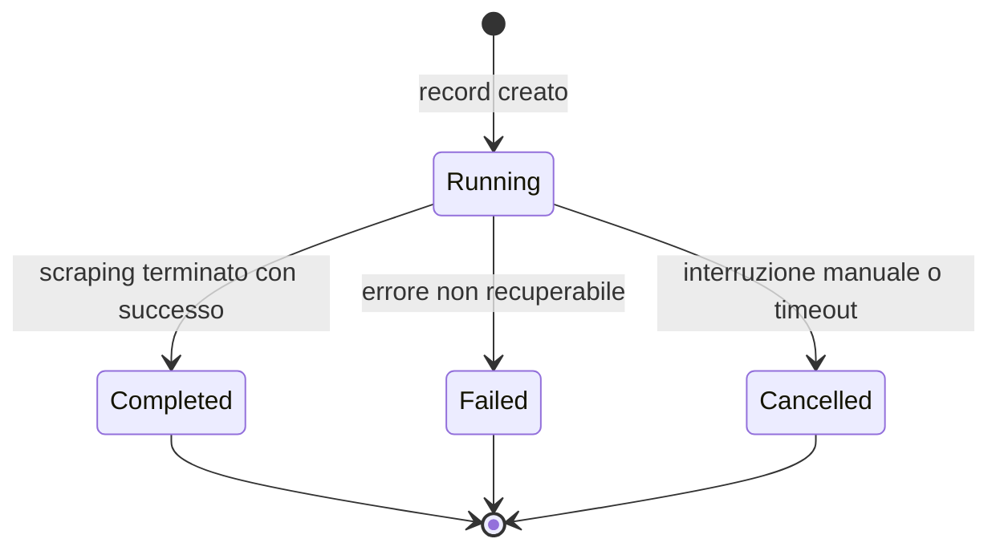

# Stato di avanzamento dello scraper

Questo documento riassume gli stati della tabella `scraper_progress` e la logica di transizione gestita da `ProgressStateService`. La colonna `status` è un `ENUM` PostgreSQL con i valori **consentiti**:

- `running` → stato iniziale all’avvio di uno scraping.
- `completed` → scraping terminato correttamente (o dispatch completato).
- `failed` → errore non recuperabile (retry esauriti, eccezioni non gestite).
- `cancelled` → interruzione manuale o abort controllato (timeout applicativo).

> ⚠️ **Nota:** lo stato `dispatched` non fa parte dell’enum a livello DB. Ogni tentativo di impostarlo comporta una violazione `scraper_progress_status_check`. La transizione va quindi mediata dal servizio dedicato, che esegue un fallback automatico a `completed`.

Di seguito il diagramma delle transizioni ammesse:



## Gestione delle transizioni

- Ogni aggiornamento di stato deve passare da `App\Services\Scraper\ProgressStateService`.
- Il metodo `transitionToDispatched(int $tenantId, int $progressId)` applica un `lockForUpdate()` sul record e verifica la transizione.
- Se lo stato di destinazione non è previsto dall’enum (es. `dispatched`), il metodo ritorna `false`, loggando l’anomalia.
- Nel caso di fallback viene invocato `finalizeProgress('completed')` nel servizio di scraping.

### Esempio d’uso

```php
$transitioned = $progressStateService->transitionToDispatched($tenantId, $progressId);

if (!$transitioned) {
    Log::warning('Fallback to completed state', [
        'progress_id' => $progressId,
        'tenant_id' => $tenantId,
    ]);

    $progress->update(['status' => ProgressStateService::STATUS_COMPLETED]);
}
```

### Cambio di stato esplicito

Per cambiare stato manualmente (es. da job di pulizia) usare:

```php
$progress->update(['status' => ProgressStateService::STATUS_FAILED]);
```

Assicurarsi di rispettare il tenant scoping (`where('tenant_id', $tenantId)`), soprattutto in ambienti multitenant.

## Changelog
- **2025-11-13**: introdotto `ProgressStateService` per centralizzare le transizioni; fallback da `dispatched` a `completed` per evitare violazioni del vincolo enumerativo; aggiornato doc e test.

