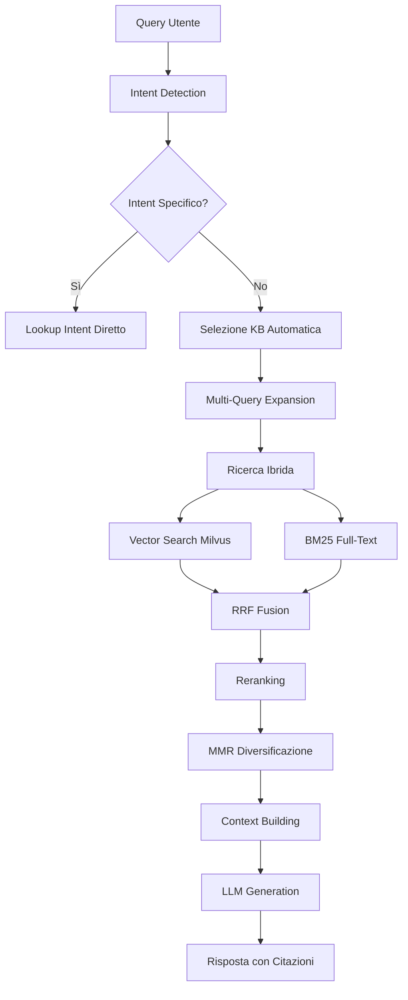

# 🧠 RAG (Retrieval-Augmented Generation) - Documentazione Completa

## 📋 Panoramica

Il sistema RAG di ChatbotPlatform combina ricerca avanzata nella knowledge base con generazione di risposte intelligenti usando LLM. Il sistema implementa tecniche all'avanguardia per garantire risposte accurate, pertinenti e ben citate.

## 🏗️ Architettura del Sistema

### **Componenti Principali**

1. **KbSearchService**: Orchestratore principale del retrieval
2. **TextSearchService**: Ricerca full-text (BM25) e pattern matching
3. **MilvusClient**: Ricerca semantica vettoriale 
4. **KnowledgeBaseSelector**: Selezione automatica KB ottimale
5. **RerankerInterface**: Riordino risultati (Embedding/Cohere)
6. **ContextBuilder**: Costruzione contesto token-aware
7. **OpenAIChatService**: Generazione risposte finali

### **Flusso di Elaborazione**



## 🔍 Processo di Retrieval Dettagliato

### **Fase 1: Intent Detection**

Il sistema rileva automaticamente 5 tipi di intent specifici:

```php
$intents = ['thanks', 'phone', 'email', 'address', 'schedule'];
```

**Algoritmo di Scoring**:
- **Exact Match**: Keyword trovata nella query originale (peso 1.0)
- **Expanded Match**: Keyword trovata in query con sinonimi (peso 0.5)
- **Length Weight**: Score proporzionale alla lunghezza della keyword
- **Execution Order**: Gli intent vengono eseguiti in ordine di score decrescente, non in ordine fisso

**Esempio Pratico Orari**:
```
Query: "Quali sono gli orari dell'ufficio anagrafe?"

Intent Scores:
- schedule: 2.1 (match: "orari", "ufficio")
- address: 0.3 (match: "ufficio") 
- email: 0.0
- phone: 0.0

Execution Order: schedule (score 2.1) → address (score 0.3) → [altri]
Risultato: Intent SCHEDULE eseguito per primo
```

**Esempio Pratico Telefono**:
```
Query: "numero di telefono moretti"

Intent Scores:
- phone: 1.346 (match: "numero di telefono", "telefono", "numero")
- schedule: 0.115 (match: "ore")  
- address: 0.0
- email: 0.0

Execution Order: phone (score 1.346) → schedule (score 0.115) → [altri]
Risultato: Intent PHONE eseguito per primo (corretto!)
```

### **Fase 2: Knowledge Base Selection**

Se non è rilevato un intent specifico, il sistema seleziona automaticamente la KB più rilevante:

**Strategia BM25 Aggregate**:
1. Esegue ricerca BM25 su tutti i documenti del tenant (top 200)
2. Raggruppa risultati per Knowledge Base
3. Somma gli score per ogni KB
4. Seleziona la KB con score aggregato più alto

**Esempio**:
```
Query: "Come si richiede la carta d'identità?"

BM25 Results:
- Doc 15 (KB Servizi): score 4.2
- Doc 23 (KB Servizi): score 3.8  
- Doc 31 (KB News): score 1.1
- Doc 7 (KB Servizi): score 2.9

KB Scores:
- KB Servizi: 4.2 + 3.8 + 2.9 = 10.9 ✅
- KB News: 1.1

Risultato: KB "Servizi" selezionata
```

### **Fase 3: Multi-Query Expansion**

Il sistema genera variazioni della query per migliorare il recall:

```php
// Query originale
$original = "orari sportello comunale";

// Query espanse (generate da LLM)
$expanded = [
    "orari sportello comunale",
    "quando è aperto l'ufficio comunale",
    "orario apertura municipio",
    "quando si può andare in comune"
];
```

### **Fase 4: Ricerca Ibrida (Vector + BM25)**

**Ricerca Vettoriale (Milvus)**:
- Converte query in embedding (1536 dimensioni)
- Ricerca similarità coseno in vector store
- Filtra per knowledge base selezionata
- Restituisce top 40 chunk più simili

**Ricerca BM25 (PostgreSQL FTS)**:
- Ricerca full-text su indice PostgreSQL
- Ranking TF-IDF tradizionale
- Filtra per knowledge base selezionata  
- Restituisce top 80 chunk più rilevanti

### **Fase 5: RRF (Reciprocal Rank Fusion)**

Combina i risultati delle due ricerche usando la formula:

```
Score(doc) = Σ (1 / (rank + k))
```

**Configurazione**:
- `k = 60` (parametro RRF)
- I Aocumenti presenti in entrambe le liste ottengono score più alti

**Esempio**:
```
Vector Results:        BM25 Results:
1. Doc A (score: 0.92) 1. Doc C (score: 12.4)
2. Doc B (score: 0.89) 2. Doc A (score: 11.2)  
3. Doc C (score: 0.85) 3. Doc D (score: 9.8)

RRF Fusion:
- Doc A: 1/(1+60) + 1/(2+60) = 0.0164 + 0.0161 = 0.0325
- Doc C: 1/(3+60) + 1/(1+60) = 0.0159 + 0.0164 = 0.0323  
- Doc B: 1/(2+60) + 0 = 0.0161
- Doc D: 0 + 1/(3+60) = 0.0159

Final Ranking: A, C, B, D
```

### **Fase 6: Reranking**

**Driver Embedding** (default):
- Calcola similarità coseno tra query e ogni candidato
- Usa gli stessi embedding di OpenAI
- Veloce e gratuito

**Driver Cohere** (opzionale):
- Usa modelli cross-encoder specializzati  
- Più accurato ma richiede API key Cohere
- Migliore comprensione del contesto

### **Fase 7: MMR (Maximal Marginal Relevance)**

Diversifica i risultati per ridurre ridondanza:

```
MMR(doc) = λ × sim(query, doc) - (1-λ) × max(sim(doc, selected))
```

**Parametri**:
- `λ = 0.25` (bilancia rilevanza vs diversità)
- `k = 10` (documenti finali selezionati)

### **Fase 8: Context Building**

**Neighbor Expansion**:
- Per ogni chunk selezionato, include chunk adiacenti (±2 posizioni)
- Migliora la coerenza del contesto
- Ricostruisce paragrafi spezzati dal chunking

**Token Management**:
- Limita contesto a ~6000 caratteri
- Comprime automaticamente se necessario
- Gestisce template personalizzati del tenant

## 🎯 Intent Lookup Specializzati

### **Intent: Thanks**

**Comportamento Speciale**:
- Non cerca informazioni nei documenti
- Restituisce direttamente una risposta cortese
- Personalizza la risposta con il nome del tenant
- Supporta risposte multilingue

**Keywords di Riconoscimento**:
```
Italiano: "grazie", "ti ringrazio", "molto gentile", "perfetto", "ottimo"
Inglese: "thanks", "thank you", "appreciate it", "perfect", "awesome"
Spagnolo: "gracias", "muchas gracias", "perfecto", "excelente"
Francese: "merci", "merci beaucoup", "parfait", "excellent"
```

**Esempio**:
```
Query: "Grazie mille per l'aiuto!"
Intent: thanks (score: 2.1)
Risposta: "Prego! Sono qui per aiutarti con i servizi di [Tenant Name]."
Confidence: 1.0
```

### **Intent: Phone**

**Pattern di Ricerca**:
```regex
/(?<!\d)(?:\+39\s*)?0\d{1,3}\s*\d{6,8}(?!\d)/u  # Fisso
/(?<!\d)(?:\+39\s*)?3\d{2}\s*\d{3}\s*\d{3,4}(?!\d)/u  # Mobile
/(?<!\d)(?:800|199|892|899)\s*\d{3,6}(?!\d)/u  # Verde
```

**Processo**:
1. Estrae nome/entità dalla query (es: "vigili urbani")
2. Espande con sinonimi (es: "polizia locale", "municipale")
3. Cerca telefoni vicini al nome nel testo
4. Valida pattern e contesto

**Esempio**:
```
Query: "telefono vigili urbani"
Nome estratto: "vigili urbani"
Sinonimi: "polizia locale municipale vigili"
Trovato: "Polizia Locale - Tel: 0544 123456"
Risultato: Telefono 0544 123456
```

### **Intent: Email**

**Pattern**: `/[A-Z0-9._%+-]+@[A-Z0-9.-]+\.[A-Z]{2,}/iu`

**Validazioni**:
- Dominio valido (almeno 2 caratteri TLD)
- No email in immagini o codice  
- Contesto appropriato (contatti, footer, etc.)

### **Intent: Address**

**Pattern Avanzati**:
```regex
/\b(?:via|viale|piazza|corso|largo)\s+[A-Za-zÀ-ÖØ-öø-ÿ\'\-\s]{2,60}(?:,?\s+\d{1,4}[A-Za-z]?)?/iu
```

**Validazioni**:
- Presenza vie/piazze italiane
- Numero civico opzionale
- CAP eventuale
- Esclude indirizzi web/email

### **Intent: Schedule**

**Pattern Complessi**:
```regex
/\b(?:dalle?\s+)?(?:ore\s+)?(\d{1,2}[:\.]?\d{2})\s*[-–—]\s*(\d{1,2}[:\.]?\d{2})\b/iu
/\b(lunedì|martedì|mercoledì|giovedì|venerdì|sabato|domenica)\s*:?\s*(\d{1,2}(?:[:\.]?\d{2})?)/iu
```

**Validazioni**:
- Orari sensati (non date o codici)
- Contesto temporale appropriato  
- Giorni della settimana riconosciuti
- Formato italiano/internazionale

## 🚀 Esempi di Execution End-to-End

### **Esempio 1: Intent Detection**

```bash
Query: "Qual è il numero dell'ufficio tecnico?"

# Step 1: Intent Detection
Intent scores calculated:
- phone: 1.8 (match: "numero", "ufficio")
- schedule: 0.2 (match: "ufficio")
- address: 0.1 (match: "ufficio")
- email: 0.0

Execution order: phone → schedule → address → email
Intent executed: phone (score più alto)

# Step 2: KB Selection (for intent scoping)  
Selected KB: "Servizi" (BM25 aggregate score: 8.4)

# Step 3: Intent Lookup
Extracted name: "ufficio tecnico"
Expanded: "ufficio tecnico comune municipio"
Pattern search: Found "Ufficio Tecnico: 0544 987654"

# Step 4: Result
Citations: [
  {
    "id": 42,
    "title": "Contatti Uffici Comunali", 
    "phone": "0544 987654",
    "snippet": "Ufficio Tecnico: Tel. 0544 987654...",
    "score": 1.0,
    "knowledge_base": "Servizi"
  }
]
Executed intent: "phone" (corretto!)
```

### **Esempio 2: Hybrid RAG**

```bash
Query: "Come richiedere un permesso di costruire?"

# Step 1: Intent Detection
No specific intent detected (generic query)

# Step 2: KB Selection
BM25 aggregate scores:
- KB Servizi: 15.7 ✅
- KB News: 2.1  
Selected: "Servizi"

# Step 3: Multi-Query Expansion
Queries generated:
- "Come richiedere un permesso di costruire?"
- "procedura domanda permesso edilizio"  
- "richiesta autorizzazione edilizia"

# Step 4: Vector Search (per ogni query)
Query 1 → Embedding → Milvus search → 40 results
Query 2 → Embedding → Milvus search → 35 results  
Query 3 → Embedding → Milvus search → 38 results

# Step 5: BM25 Search (per ogni query)
Query 1 → PostgreSQL FTS → 80 results
Query 2 → PostgreSQL FTS → 72 results
Query 3 → PostgreSQL FTS → 75 results

# Step 6: RRF Fusion (per ogni query)
Each query: Vector + BM25 → RRF → Ranked list

# Step 7: Final RRF (tra tutte le query)
Combined ranking across all query variants

# Step 8: Reranking
Top 30 candidates → Embedding reranker → Reordered

# Step 9: MMR Diversification  
Reranked list → MMR (λ=0.25) → 8 diverse documents

# Step 10: Context Building
Selected docs → Neighbor expansion → Token management

# Step 11: Citations
Final result: 5 citazioni con snippet e metadati
```

### **Esempio 3: Semantic Fallback**

```bash
Query: "contatti sindaco"

# Step 1: Intent Detection
Intent: phone (score: 0.8)

# Step 2: Direct Intent Lookup
Extracted name: "sindaco"
Search result: No direct phone found

# Step 3: Semantic Fallback Triggered
Semantic query: "sindaco contatti telefono numero"
Vector search: 100 results from Milvus

# Step 4: Intent Data Extraction
For each chunk:
- Extract phone patterns
- Validate context  
- Filter by extracted data

Results found: 2 phone numbers in relevant contexts

# Step 5: Final Result
Citations with semantically discovered phones
```

## ⚙️ Configurazione e Tuning

### **Sinonimi Personalizzati per Tenant**

Ogni tenant può avere sinonimi personalizzati per migliorare l'accuratezza delle ricerche:

```php
// Configurazione sinonimi per tenant (DB: tenants.custom_synonyms)
[
    "vigili urbani" => "polizia locale municipale vigili",
    "comune" => "municipio ufficio comunale",
    "pronto soccorso" => "ospedale emergenza 118",
    "farmacia" => "farmacia comunale guardia medica"
]
```

**Come Funzionano:**
- Quando l'utente cerca "vigili urbani", il sistema cerca anche "polizia locale", "municipale", "vigili"
- L'espansione avviene sia nell'**intent detection** che nella **ricerca semantica**
- Se il tenant non ha sinonimi personalizzati, usa quelli di default del sistema

**Gestione tramite UI:**
1. Admin Panel → Clienti → Modifica Cliente
2. Sezione "Sinonimi Personalizzati"
3. Inserire JSON nel formato: `{"termine": "sinonimi alternativi"}`

**Gestione tramite CLI:**
```bash
# Mostra sinonimi attuali
php artisan tenant:synonyms:manage 5 --show

# Ripristina sinonimi di default
php artisan tenant:synonyms:manage 5 --reset

# Imposta sinonimi personalizzati
php artisan tenant:synonyms:manage 5 --set='{"vigili":"polizia locale","comune":"municipio"}'

# Aggiungi singolo sinonimo
php artisan tenant:synonyms:manage 5 --add="biblioteca=centro lettura"

# Rimuovi sinonimo
php artisan tenant:synonyms:manage 5 --remove="biblioteca"
```

### **Parametri Chiave (`config/rag.php`)**

```php
'hybrid' => [
    'vector_top_k' => 40,      // Risultati vettoriali per query
    'bm25_top_k' => 80,        // Risultati BM25 per query  
    'rrf_k' => 60,             // Parametro fusion RRF
    'mmr_lambda' => 0.25,      // Balance rilevanza/diversità
    'mmr_take' => 10,          // Documenti finali
    'neighbor_radius' => 2,    // Chunk adiacenti da includere
],

'reranker' => [
    'driver' => 'embedding',   // embedding | cohere | none
    'top_n' => 40,            // Candidati per reranking
],

'answer' => [
    'min_citations' => 1,      // Citazioni minime per risposta
    'min_confidence' => 0.08,  // Soglia confidence
    'force_if_has_citations' => true,
],
```

### **Parametri di Chunking Tenant-Aware** ✅

Il sistema di chunking è ora **tenant-aware** e supporta configurazioni personalizzate per ogni tenant:

```php
// Global defaults (config/rag.php)
'chunk_max_chars' => 2200,      // Massimo caratteri per chunk
'chunk_overlap_chars' => 250,   // Sovrapposizione tra chunk

// Tenant-specific overrides (DB: tenants.rag_settings JSON)
[
    'chunking' => [
        'max_chars' => 3000,       // Override per questo tenant
        'overlap_chars' => 300      // Override per questo tenant
    ]
]
```

**Come Funziona:**

1. **`TenantRagConfigService`** gestisce la configurazione tenant
2. **`ChunkingService`** richiede `$tenantId` per ogni operazione
3. **Fallback a 3 livelli**: tenant-specific → profile → global defaults

**Gestione tramite Admin UI:**
- Admin Panel → Clienti → Modifica Cliente → Tab "Configurazione RAG"
- Sezione "Parametri di Chunking"
- I parametri non impostati usano i valori globali di default

**Esempio: Tenant con Documenti Tecnici Lunghi**
```php
// Tenant 5: Comune con delibere lunghe
'chunking' => [
    'max_chars' => 3000,    // ✅ Chunk più grandi per paragrafi completi
    'overlap_chars' => 300  // ✅ Overlap maggiore per continuità
]
```

**Impatto:**
- ✅ Ogni tenant può ottimizzare il chunking per il proprio tipo di contenuti
- ✅ Delibere, PDF tecnici, tabelle complesse richiedono chunk più grandi
- ✅ FAQ brevi possono usare chunk più piccoli
- ✅ La configurazione è applicata automaticamente durante l'ingestion

**Nota Importante:**  
⚠️ Dopo aver modificato i parametri di chunking per un tenant, è necessario **re-ingerire i documenti** esistenti per applicare i nuovi chunk. I nuovi documenti caricati useranno automaticamente la nuova configurazione.

### **Tuning per Casi d'Uso**

**PA/Enti Pubblici**:
```php
'vector_top_k' => 50,     // Più recall per procedure complesse
'bm25_top_k' => 100,      
'mmr_lambda' => 0.3,      // Più diversità
```

**E-commerce**:
```php
'vector_top_k' => 30,     // Meno recall, più precisione
'mmr_lambda' => 0.2,      // Meno diversità, più focus
'neighbor_radius' => 1,   // Contesto più stretto
```

**FAQ/Customer Service**:
```php
'reranker.driver' => 'cohere',  // Migliore comprensione
'min_confidence' => 0.12,       // Soglia più alta
```

## 🧪 Testing e Debug

### **RAG Tester (UI Admin)**

**Input Parameters**:
- **Tenant**: Selezione tenant per test
- **Query**: Domanda da testare
- **Top K**: Numero risultati (1-50)
- **MMR Lambda**: Bilanciamento diversità (0-1)
- **Max Output Tokens**: Lunghezza risposta LLM
- **With Answer**: Genera risposta completa

**Debug Output**:
```json
{
  "citations": [...],
  "confidence": 0.85,
  "debug": {
    "queries": ["query1", "query2", "query3"],
    "milvus": {"ok": true, "status": "connected"},
    "selected_kb": {
      "knowledge_base_id": 5,
      "kb_name": "Servizi",
      "reason": "bm25_aggregate_score"
    },
    "per_query": [{
      "q": "query1",
      "vector_hits": [...],
      "fts_hits": [...]
    }],
    "fused_top": [...],
    "reranked_top": [...], 
    "mmr_selected_idx": [0, 3, 5, 7],
    "intent_detection": {
      "executed_intent": "hybrid_rag",
      "intents_detected": [],
      "intent_scores": {...}
    }
  }
}
```

### **Analisi Performance**

**Metriche Chiave**:
- **Latenza**: < 2.5s P95
- **Groundedness**: > 80% risposte supportate da fonti
- **Deflection Rate**: > 60% query risolte senza operatore
- **Citation Rate**: > 90% risposte con citazioni valide

**Query di Test Consigliate**:
```bash
# Intent specifici
"grazie mille per l'aiuto"
"telefono vigili urbani"
"numero di telefono moretti"  # Test priorità intent
"orari biblioteca"  
"email ufficio anagrafe"
"indirizzo municipio"

# Domande complesse
"come richiedere la carta d'identità?"
"procedura per aprire un nuovo negozio"
"tasse sui rifiuti per aziende"

# Test priorità intent (verificare executed_intent corretto)
"numero telefono biblioteca" # Deve eseguire phone, non schedule
"orario email supporto"      # Deve eseguire schedule, non email

# Edge cases
"asdasd" (query nonsense)
"" (query vuota)
"the quick brown fox" (query fuori dominio)
```

## 🚀 Tecniche RAG Avanzate

### **HyDE (Hypothetical Document Embeddings)**

**Stato**: ✅ Implementato e disponibile

**Descrizione**: Genera una risposta ipotetica alla query dell'utente e cerca documenti simili a questa risposta invece che alla query originale.

**Benefici**:
- +25-40% miglioramento rilevanza risultati
- Migliore matching semantico
- Contesto arricchito per ricerca

**Configurazione**:
```env
RAG_HYDE_ENABLED=true
RAG_HYDE_MODEL=gpt-4o-mini
RAG_HYDE_MAX_TOKENS=200
RAG_HYDE_TEMPERATURE=0.3
```

**Testing**:
```bash
# Test singolo
php artisan rag:test-hyde 1 "orari biblioteca"

# Confronto Standard vs HyDE  
php artisan rag:test-hyde 1 "orari biblioteca" --compare
```

**Costi**: +$0.02 per query (~50% aumento costo)
**Performance**: +0.5s latenza media

### **LLM-as-a-Judge Reranking**

**Stato**: ✅ Implementato e disponibile

**Descrizione**: Usa un LLM per valutare la rilevanza di ogni candidato assegnando punteggi 0-100, producendo un ranking molto più accurato.

**Benefici**:
- +30-50% miglioramento rilevanza risultati
- Comprensione semantica avanzata
- Valutazione contestuale sofisticata

**Configurazione**:
```env
RAG_RERANK_DRIVER=llm
RAG_LLM_RERANK_ENABLED=true
RAG_LLM_RERANK_MODEL=gpt-4o-mini
RAG_LLM_RERANK_BATCH_SIZE=5
```

**Testing**:
```bash
# Test LLM reranking
php artisan rag:test-llm-reranking 1 "orari biblioteca"

# Confronto tutti i reranker
php artisan rag:test-llm-reranking 1 "query" --compare

# Super combo: HyDE + LLM Reranking
php artisan rag:test-llm-reranking 1 "query" --with-hyde
```

**Costi**: +$0.04-0.06 per query (~100% aumento costo)
**Performance**: +0.9s latenza media
**Combo HyDE+LLM**: +50-60% rilevanza totale! 🚀

### **Tecniche Future** 

🕰️ **In Roadmap**:
- **Parent-Child Chunking**: Chunk piccoli + chunk grandi per contesto
- **Query Decomposition**: Scompone query complesse in sotto-domande
- **Semantic Chunking**: Chunking basato su significato vs lunghezza
- **Multi-Vector Retrieval**: Diversi tipi embedding per chunk

📈 **Priorità Implementazione**:
1. HyDE ✅ (completato)
2. LLM Reranking ✅ (completato)
3. Query Decomposition (🔄 prossimo)
4. Parent-Child Chunking

Vedi `backend/docs/hyde-implementation.md` per dettagli completi su HyDE.
Vedi `backend/docs/advanced-rag-roadmap.md` per roadmap completa.

## 📦 Gestione Code e Worker

### **Comando per Avviare Tutte le Code**

Per far funzionare correttamente il sistema RAG, è necessario avviare i worker per le diverse code di elaborazione:

```bash
php artisan queue:work --queue=default,ingestion,scraping,indexing,email,evaluation
```

**Code Gestite**:
- **`default`**: Operazioni generali del sistema (Milvus partitions, cleanup)
- **`ingestion`**: Processamento, parsing, chunking e embeddings documenti caricati 
- **`scraping`**: Web scraping automatico da URL configurati
- **`indexing`**: Indicizzazione/cancellazione vettori in Milvus e PostgreSQL FTS
- **`email`**: Invio notifiche form e conferme utenti
- **`evaluation`**: Valutazione qualità contenuti e metriche RAG

**⚠️ Nota**: La coda `embeddings` è integrata nella coda `ingestion` per ottimizzare il flusso di processing.

### **Worker Separati per Produzione**

In ambiente di produzione, è consigliabile usare worker dedicati:

```bash
# Worker per ingestion (CPU/memory intensivo)
php artisan queue:work --queue=ingestion --timeout=1800 --sleep=3 --memory=1024 --tries=3

# Worker per scraping (I/O intensivo, long-running)
php artisan queue:work --queue=scraping --timeout=1800 --sleep=3 --memory=512 --tries=3

# Worker per indexing (database/Milvus)
php artisan queue:work --queue=indexing --timeout=300 --sleep=1 --tries=3

# Worker per email (priorità media)
php artisan queue:work --queue=email --timeout=60 --sleep=1 --tries=3

# Worker per evaluation (background, bassa priorità)
php artisan queue:work --queue=evaluation --timeout=300 --sleep=5 --tries=2
```

### **Monitoring Code**

```bash
# Verifica code attive
php artisan queue:monitor

# Restart worker (dopo deploy)
php artisan queue:restart

# Clear failed jobs
php artisan queue:clear

# Statistiche code
php artisan horizon:status  # Se Horizon configurato
```

### **Script di Avvio Automatico**

Per Windows (Laragon):
```batch
@echo off
cd /d "C:\laragon\www\ChatbotPlatform\backend"
php artisan queue:work --queue=default,ingestion,scraping,indexing,email,evaluation --timeout=1800 --sleep=3 --tries=3 --memory=1024
```

Per Linux/MacOS:
```bash
#!/bin/bash
cd /path/to/ChatbotPlatform/backend
php artisan queue:work --queue=default,ingestion,scraping,indexing,email,evaluation --timeout=1800 --sleep=3 --tries=3 --memory=1024
```

**Script Esistenti** (per worker specializzati):
```bash
# Solo ingestion (Windows)
./start-ingestion-worker.bat

# Solo scraping (Windows)  
./start-scraping-worker.bat

# Equivalenti per Linux/MacOS
./start-ingestion-worker.sh
./start-scraping-worker.sh
```

**⚠️ Importante**: I worker devono essere sempre attivi per il corretto funzionamento del sistema RAG. Senza worker attivi, documenti caricati non verranno processati e non saranno disponibili per le ricerche.

## 🔧 Troubleshooting

### **Problemi Comuni**

**1. Nessuna Citazione Trovata**:
```bash
# Check 1: Milvus connesso?
Debug → milvus.ok = true

# Check 2: Documenti indicizzati?
SELECT COUNT(*) FROM document_chunks WHERE tenant_id = X;

# Check 3: Embedding generati?
SELECT COUNT(*) FROM documents WHERE embedding_status = 'completed';

# Check 4: Knowledge Base associata?
SELECT knowledge_base_id FROM documents WHERE tenant_id = X;
```

**2. Intent Non Rilevati**:
```bash
# Verifica keywords
Debug → intent_detection.intent_scores

# Aggiungi keywords personalizzate
Tenant → Extra Intent Keywords → {"phone": ["centralino"]}

# Verifica lingua tenant
SELECT languages FROM tenants WHERE id = X;
```

**2.1. Intent Sbagliato Eseguito**:
```bash
# Controlla scores nel debug
Debug → intent_detection.intent_scores
- phone: 1.346 ✅ (score più alto)
- schedule: 0.115 (score più basso)

# Verifica ordine esecuzione
Debug → intent_detection.executed_intent
- Deve essere "phone", non "schedule_semantic"

# Se executed_intent != intent con score più alto:
- Bug di priorità: intent vengono eseguiti in ordine fisso
- Soluzione: modificare logica per usare ordine per score
```

**3. KB Selection Errata**:
```bash
# Verifica distribuzione documenti
SELECT kb.name, COUNT(*) FROM documents d 
JOIN knowledge_bases kb ON d.knowledge_base_id = kb.id 
WHERE d.tenant_id = X GROUP BY kb.name;

# Forza KB specifica in intent mode
Tenant → KB Scope Mode → "strict"
```

**4. Performance Lenta**:
```bash
# Ottimizza parametri
'vector_top_k' => 20,  # Riduci da 40
'bm25_top_k' => 40,    # Riduci da 80  
'reranker' => 'none',  # Disabilita temporaneamente

# Check indici PostgreSQL
EXPLAIN SELECT * FROM document_chunks WHERE tenant_id = X AND ...
```

### **Monitoring Avanzato**

**Log Patterns**:
```bash
# Cerca errori RAG
tail -f storage/logs/laravel.log | grep -i "rag\|milvus\|embedding"

# Performance queries
tail -f storage/logs/laravel.log | grep "SLOW QUERY"

# Intent detection patterns  
tail -f storage/logs/laravel.log | grep "intent_detected"
```

**Database Queries Utili**:
```sql
-- Top KB per tenant
SELECT kb.name, COUNT(*) as docs 
FROM documents d 
JOIN knowledge_bases kb ON d.knowledge_base_id = kb.id
WHERE d.tenant_id = 5 
GROUP BY kb.name 
ORDER BY docs DESC;

-- Distribuzione chunk
SELECT COUNT(*) as chunks, AVG(LENGTH(content)) as avg_length
FROM document_chunks 
WHERE tenant_id = 5;

-- Status ingestion
SELECT ingestion_status, COUNT(*) 
FROM documents 
WHERE tenant_id = 5 
GROUP BY ingestion_status;
```

## 🎛️ Configurazioni Avanzate

### **Intent Personalizzati per Tenant**

```php
// Database: tenants table
intents_enabled: {
  "thanks": true,
  "phone": true,
  "email": true, 
  "address": false,  // Disabilita intent address
  "schedule": true
}

extra_intent_keywords: {
  "thanks": ["mille grazie", "ti ringrazio molto", "molto gentile"],
  "phone": ["centralino", "call center"],
  "schedule": ["ricevimento", "sportello"],
  "address": ["sede legale", "ubicazione"], 
  "email": ["pec", "posta istituzionale"]
}

kb_scope_mode: "relaxed",  // "strict" | "relaxed"
intent_min_score: 0.5     // Soglia personalizzata
```

### **Template Personalizzati**

```php
// Custom System Prompt
custom_system_prompt: "Sei un assistente specializzato per servizi comunali. Rispondi sempre in modo cortese e istituzionale."

// Custom Context Template  
custom_context_template: "Basandoti su queste informazioni ufficiali: {context}\n\nRispondi in modo preciso e cita sempre le fonti."
```

### **Multi-Knowledge Base Strategy**

**Scenario: Comune con 3 KB**:
- **KB Servizi**: Procedure, moduli, requisiti
- **KB Contatti**: Telefoni, email, orari, indirizzi  
- **KB News**: Comunicazioni, avvisi, eventi

**Strategia di Selezione**:
```php
Query: "numero ufficio anagrafe"
→ Intent: phone 
→ KB Selector: "Contatti" (più telefoni)
→ Result: Telefono trovato in KB Contatti

Query: "come richiedere carta identità"  
→ Intent: none
→ KB Selector: "Servizi" (più procedure)
→ Result: Procedura da KB Servizi
```

Questa documentazione copre completamente il funzionamento del sistema RAG con esempi pratici per ogni fase del processo. Il sistema è progettato per essere robusto, configurabile e facilmente debuggabile.
