# 🏗️ God Classes Refactoring - Architecture Design

**Data Creazione**: 14 Ottobre 2025  
**Versione**: 1.0  
**Status**: 📋 **PLANNING**  

---

## 📋 Indice

1. [Overview](#overview)
2. [Current State](#current-state)
3. [Target Architecture](#target-architecture)
4. [Decomposition Diagrams](#decomposition-diagrams)
5. [Service Interfaces](#service-interfaces)
6. [Implementation Plan](#implementation-plan)
7. [Testing Strategy](#testing-strategy)

---

## Overview

Questo documento descrive l'architettura target per il refactoring delle tre **God Classes** identificate nel codebase:

1. `IngestUploadedDocumentJob` (977 LOC)
2. `ChatCompletionsController` (789 LOC)
3. `DocumentAdminController` (786 LOC)

**Obiettivo**: Decomporre le responsabilità in Services dedicati che rispettano il **Single Responsibility Principle** e il limite di **300 LOC per classe**.

---

## Current State

### Problemi Identificati

| God Class | LOC | Methods | Issues |
|-----------|-----|---------|--------|
| `IngestUploadedDocumentJob` | 977 | 69 | ❌ 0 dependencies injected<br/>❌ 5 metodi >100 LOC<br/>❌ 12 responsabilità mischiate |
| `ChatCompletionsController` | 789 | 13 | ❌ 350+ LOC in `create()` method<br/>❌ 6 metodi privati di business logic<br/>❌ Violazione thin controller |
| `DocumentAdminController` | 786 | 12 | ❌ Chiamate dirette a Milvus/Storage/DB<br/>❌ Logica filtering inline<br/>❌ Upload + validation + dispatch mixed |

### Metriche di Complessità

- **Total LOC**: 2,550 righe (target: <600)
- **Avg Complexity**: 4.35 (target: <2.00)
- **Test Coverage**: ~2% (target: >85%)
- **Maintainability Index**: 20/100 (target: >85/100)

---

## Target Architecture

### Principi Architetturali

1. **Single Responsibility Principle**: Ogni Service una singola responsabilità
2. **Dependency Injection**: Constructor injection per tutte le dipendenze
3. **Interface Segregation**: Interfacce minimali e coese
4. **Test-Driven**: Unit test per ogni Service
5. **Max 300 LOC**: Limite rigido per classe

### Layer Architecture


---

## Decomposition Diagrams

### 1️⃣ IngestUploadedDocumentJob - Decomposition

**Current State**: Monolith con 12 responsabilità mescolate  
**Target State**: Orchestrator + 5 Services specializzati

```mermaid
graph TD
    subgraph "BEFORE - IngestUploadedDocumentJob (977 LOC)"
        IJ[IngestUploadedDocumentJob<br/>977 righe, 69 metodi<br/>12 responsabilità mischiate]
        style IJ fill:#ff6b6b,stroke:#c92a2a,stroke-width:3px
    end
    
    subgraph "AFTER - Orchestrator + Services (~150 LOC total orchestrator)"
        NewIJ[IngestUploadedDocumentJob<br/>~150 righe<br/>Orchestrator only]
        style NewIJ fill:#51cf66,stroke:#2f9e44,stroke-width:2px
        
        NewIJ --> ExtractionService[📄 DocumentExtractionService<br/>Responsibility: File extraction<br/>Methods: extractText, detectFormat<br/>LOC: ~120]
        NewIJ --> ParsingService[🔍 TextParsingService<br/>Responsibility: Text normalization<br/>Methods: normalize, findTables, removeNoise<br/>LOC: ~150]
        NewIJ --> ChunkingService[✂️ ChunkingService<br/>Responsibility: Semantic chunking<br/>Methods: chunk, chunkTables, extractEntries<br/>LOC: ~200]
        NewIJ --> EmbeddingService[🧠 EmbeddingBatchService<br/>Responsibility: Embeddings generation<br/>Methods: embedBatch, handleRateLimit<br/>LOC: ~80]
        NewIJ --> IndexingService[🗄️ VectorIndexingService<br/>Responsibility: Vector DB indexing<br/>Methods: upsert, delete, query<br/>LOC: ~50]
        
        ExtractionService --> |raw text| ParsingService
        ParsingService --> |clean text + tables| ChunkingService
        ChunkingService --> |chunks[]| EmbeddingService
        EmbeddingService --> |vectors[]| IndexingService
        
        style ExtractionService fill:#e7f5ff,stroke:#1c7ed6
        style ParsingService fill:#e7f5ff,stroke:#1c7ed6
        style ChunkingService fill:#e7f5ff,stroke:#1c7ed6
        style EmbeddingService fill:#e7f5ff,stroke:#1c7ed6
        style IndexingService fill:#e7f5ff,stroke:#1c7ed6
    end
    
    subgraph "External Dependencies"
        OpenAI[OpenAI API<br/>text-embedding-3-small]
        Milvus[Milvus<br/>vector database]
        S3[S3/Storage<br/>document files]
        
        EmbeddingService --> |API call| OpenAI
        IndexingService --> |upsert| Milvus
        ExtractionService --> |get file| S3
    end
```

**Reduction**: 977 LOC → ~150 LOC orchestrator + 600 LOC services = **-23% total, +400% maintainability**

---

### 2️⃣ ChatCompletionsController - Decomposition

**Current State**: Controller con business logic  
**Target State**: Thin controller + 4 Services


**Reduction**: 789 LOC → ~80 LOC controller + 550 LOC services = **-20% total, +300% testability**

---

### 3️⃣ DocumentAdminController - Decomposition

**Current State**: Controller con CRUD + filtering + upload + storage  
**Target State**: Thin controller + 4 Services



```mermaid
graph TD
    subgraph "BEFORE - DocumentAdminController (786 LOC)"
        DAC[DocumentAdminController<br/>786 righe<br/>Mixed concerns]
        style DAC fill:#ff6b6b,stroke:#c92a2a,stroke-width:3px
    end
    
    subgraph "AFTER - Thin Controller + Services (~120 LOC controller)"
        NewDAC[DocumentAdminController<br/>~120 righe<br/>Routing + validation only]
        style NewDAC fill:#51cf66,stroke:#2f9e44,stroke-width:2px
        
        NewDAC --> CrudService[📝 DocumentCrudService<br/>Responsibility: CRUD operations<br/>Methods: create, read, update, delete, bulkDelete<br/>LOC: ~200]
        NewDAC --> FilterService[🔎 DocumentFilterService<br/>Responsibility: Query building & filtering<br/>Methods: buildQuery, applyFilters, paginate<br/>LOC: ~150]
        NewDAC --> UploadService[📤 DocumentUploadService<br/>Responsibility: File upload & validation<br/>Methods: upload, validate, virusScan, dispatchJob<br/>LOC: ~100]
        
        CrudService --> StorageService[🗑️ DocumentStorageService<br/>Responsibility: Storage cleanup<br/>Methods: deleteFromS3, deleteFromMilvus, cleanup<br/>LOC: ~100]
        UploadService --> StorageService
        
        style CrudService fill:#d3f9d8,stroke:#2f9e44
        style FilterService fill:#d3f9d8,stroke:#2f9e44
        style UploadService fill:#d3f9d8,stroke:#2f9e44
        style StorageService fill:#d3f9d8,stroke:#2f9e44
    end
    
    subgraph "External Dependencies"
        Milvus2[Milvus<br/>vector database]
        S32[S3/Azure Blob<br/>file storage]
        DB[PostgreSQL<br/>metadata]
        
        StorageService --> |delete vectors| Milvus2
        StorageService --> |delete files| S32
        CrudService --> |insert/update| DB
        FilterService --> |query| DB
        UploadService --> |put file| S32
    end
```

**Reduction**: 786 LOC → ~120 LOC controller + 550 LOC services = **-15% total, +250% modularity**

---

## Service Interfaces

### Ingestion Pipeline Services

#### DocumentExtractionServiceInterface

```php
<?php

namespace App\Contracts\Ingestion;

interface DocumentExtractionServiceInterface
{
    /**
     * Extract text from a document file
     * 
     * @param string $filePath Storage path to document
     * @return string Extracted raw text
     * @throws ExtractionException If file cannot be read or format unsupported
     */
    public function extractText(string $filePath): string;
    
    /**
     * Detect document format
     * 
     * @param string $filePath Storage path to document
     * @return string Format (pdf, docx, xlsx, txt, md)
     */
    public function detectFormat(string $filePath): string;
}
```

#### TextParsingServiceInterface

```php
<?php

namespace App\Contracts\Ingestion;

interface TextParsingServiceInterface
{
    /**
     * Normalize and clean text
     * 
     * @param string $text Raw extracted text
     * @return string Cleaned text
     */
    public function normalize(string $text): string;
    
    /**
     * Find tables in text
     * 
     * @param string $text Normalized text
     * @return array<int, array{content: string, start: int, end: int}>
     */
    public function findTables(string $text): array;
    
    /**
     * Remove tables from text
     * 
     * @param string $text Original text
     * @param array $tables Tables metadata
     * @return string Text without tables
     */
    public function removeTables(string $text, array $tables): string;
}
```

#### ChunkingServiceInterface

```php
<?php

namespace App\Contracts\Ingestion;

interface ChunkingServiceInterface
{
    /**
     * Chunk text semantically
     * 
     * @param string $text Clean text to chunk
     * @param array $options Chunking options (max_chars, overlap_chars)
     * @return array<int, array{text: string, type: string, metadata: array}>
     */
    public function chunk(string $text, array $options = []): array;
    
    /**
     * Chunk tables separately
     * 
     * @param array $tables Tables from TextParsingService
     * @return array<int, array{text: string, type: 'table', metadata: array}>
     */
    public function chunkTables(array $tables): array;
    
    /**
     * Extract directory entries
     * 
     * @param string $text Text containing directory-like entries
     * @return array<int, array{text: string, type: 'directory_entry', metadata: array}>
     */
    public function extractDirectoryEntries(string $text): array;
}
```

#### EmbeddingBatchServiceInterface

```php
<?php

namespace App\Contracts\Ingestion;

interface EmbeddingBatchServiceInterface
{
    /**
     * Generate embeddings for chunks in batches
     * 
     * @param array $chunks Chunks from ChunkingService
     * @return array<int, array{chunk_id: int, vector: array<float>}>
     * @throws EmbeddingException If OpenAI API fails
     */
    public function embedBatch(array $chunks): array;
    
    /**
     * Handle rate limiting with retry
     * 
     * @param callable $operation Operation to execute
     * @param int $maxRetries Max retry attempts
     * @return mixed Operation result
     */
    public function withRateLimitHandling(callable $operation, int $maxRetries = 3): mixed;
}
```

#### VectorIndexingServiceInterface

```php
<?php

namespace App\Contracts\Ingestion;

interface VectorIndexingServiceInterface
{
    /**
     * Upsert vectors to Milvus
     * 
     * @param int $documentId Document ID
     * @param array $chunks Chunks with embeddings
     * @return bool Success status
     */
    public function upsert(int $documentId, array $chunks): bool;
    
    /**
     * Delete vectors for document
     * 
     * @param int $documentId Document ID
     * @return bool Success status
     */
    public function delete(int $documentId): bool;
}
```

---

### Chat Services

#### ChatOrchestrationServiceInterface

```php
<?php

namespace App\Contracts\Chat;

use Illuminate\Http\JsonResponse;

interface ChatOrchestrationServiceInterface
{
    /**
     * Handle chat completion request
     * 
     * @param array $validatedData Validated request data
     * @return JsonResponse OpenAI-compatible response
     */
    public function handleRequest(array $validatedData): JsonResponse;
    
    /**
     * Build RAG context from citations
     * 
     * @param array $citations Retrieved citations
     * @param string $userQuery User query
     * @return string Context text for LLM
     */
    public function buildContext(array $citations, string $userQuery): string;
}
```

#### ContextScoringServiceInterface

```php
<?php

namespace App\Contracts\Chat;

interface ContextScoringServiceInterface
{
    /**
     * Calculate smart source score
     * 
     * @param array $citation Citation data
     * @param string $query User query
     * @return float Score 0-1
     */
    public function calculateSmartScore(array $citation, string $query): float;
    
    /**
     * Calculate content quality score
     * 
     * @param array $citation Citation data
     * @return float Score 0-1
     */
    public function calculateQualityScore(array $citation): float;
    
    /**
     * Calculate source authority score
     * 
     * @param array $citation Citation data
     * @return float Score 0-1
     */
    public function calculateAuthorityScore(array $citation): float;
}
```

---

### Document Admin Services

#### DocumentCrudServiceInterface

```php
<?php

namespace App\Contracts\Document;

use App\Models\Document;
use Illuminate\Database\Eloquent\Collection;

interface DocumentCrudServiceInterface
{
    /**
     * Create a new document
     * 
     * @param array $data Document data
     * @param int $tenantId Tenant ID (multitenancy)
     * @return Document Created document
     */
    public function create(array $data, int $tenantId): Document;
    
    /**
     * Update a document
     * 
     * @param int $documentId Document ID
     * @param array $data Updated data
     * @return Document Updated document
     */
    public function update(int $documentId, array $data): Document;
    
    /**
     * Soft delete a document
     * 
     * @param int $documentId Document ID
     * @return bool Success status
     */
    public function delete(int $documentId): bool;
    
    /**
     * Bulk delete documents
     * 
     * @param array<int> $documentIds Document IDs
     * @param int $tenantId Tenant ID (multitenancy)
     * @return int Number of deleted documents
     */
    public function bulkDelete(array $documentIds, int $tenantId): int;
}
```

#### DocumentFilterServiceInterface

```php
<?php

namespace App\Contracts\Document;

use Illuminate\Contracts\Pagination\LengthAwarePaginator;
use Illuminate\Database\Eloquent\Builder;

interface DocumentFilterServiceInterface
{
    /**
     * Apply filters to query
     * 
     * @param Builder $query Base query
     * @param array $filters Filter parameters
     * @return Builder Filtered query
     */
    public function applyFilters(Builder $query, array $filters): Builder;
    
    /**
     * Paginate results
     * 
     * @param Builder $query Filtered query
     * @param int $perPage Items per page
     * @return LengthAwarePaginator Paginated results
     */
    public function paginate(Builder $query, int $perPage = 50): LengthAwarePaginator;
}
```

---

## Implementation Plan

### Phase 1: Setup (Steps 3-4)
- ✅ Creare interfacce in `app/Contracts/`
- ✅ Registrare binding in `AppServiceProvider`
- ✅ Implementare Services per ingestion pipeline

**Estimated Effort**: 12 ore

### Phase 2: Chat Services (Steps 6-7)
- ✅ Implementare Chat Services
- ✅ Refactor `ChatCompletionsController`
- ✅ Test unitari

**Estimated Effort**: 10 ore

### Phase 3: Admin Services (Steps 8-9)
- ✅ Implementare Document Services
- ✅ Refactor `DocumentAdminController`
- ✅ Test unitari

**Estimated Effort**: 8 ore

### Phase 4: Testing & Documentation (Steps 10-11)
- ✅ Test coverage ≥85%
- ✅ Aggiornare documentazione
- ✅ OpenAPI spec

**Estimated Effort**: 4 ore

**Total Estimated Effort**: ~34 ore

---

## Testing Strategy

### Unit Testing

Ogni Service avrà unit test con:
- ✅ **Mock delle dipendenze** (OpenAI, Milvus, Storage)
- ✅ **Edge cases** (file corrotto, rate limit, timeout)
- ✅ **Assertions sul comportamento**

Example:
```php
public function test_extraction_service_extracts_pdf_correctly()
{
    // Arrange
    $mockStorage = Mockery::mock(FilesystemAdapter::class);
    $mockStorage->shouldReceive('get')->andReturn('mock PDF content');
    
    $service = new DocumentExtractionService($mockStorage);
    
    // Act
    $text = $service->extractText('test.pdf');
    
    // Assert
    $this->assertNotEmpty($text);
    $this->assertStringContainsString('mock PDF', $text);
}
```

### Integration Testing

Test per verificare la pipeline completa:
```php
public function test_ingestion_pipeline_end_to_end()
{
    // Arrange
    $testFile = UploadedFile::fake()->create('test.pdf', 100);
    $document = Document::factory()->create();
    
    // Act
    IngestUploadedDocumentJob::dispatch($document);
    
    // Assert
    $this->assertDatabaseHas('document_chunks', ['document_id' => $document->id]);
    $this->assertMilvusHasVectors($document->id);
}
```

### Coverage Target

| Service | Target Coverage |
|---------|----------------|
| ExtractionService | >90% |
| ParsingService | >85% |
| ChunkingService | >90% |
| EmbeddingService | >85% |
| IndexingService | >80% |
| **Overall** | **>85%** |

---

## Appendix: Design Patterns Used

### Strategy Pattern
**Usage**: `ChunkingService` con diverse strategie di chunking
- `SemanticChunkingStrategy`
- `TableAwareChunkingStrategy`
- `SlidingWindowChunkingStrategy`

### Facade Pattern
**Usage**: `ChatOrchestrationService` come facade per RAG pipeline

### Repository Pattern
**Usage**: `DocumentCrudService` come repository per Document

### Chain of Responsibility
**Usage**: `FallbackStrategyService` per retry e fallback logic

---

## Next Steps

**Step 3**: Implementazione interfacce  
**Estimated Time**: 2 ore  
**Ready to proceed**: ✅ YES


